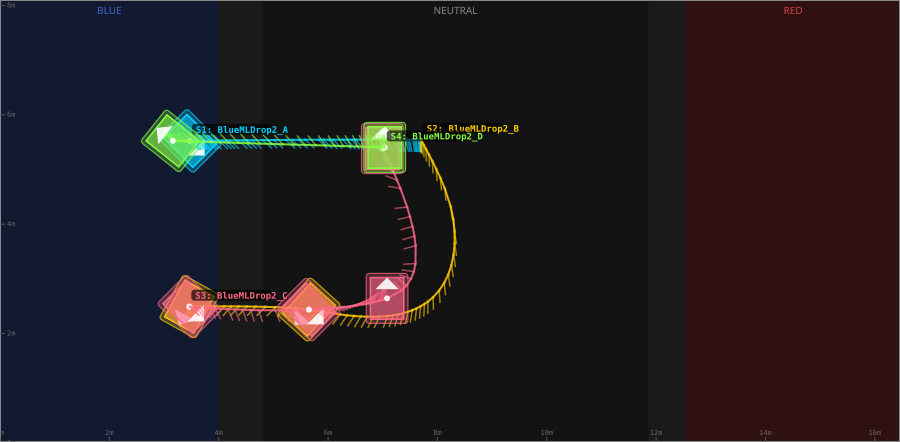
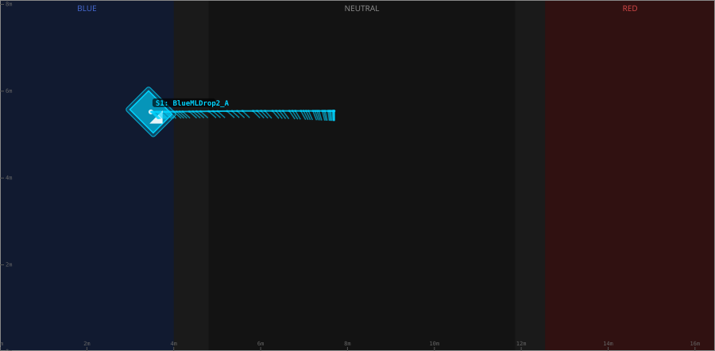
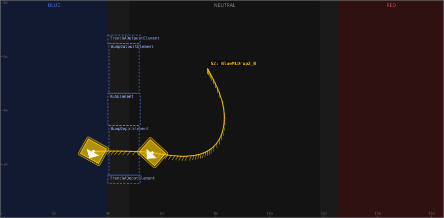
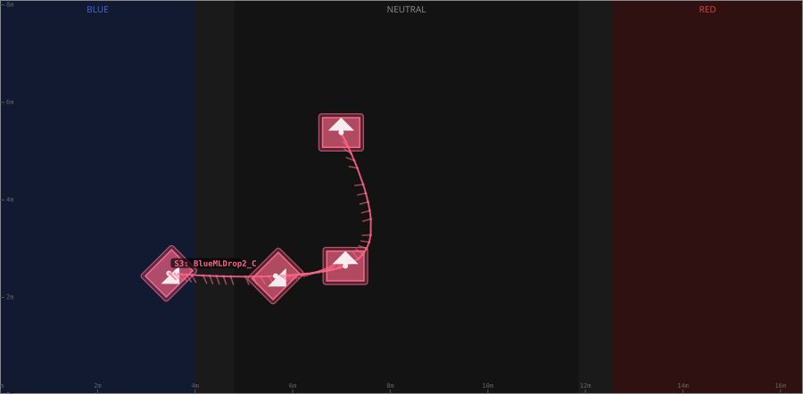
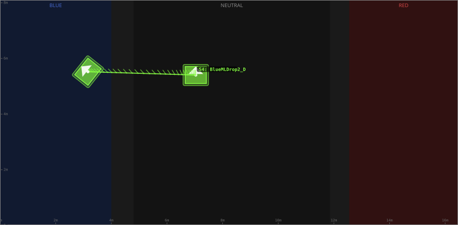

# Auton: BlueBDepDrop2NDepNOutScoreNCli

> Auto-generated from [`src/main/deploy/auton/BlueBDepDrop2NDepNOutScoreNCli.xml`](../../src/main/deploy/auton/BlueBDepDrop2NDepNOutScoreNCli.xml).  
> Do not edit this file manually -- push a change to the XML and the [auton-diagrams workflow](../../.github/workflows/auton-diagrams.yml) will regenerate it.

## State Diagram

```mermaid
stateDiagram-v2
    direction LR

    %% Green = intake active, Purple = intake off
    classDef intake  fill:#1a7a3a,color:#ffffff,stroke:#0d4a1f,font-weight:bold
    classDef noIntake fill:#5a4a8a,color:#ffffff,stroke:#3a2a6a,font-weight:bold

    Step1 : Step 1 - TRAJECTORY_DRIVE BlueMLDrop2_A
    Step2 : Step 2 - TRAJECTORY_DRIVE BlueMLDrop2_B
    Step3 : Step 3 - TRAJECTORY_DRIVE BlueMLDrop2_C
    Step4 : Step 4 - TRAJECTORY_DRIVE BlueMLDrop2_D

    class Step1 intake
    class Step2 intake
    class Step3 noIntake
    class Step4 intake

    [*] --> Step1 : start
    Step1 --> Step2: intake=INTAKE zones=LeftBumpZone DRIVE_OVER_BUMP
    Step2 --> Step3: intake=INTAKE zones=RightBumpZone DRIVE_OVER_BUMP LaunchZone PREPARE_TO_LAUNCH
    Step3 --> Step4: zones=RightBumpZone DRIVE_OVER_BUMP LaunchZone PREPARE_TO_LAUNCH
    Step4 --> [*]: intake=INTAKE zones=RightBumpZone DRIVE_OVER_BUMP LaunchZone PREPARE_TO_LAUNCH
```

## Primitive Summary

| Step | Primitive | Trajectory | Timeout | Intake | Launcher | Climber | Zones |
|------|-----------|------------|---------|--------|----------|---------|-------|
| 1 | TRAJECTORY_DRIVE | [BlueMLDrop2_A](../../src/main/deploy/choreo/BlueMLDrop2_A.traj) | 5.0 s | STATE_INTAKE | STATE_IDLE | STATE_OFF | BlueLeftBumpZone |
| 2 | TRAJECTORY_DRIVE | [BlueMLDrop2_B](../../src/main/deploy/choreo/BlueMLDrop2_B.traj) | 5.0 s | STATE_INTAKE | STATE_IDLE | STATE_OFF | BlueRightBumpZone, BlueLaunchZone |
| 3 | TRAJECTORY_DRIVE | [BlueMLDrop2_C](../../src/main/deploy/choreo/BlueMLDrop2_C.traj) | 5.0 s | STATE_OFF | STATE_IDLE | STATE_OFF | BlueRightBumpZone, BlueLaunchZone |
| 4 | TRAJECTORY_DRIVE | [BlueMLDrop2_D](../../src/main/deploy/choreo/BlueMLDrop2_D.traj) | 5.0 s | STATE_INTAKE | STATE_IDLE | STATE_OFF | BlueRightBumpZone, BlueLaunchZone |

## Trajectory Details

### All Trajectories Overview

### Step 1 -- BlueMLDrop2_A

- **File:** [`BlueMLDrop2_A.traj`](../../src/main/deploy/choreo/BlueMLDrop2_A.traj)
- **Duration:** 2.374 s
- **Timeout in auton XML:** 5.0 s

| # | X (m) | Y (m) | Heading (deg) |
|---|-------|-------|---------------|
| 1 | 3.474 | 5.523 | 315.0 |
| 2 | 5.823 | 5.545 | 315.0 |
| 3 | 7.697 | 5.545 | 270.0 |

### Step 2 -- BlueMLDrop2_B

- **File:** [`BlueMLDrop2_B.traj`](../../src/main/deploy/choreo/BlueMLDrop2_B.traj)
- **Duration:** 3.945 s
- **Timeout in auton XML:** 5.0 s

| # | X (m) | Y (m) | Heading (deg) |
|---|-------|-------|---------------|
| 1 | 7.697 | 5.545 | 270.0 |
| 2 | 7.859 | 2.611 | 270.0 |
| 3 | 5.65 | 2.438 | 227.9 |
| 4 | 3.463 | 2.492 | 240.8 |

### Step 3 -- BlueMLDrop2_C

- **File:** [`BlueMLDrop2_C.traj`](../../src/main/deploy/choreo/BlueMLDrop2_C.traj)
- **Duration:** 4.322 s
- **Timeout in auton XML:** 5.0 s

| # | X (m) | Y (m) | Heading (deg) |
|---|-------|-------|---------------|
| 1 | 3.463 | 2.492 | 315.0 |
| 2 | 5.65 | 2.438 | 315.0 |
| 3 | 7.079 | 2.643 | 90.0 |
| 4 | 6.993 | 5.383 | 90.0 |

### Step 4 -- BlueMLDrop2_D

- **File:** [`BlueMLDrop2_D.traj`](../../src/main/deploy/choreo/BlueMLDrop2_D.traj)
- **Duration:** 1.331 s
- **Timeout in auton XML:** 5.0 s

| # | X (m) | Y (m) | Heading (deg) |
|---|-------|-------|---------------|
| 1 | 7.036 | 5.404 | 90.0 |
| 2 | 3.16 | 5.523 | 141.4 |

## Zone Legend

| Zone file | Effect when entered |
|-----------|---------------------|
| `BlueLaunchZone` | `launcherState -> STATE_PREPARE_TO_LAUNCH` |
| `BlueLeftBumpZone` | `pathUpdateOption = DRIVE_OVER_BUMP` |
| `BlueRightBumpZone` | `pathUpdateOption = DRIVE_OVER_BUMP` |
