# Auton: BlueBDepKeep3NDepNOutScoreNCli

> Auto-generated from [`src/main/deploy/auton/BlueBDepKeep3NDepNOutScoreNCli.xml`](../../src/main/deploy/auton/BlueBDepKeep3NDepNOutScoreNCli.xml).  
> Do not edit this file manually -- push a change to the XML and the [auton-diagrams workflow](../../.github/workflows/auton-diagrams.yml) will regenerate it.

## State Diagram

```mermaid
stateDiagram-v2
    direction LR

    %% Green = intake active, Purple = intake off
    classDef intake  fill:#1a7a3a,color:#ffffff,stroke:#0d4a1f,font-weight:bold
    classDef noIntake fill:#5a4a8a,color:#ffffff,stroke:#3a2a6a,font-weight:bold

    Step1 : Step 1 - TRAJECTORY_DRIVE BlueMLDrop3_Init
    Step2 : Step 2 - TRAJECTORY_DRIVE BlueMLDrop3_A
    Step3 : Step 3 - TRAJECTORY_DRIVE BlueMLDrop3_C
    Step4 : Step 4 - DRIVE_STOP_MECH --
    Step5 : Step 5 - TRAJECTORY_DRIVE BlueMLDrop3_C2
    Step6 : Step 6 - TRAJECTORY_DRIVE BlueMLDrop3_D
    Step7 : Step 7 - TRAJECTORY_DRIVE BlueMLDrop3_F
    Step8 : Step 8 - DRIVE_STOP_MECH --

    class Step1 noIntake
    class Step2 intake
    class Step3 noIntake
    class Step4 noIntake
    class Step5 intake
    class Step6 intake
    class Step7 intake
    class Step8 noIntake

    [*] --> Step1 : start
    Step1 --> Step2: zones=LeftBumpZoneRect DRIVE_OVER_BUMP
    Step2 --> Step3: intake=INTAKE
    Step3 --> Step4: zones=LeftBumpZoneRect DRIVE_OVER_BUMP LaunchZone PREPARE_TO_LAUNCH
    Step4 --> Step5
    Step5 --> Step6: intake=INTAKE zones=LeftBumpZone DRIVE_OVER_BUMP
    Step6 --> Step7: intake=INTAKE
    Step7 --> Step8: intake=INTAKE zones=LeftBumpZoneRect DRIVE_OVER_BUMP LaunchZone PREPARE_TO_LAUNCH
    Step8 --> [*]
```

## Primitive Summary

| Step | Primitive | Trajectory | Timeout | Intake | Launcher | Climber | Zones |
|------|-----------|------------|---------|--------|----------|---------|-------|
| 1 | TRAJECTORY_DRIVE | BlueMLDrop3_Init | 3.0 s | STATE_OFF | STATE_IDLE | STATE_OFF | BlueLeftBumpZoneRect |
| 2 | TRAJECTORY_DRIVE | BlueMLDrop3_A | 3.0 s | STATE_INTAKE | STATE_IDLE | STATE_OFF | ? |
| 3 | TRAJECTORY_DRIVE | BlueMLDrop3_C | 5.0 s | STATE_OFF | STATE_IDLE | STATE_OFF | BlueLeftBumpZoneRect, BlueLaunchZone |
| 4 | DRIVE_STOP_MECH | -- | 5.0 s | STATE_OFF | STATE_IDLE | STATE_OFF | ? |
| 5 | TRAJECTORY_DRIVE | BlueMLDrop3_C2 | 5.0 s | STATE_INTAKE | STATE_IDLE | STATE_OFF | BlueLeftBumpZone |
| 6 | TRAJECTORY_DRIVE | BlueMLDrop3_D | 5.0 s | STATE_INTAKE | STATE_IDLE | STATE_OFF | ? |
| 7 | TRAJECTORY_DRIVE | BlueMLDrop3_F | 5.0 s | STATE_INTAKE | STATE_IDLE | STATE_OFF | BlueLeftBumpZoneRect, BlueLaunchZone |
| 8 | DRIVE_STOP_MECH | -- | 5.0 s | STATE_OFF | STATE_IDLE | STATE_OFF | ? |

## Zone Legend

| Zone file | Effect when entered |
|-----------|---------------------|
| `BlueLaunchZone` | `launcherState -> STATE_PREPARE_TO_LAUNCH` |
| `BlueLeftBumpZone` | `pathUpdateOption = DRIVE_OVER_BUMP` |
| `BlueLeftBumpZoneRect` | `pathUpdateOption = DRIVE_OVER_BUMP` |
