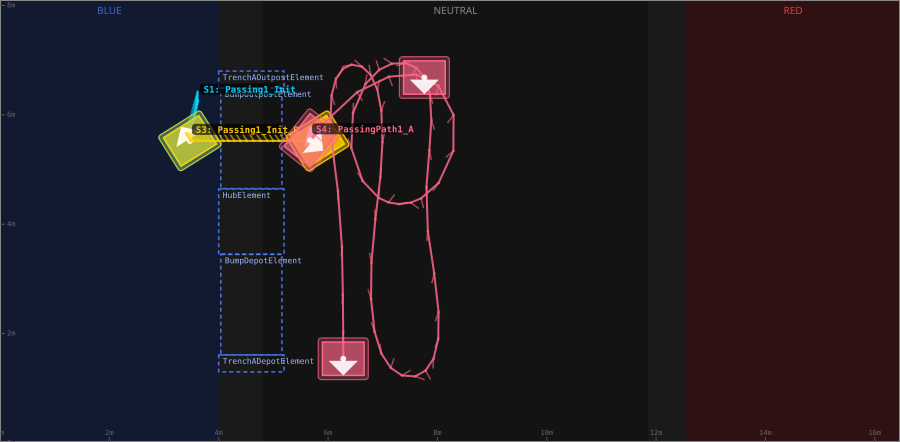
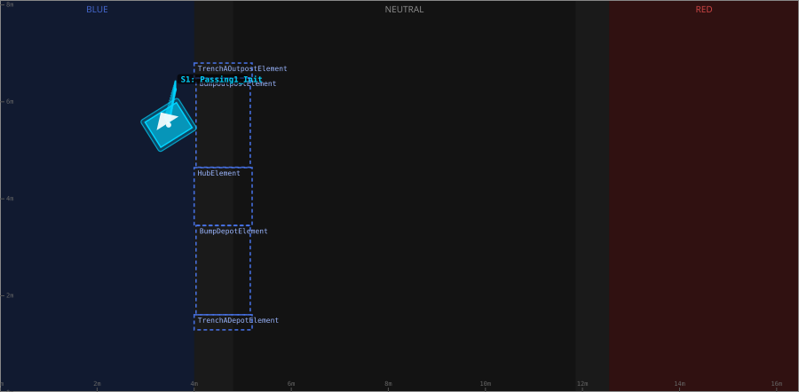
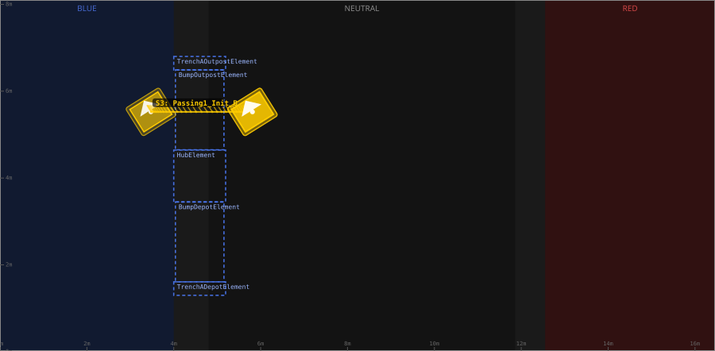
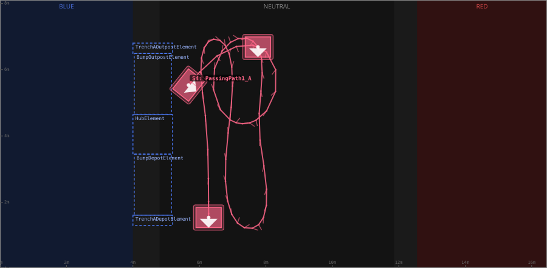

# Auton: BlueBDepLaunch1ComboNDepNOutPassNCli

> Auto-generated from [`src/main/deploy/auton/BlueBDepLaunch1ComboNDepNOutPassNCli.xml`](../../src/main/deploy/auton/BlueBDepLaunch1ComboNDepNOutPassNCli.xml).  
> Do not edit this file manually -- push a change to the XML and the [auton-diagrams workflow](../../.github/workflows/auton-diagrams.yml) will regenerate it.

## State Diagram

```mermaid
stateDiagram-v2
    direction LR

    %% Green = intake active, Purple = intake off
    classDef intake  fill:#1a7a3a,color:#ffffff,stroke:#0d4a1f,font-weight:bold
    classDef noIntake fill:#5a4a8a,color:#ffffff,stroke:#3a2a6a,font-weight:bold

    Step1 : "Step 1 - TRAJECTORY_DRIVE Passing1_Init"
    Step2 : "Step 2 - DRIVE_STOP_MECH --"
    Step3 : "Step 3 - TRAJECTORY_DRIVE Passing1_Init_B"
    Step4 : "Step 4 - TRAJECTORY_DRIVE PassingPath1_A"

    class Step1 noIntake
    class Step2 noIntake
    class Step3 noIntake
    class Step4 intake

    [*] --> Step1 : "start"
    Step1 --> Step2
    Step2 --> Step3: "launcher=PREPARE_TO_LAUNCH"
    Step3 --> Step4
    Step4 --> [*]: "intake=INTAKE | launcher=PREPARE_TO_LAUNCH"
```

## Primitive Summary

| Step | Primitive | Trajectory | Timeout | Intake | Launcher | Climber | Zones |
|------|-----------|------------|---------|--------|----------|---------|-------|
| 1 | TRAJECTORY_DRIVE | [Passing1_Init](../../src/main/deploy/choreo/Passing1_Init.traj) | 3.0 s | STATE_OFF | STATE_IDLE | STATE_OFF | -- |
| 2 | DRIVE_STOP_MECH | -- | 5.0 s | STATE_OFF | STATE_PREPARE_TO_LAUNCH | STATE_OFF | -- |
| 3 | TRAJECTORY_DRIVE | [Passing1_Init_B](../../src/main/deploy/choreo/Passing1_Init_B.traj) | 3.0 s | STATE_OFF | STATE_IDLE | STATE_OFF | -- |
| 4 | TRAJECTORY_DRIVE | [PassingPath1_A](../../src/main/deploy/choreo/PassingPath1_A.traj) | 3.0 s | STATE_INTAKE | STATE_PREPARE_TO_LAUNCH | STATE_OFF | -- |

## Trajectory Details

### All Trajectories Overview

### Step 1 -- Passing1_Init

- **File:** [`Passing1_Init.traj`](../../src/main/deploy/choreo/Passing1_Init.traj)
- **Duration:** 1.001 s
- **Timeout in auton XML:** 3.0 s
- **Colour in overview:** `#00d4ff`

| # | X (m) | Y (m) | Heading (deg) |
|---|-------|-------|---------------|
| 1 | 3.615 | 6.26 | 90.0 |
| 2 | 3.474 | 5.523 | 122.1 |

### Step 3 -- Passing1_Init_B

- **File:** [`Passing1_Init_B.traj`](../../src/main/deploy/choreo/Passing1_Init_B.traj)
- **Duration:** 1.766 s
- **Timeout in auton XML:** 3.0 s
- **Colour in overview:** `#ffcc00`

| # | X (m) | Y (m) | Heading (deg) |
|---|-------|-------|---------------|
| 1 | 3.474 | 5.523 | 122.1 |
| 2 | 5.813 | 5.523 | 122.1 |

### Step 4 -- PassingPath1_A

- **File:** [`PassingPath1_A.traj`](../../src/main/deploy/choreo/PassingPath1_A.traj)
- **Duration:** 13.775 s
- **Timeout in auton XML:** 3.0 s
- **Colour in overview:** `#ff6688`

| # | X (m) | Y (m) | Heading (deg) |
|---|-------|-------|---------------|
| 1 | 5.672 | 5.534 | 321.5 |
| 2 | 7.772 | 6.693 | 270.0 |
| 3 | 7.772 | 4.516 | 270.0 |
| 4 | 6.906 | 4.495 | 90.0 |
| 5 | 6.798 | 6.704 | 90.0 |
| 6 | 7.762 | 6.682 | 270.0 |
| 7 | 7.794 | 4.495 | 270.0 |
| 8 | 7.913 | 1.506 | 270.0 |
| 9 | 7.036 | 1.517 | 90.0 |
| 10 | 6.917 | 4.495 | 90.0 |
| 11 | 6.809 | 6.682 | 90.0 |
| 12 | 6.159 | 6.693 | 270.0 |
| 13 | 6.192 | 4.516 | 270.0 |
| 14 | 6.278 | 1.539 | 270.0 |

## Zone Legend

| Zone file | Effect when entered |
|-----------|---------------------|

