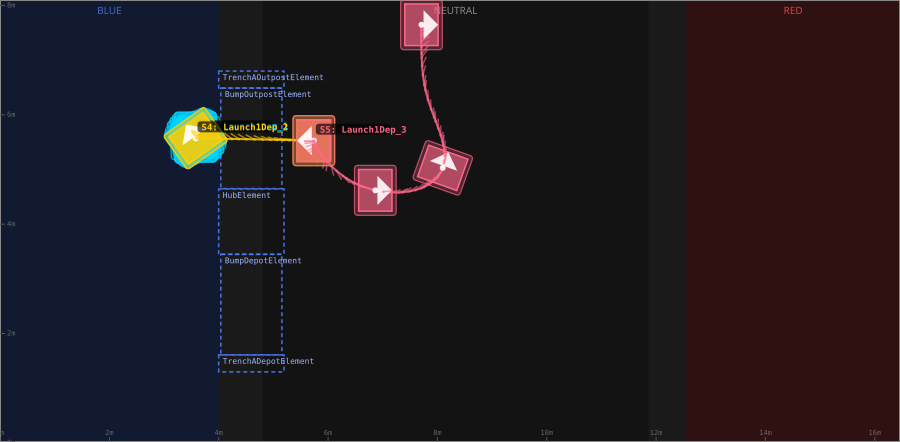
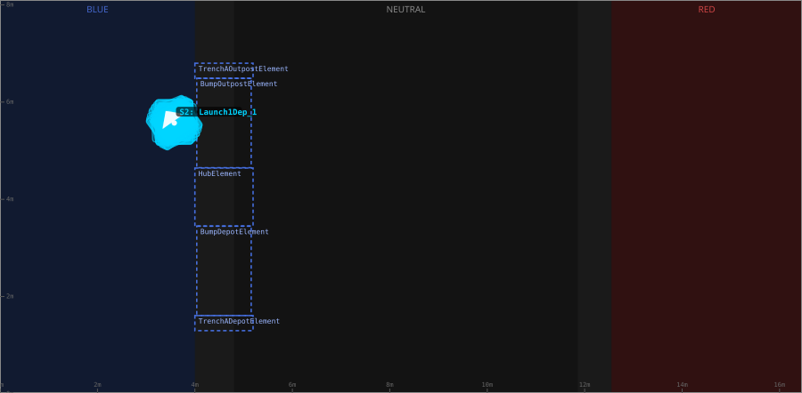
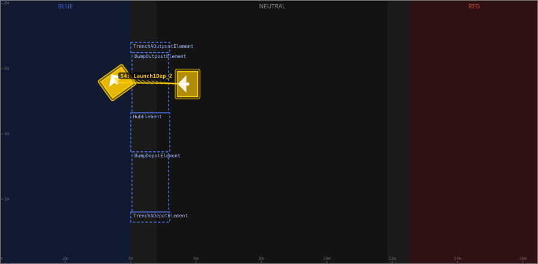
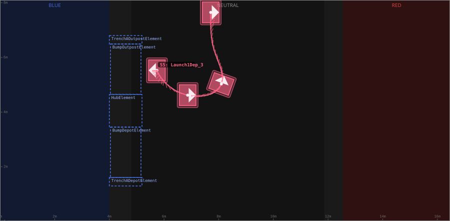

# Auton: BlueBDepLaunch1NDepNOutPassNCli

> Auto-generated from [`src/main/deploy/auton/BlueBDepLaunch1NDepNOutPassNCli.xml`](../../src/main/deploy/auton/BlueBDepLaunch1NDepNOutPassNCli.xml).  
> Do not edit this file manually -- push a change to the XML and the [auton-diagrams workflow](../../.github/workflows/auton-diagrams.yml) will regenerate it.

## State Diagram

```mermaid
stateDiagram-v2
    direction LR

    %% Green = intake active, Purple = intake off
    classDef intake  fill:#1a7a3a,color:#ffffff,stroke:#0d4a1f,font-weight:bold
    classDef noIntake fill:#5a4a8a,color:#ffffff,stroke:#3a2a6a,font-weight:bold

    Step1 : "Step 1 - DO_NOTHING --"
    Step2 : "Step 2 - TRAJECTORY_DRIVE Launch1Dep_1"
    Step3 : "Step 3 - DRIVE_STOP_MECH --"
    Step4 : "Step 4 - TRAJECTORY_DRIVE Launch1Dep_2"
    Step5 : "Step 5 - TRAJECTORY_DRIVE Launch1Dep_3"

    class Step1 noIntake
    class Step2 noIntake
    class Step3 noIntake
    class Step4 intake
    class Step5 noIntake

    [*] --> Step1 : "start"
    Step1 --> Step2
    Step2 --> Step3
    Step3 --> Step4: "launcher=PREPARE_TO_LAUNCH"
    Step4 --> Step5: "intake=INTAKE | zones=RightBumpZone DRIVE_OVER_BUMP"
    Step5 --> [*]: "launcher=PREPARE_TO_LAUNCH"
```

## Primitive Summary

| Step | Primitive | Trajectory | Timeout | Intake | Launcher | Climber | Zones |
|------|-----------|------------|---------|--------|----------|---------|-------|
| 1 | DO_NOTHING | -- | 5.0 s | STATE_OFF | STATE_IDLE | STATE_OFF | -- |
| 2 | TRAJECTORY_DRIVE | [Launch1Dep_1](../../src/main/deploy/choreo/Launch1Dep_1.traj) | 3.0 s | STATE_OFF | STATE_IDLE | STATE_OFF | -- |
| 3 | DRIVE_STOP_MECH | -- | 3.0 s | STATE_OFF | STATE_PREPARE_TO_LAUNCH | STATE_OFF | -- |
| 4 | TRAJECTORY_DRIVE | [Launch1Dep_2](../../src/main/deploy/choreo/Launch1Dep_2.traj) | 3.0 s | STATE_INTAKE | STATE_IDLE | STATE_OFF | BlueRightBumpZone |
| 5 | TRAJECTORY_DRIVE | [Launch1Dep_3](../../src/main/deploy/choreo/Launch1Dep_3.traj) | 10.0 s | STATE_OFF | STATE_PREPARE_TO_LAUNCH | STATE_OFF | -- |

## Trajectory Details

### All Trajectories Overview

### Step 2 -- Launch1Dep_1

- **File:** [`Launch1Dep_1.traj`](../../src/main/deploy/choreo/Launch1Dep_1.traj)
- **Duration:** 0.486 s
- **Timeout in auton XML:** 3.0 s
- **Colour in overview:** `#00d4ff`

| # | X (m) | Y (m) | Heading (deg) |
|---|-------|-------|---------------|
| 1 | 3.576 | 5.592 | 0.0 |
| 2 | 3.576 | 5.571 | 125.5 |

### Step 4 -- Launch1Dep_2

- **File:** [`Launch1Dep_2.traj`](../../src/main/deploy/choreo/Launch1Dep_2.traj)
- **Duration:** 0.972 s
- **Timeout in auton XML:** 3.0 s
- **Colour in overview:** `#ffcc00`

| # | X (m) | Y (m) | Heading (deg) |
|---|-------|-------|---------------|
| 1 | 3.576 | 5.571 | 125.5 |
| 2 | 5.739 | 5.527 | 180.0 |

### Step 5 -- Launch1Dep_3

- **File:** [`Launch1Dep_3.traj`](../../src/main/deploy/choreo/Launch1Dep_3.traj)
- **Duration:** 2.149 s
- **Timeout in auton XML:** 10.0 s
- **Colour in overview:** `#ff6688`

| # | X (m) | Y (m) | Heading (deg) |
|---|-------|-------|---------------|
| 1 | 5.739 | 5.527 | 180.0 |
| 2 | 6.864 | 4.619 | 0.0 |
| 3 | 8.097 | 5.03 | 70.3 |
| 4 | 7.859 | 6.176 | 92.9 |
| 5 | 7.708 | 7.647 | 0.0 |

## Zone Legend

| Zone file | Effect when entered |
|-----------|---------------------|
| `BlueRightBumpZone` | `pathUpdateOption = DRIVE_OVER_BUMP` |
