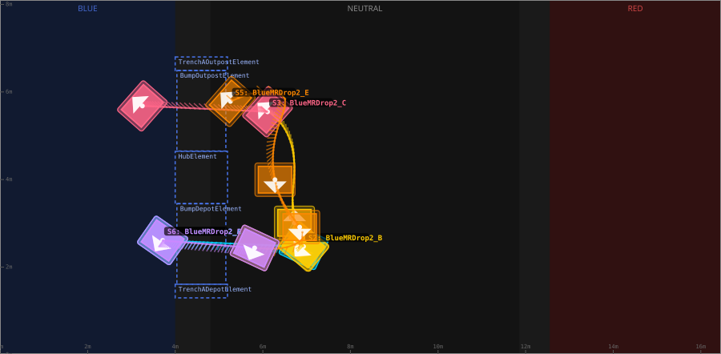
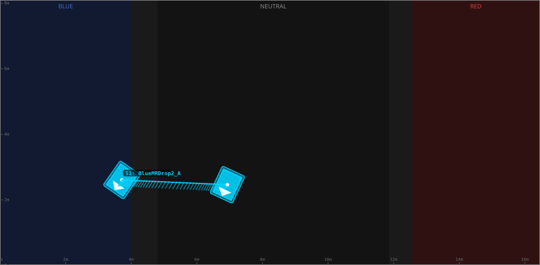
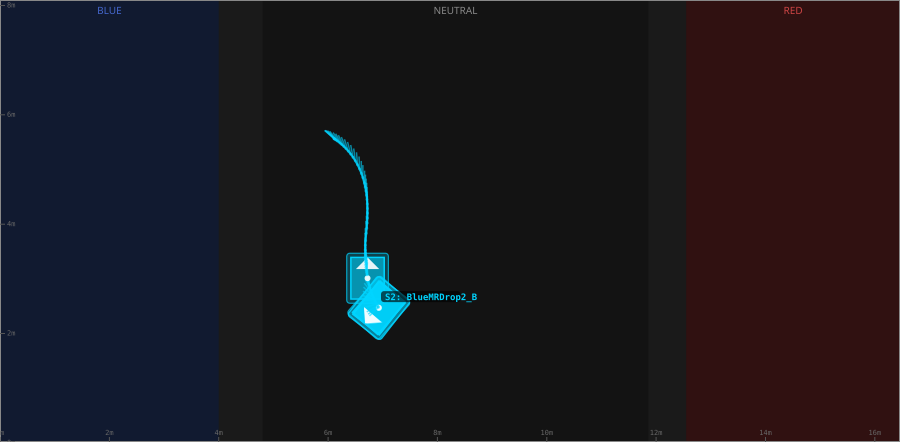
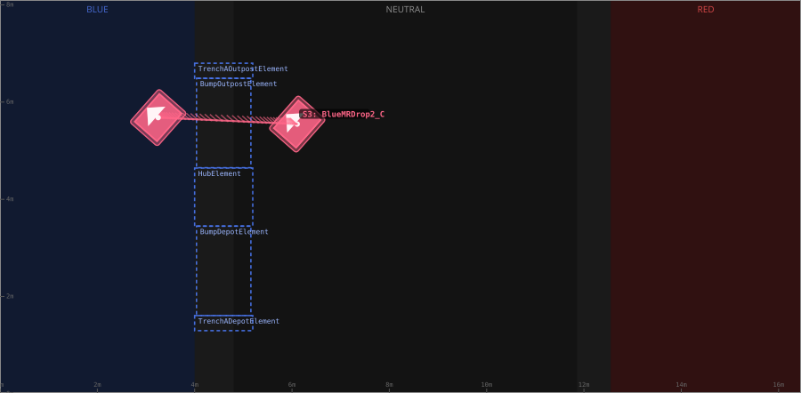
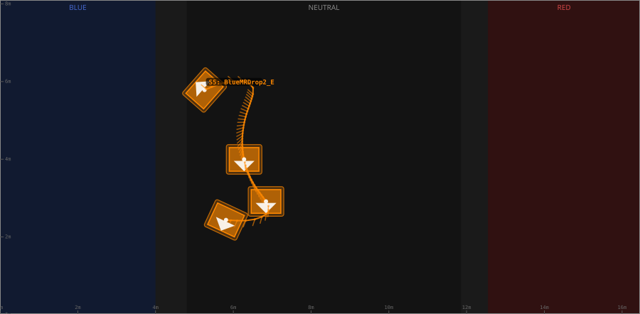

# Auton: BlueBOutDrop2NDepNOutScoreNCli

> Auto-generated from [`src/main/deploy/auton/BlueBOutDrop2NDepNOutScoreNCli.xml`](../../src/main/deploy/auton/BlueBOutDrop2NDepNOutScoreNCli.xml).  
> Do not edit this file manually -- push a change to the XML and the [auton-diagrams workflow](../../.github/workflows/auton-diagrams.yml) will regenerate it.

## State Diagram

```mermaid
stateDiagram-v2
    direction LR

    %% Green = intake active, Purple = intake off
    classDef intake  fill:#1a7a3a,color:#ffffff,stroke:#0d4a1f,font-weight:bold
    classDef noIntake fill:#5a4a8a,color:#ffffff,stroke:#3a2a6a,font-weight:bold

    Step1 : "Step 1 - TRAJECTORY_DRIVE BlueMRDrop2_A"
    Step2 : "Step 2 - TRAJECTORY_DRIVE BlueMRDrop2_B"
    Step3 : "Step 3 - TRAJECTORY_DRIVE BlueMRDrop2_C"
    Step4 : "Step 4 - TRAJECTORY_DRIVE BlueMRDrop2_D"
    Step5 : "Step 5 - TRAJECTORY_DRIVE BlueMRDrop2_E"
    Step6 : "Step 6 - TRAJECTORY_DRIVE BlueMRDrop2_F"

    class Step1 intake
    class Step2 intake
    class Step3 noIntake
    class Step4 intake
    class Step5 intake
    class Step6 intake

    [*] --> Step1 : "start"
    Step1 --> Step2: "intake=INTAKE | zones=RightBumpZone DRIVE_OVER_BUMP"
    Step2 --> Step3: "intake=INTAKE | zones=LaunchZone PREPARE_TO_LAUNCH"
    Step3 --> Step4: "zones=LeftBumpZone DRIVE_OVER_BUMP LaunchZone PREPARE_TO_LAUNCH"
    Step4 --> Step5: "intake=INTAKE | zones=LeftBumpZone DRIVE_OVER_BUMP LaunchZone PREPARE_TO_LAUNCH"
    Step5 --> Step6: "intake=INTAKE | zones=LaunchZone PREPARE_TO_LAUNCH"
    Step6 --> [*]: "intake=INTAKE | zones=RightBumpZone DRIVE_OVER_BUMP LaunchZone PREPARE_TO_LAUNCH"
```

## Primitive Summary

| Step | Primitive | Trajectory | Timeout | Intake | Launcher | Climber | Zones |
|------|-----------|------------|---------|--------|----------|---------|-------|
| 1 | TRAJECTORY_DRIVE | [BlueMRDrop2_A](../../src/main/deploy/choreo/BlueMRDrop2_A.traj) | 5.0 s | STATE_INTAKE | STATE_IDLE | STATE_OFF | BlueRightBumpZone |
| 2 | TRAJECTORY_DRIVE | [BlueMRDrop2_B](../../src/main/deploy/choreo/BlueMRDrop2_B.traj) | 5.0 s | STATE_INTAKE | STATE_IDLE | STATE_OFF | BlueLaunchZone |
| 3 | TRAJECTORY_DRIVE | [BlueMRDrop2_C](../../src/main/deploy/choreo/BlueMRDrop2_C.traj) | 5.0 s | STATE_OFF | STATE_IDLE | STATE_OFF | BlueLeftBumpZone, BlueLaunchZone |
| 4 | TRAJECTORY_DRIVE | BlueMRDrop2_D | 5.0 s | STATE_INTAKE | STATE_IDLE | STATE_OFF | BlueLeftBumpZone, BlueLaunchZone |
| 5 | TRAJECTORY_DRIVE | [BlueMRDrop2_E](../../src/main/deploy/choreo/BlueMRDrop2_E.traj) | 5.0 s | STATE_INTAKE | STATE_IDLE | STATE_OFF | BlueLaunchZone |
| 6 | TRAJECTORY_DRIVE | [BlueMRDrop2_F](../../src/main/deploy/choreo/BlueMRDrop2_F.traj) | 5.0 s | STATE_INTAKE | STATE_IDLE | STATE_OFF | BlueRightBumpZone, BlueLaunchZone |

## Trajectory Details

### All Trajectories Overview

### Step 1 -- BlueMRDrop2_A

- **File:** [`BlueMRDrop2_A.traj`](../../src/main/deploy/choreo/BlueMRDrop2_A.traj)
- **Duration:** 2.54 s
- **Timeout in auton XML:** 5.0 s
- **Colour in overview:** `#00d4ff`

| # | X (m) | Y (m) | Heading (deg) |
|---|-------|-------|---------------|
| 1 | 3.712 | 2.61 | 235.1 |
| 2 | 6.932 | 2.466 | 245.0 |

### Step 2 -- BlueMRDrop2_B

- **File:** [`BlueMRDrop2_B.traj`](../../src/main/deploy/choreo/BlueMRDrop2_B.traj)
- **Duration:** 2.732 s
- **Timeout in auton XML:** 5.0 s
- **Colour in overview:** `#ffcc00`

| # | X (m) | Y (m) | Heading (deg) |
|---|-------|-------|---------------|
| 1 | 6.932 | 2.466 | 232.1 |
| 2 | 6.722 | 3.011 | 90.0 |
| 3 | 6.679 | 3.488 | 90.0 |
| 4 | 6.625 | 4.885 | 90.0 |
| 5 | 6.109 | 5.565 | 139.0 |

### Step 3 -- BlueMRDrop2_C

- **File:** [`BlueMRDrop2_C.traj`](../../src/main/deploy/choreo/BlueMRDrop2_C.traj)
- **Duration:** 2.393 s
- **Timeout in auton XML:** 5.0 s
- **Colour in overview:** `#ff6688`

| # | X (m) | Y (m) | Heading (deg) |
|---|-------|-------|---------------|
| 1 | 6.109 | 5.548 | 138.6 |
| 2 | 3.249 | 5.681 | 138.6 |

### Step 4 -- BlueMRDrop2_D

- **File:** `BlueMRDrop2_D.traj` *(not found)*
- **Duration:** unknown
- **Timeout in auton XML:** 5.0 s
- **Colour in overview:** `#00d4ff`

### Step 5 -- BlueMRDrop2_E

- **File:** [`BlueMRDrop2_E.traj`](../../src/main/deploy/choreo/BlueMRDrop2_E.traj)
- **Duration:** 3.1 s
- **Timeout in auton XML:** 5.0 s
- **Colour in overview:** `#ff8800`

| # | X (m) | Y (m) | Heading (deg) |
|---|-------|-------|---------------|
| 1 | 5.26 | 5.783 | 138.6 |
| 2 | 6.506 | 5.675 | 137.9 |
| 3 | 6.278 | 3.997 | 270.0 |
| 4 | 6.841 | 2.914 | 270.0 |
| 5 | 5.813 | 2.438 | 245.0 |

### Step 6 -- BlueMRDrop2_F

- **File:** [`BlueMRDrop2_F.traj`](../../src/main/deploy/choreo/BlueMRDrop2_F.traj)
- **Duration:** 2.054 s
- **Timeout in auton XML:** 5.0 s
- **Colour in overview:** `#cc88ff`

| # | X (m) | Y (m) | Heading (deg) |
|---|-------|-------|---------------|
| 1 | 3.712 | 2.61 | 235.1 |
| 2 | 5.813 | 2.438 | 245.0 |

## Zone Legend

| Zone file | Effect when entered |
|-----------|---------------------|
| `BlueLaunchZone` | `launcherState -> STATE_PREPARE_TO_LAUNCH` |
| `BlueLeftBumpZone` | `pathUpdateOption = DRIVE_OVER_BUMP` |
| `BlueRightBumpZone` | `pathUpdateOption = DRIVE_OVER_BUMP` |
