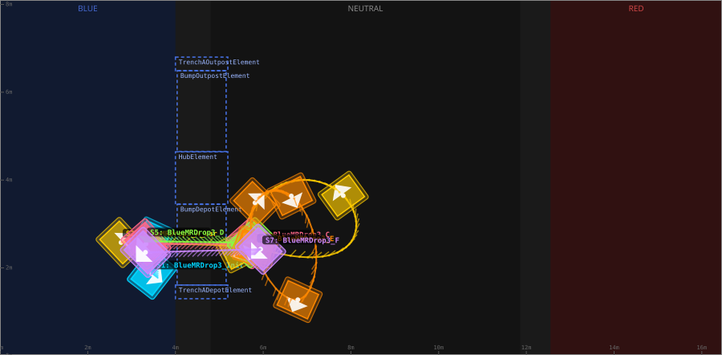
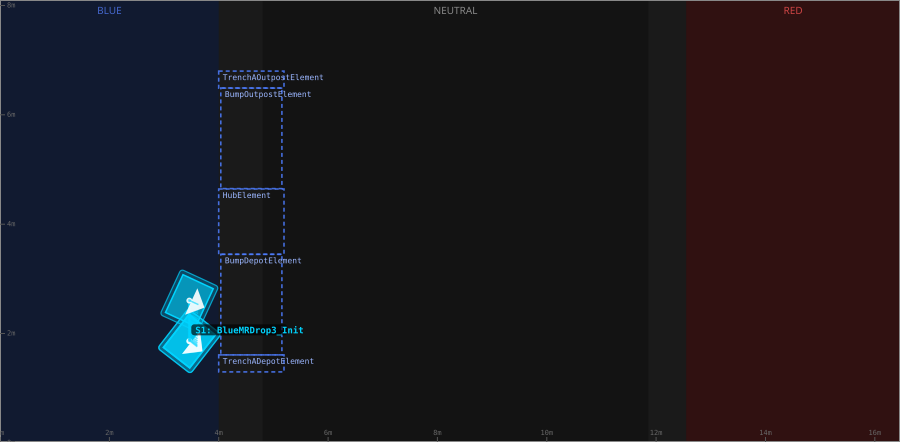
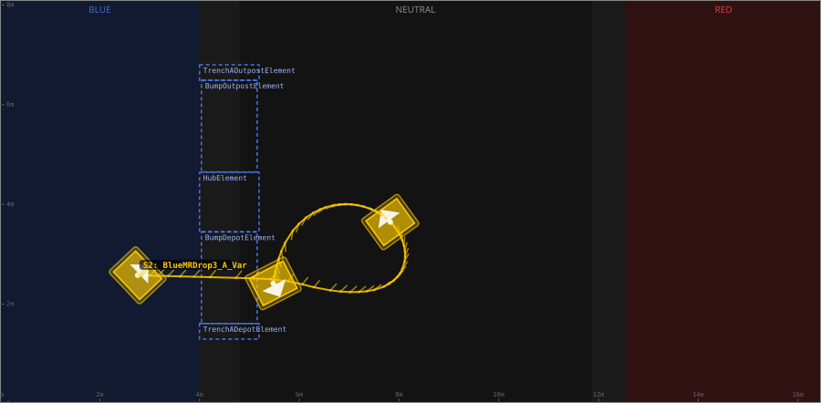
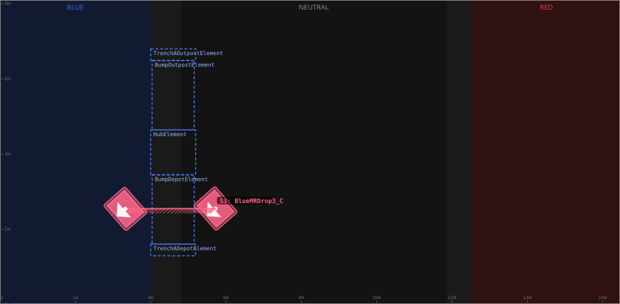
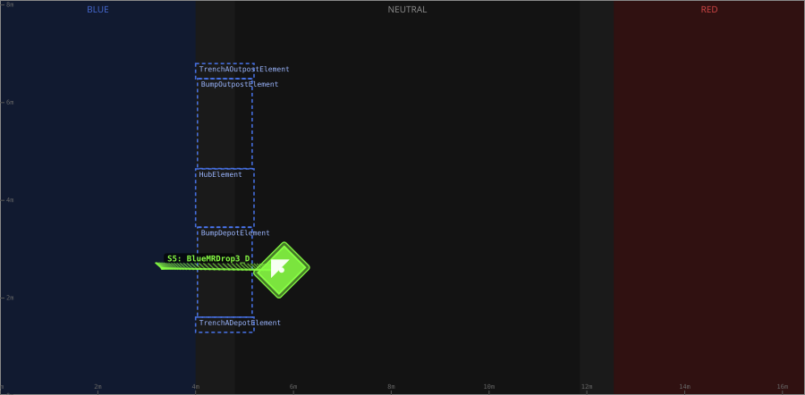
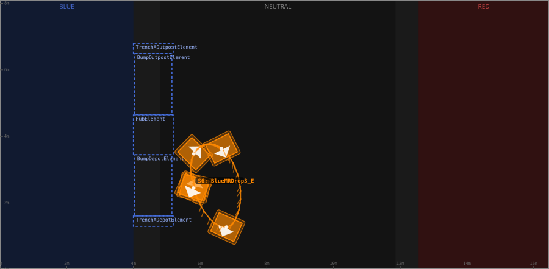
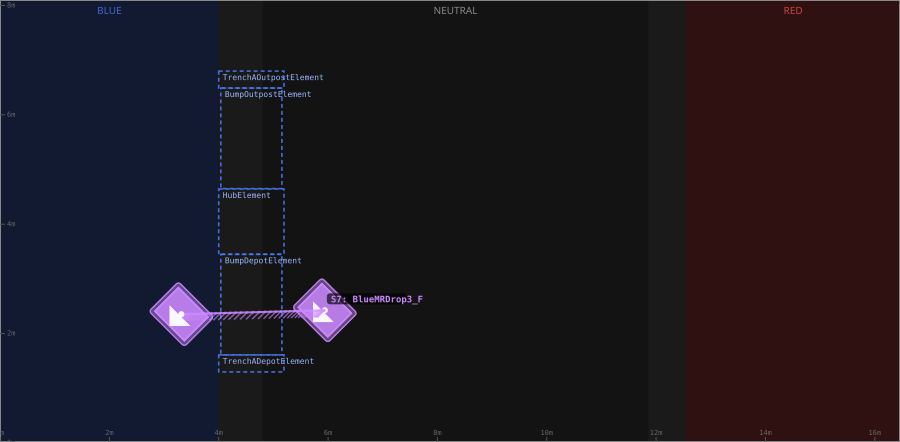

# Auton: BlueBOutKeep3NDepNOutScoreNCliLose

> Auto-generated from [`src/main/deploy/auton/BlueBOutKeep3NDepNOutScoreNCliLose.xml`](../../src/main/deploy/auton/BlueBOutKeep3NDepNOutScoreNCliLose.xml).  
> Do not edit this file manually -- push a change to the XML and the [auton-diagrams workflow](../../.github/workflows/auton-diagrams.yml) will regenerate it.

## State Diagram

```mermaid
stateDiagram-v2
    direction LR

    %% Green = intake active, Purple = intake off
    classDef intake  fill:#1a7a3a,color:#ffffff,stroke:#0d4a1f,font-weight:bold
    classDef noIntake fill:#5a4a8a,color:#ffffff,stroke:#3a2a6a,font-weight:bold

    Step1 : "Step 1 - TRAJECTORY_DRIVE BlueMRDrop3_Init"
    Step2 : "Step 2 - TRAJECTORY_DRIVE BlueMRDrop3_A_Var"
    Step3 : "Step 3 - TRAJECTORY_DRIVE BlueMRDrop3_C"
    Step4 : "Step 4 - DRIVE_STOP_MECH --"
    Step5 : "Step 5 - TRAJECTORY_DRIVE BlueMRDrop3_D"
    Step6 : "Step 6 - TRAJECTORY_DRIVE BlueMRDrop3_E"
    Step7 : "Step 7 - TRAJECTORY_DRIVE BlueMRDrop3_F"
    Step8 : "Step 8 - DRIVE_STOP_MECH --"

    class Step1 noIntake
    class Step2 intake
    class Step3 noIntake
    class Step4 noIntake
    class Step5 intake
    class Step6 intake
    class Step7 noIntake
    class Step8 noIntake

    [*] --> Step1 : "start"
    Step1 --> Step2: "zones=RightBumpZoneRect DRIVE_OVER_BUMP"
    Step2 --> Step3: "intake=INTAKE"
    Step3 --> Step4: "zones=RightBumpZone DRIVE_OVER_BUMP LaunchZone"
    Step4 --> Step5
    Step5 --> Step6: "intake=INTAKE | zones=RightBumpZone DRIVE_OVER_BUMP"
    Step6 --> Step7: "intake=INTAKE"
    Step7 --> Step8: "zones=LaunchZone RightBumpZone DRIVE_OVER_BUMP"
    Step8 --> [*]
```

## Primitive Summary

| Step | Primitive | Trajectory | Timeout | Intake | Launcher | Climber | Zones |
|------|-----------|------------|---------|--------|----------|---------|-------|
| 1 | TRAJECTORY_DRIVE | [BlueMRDrop3_Init](../../src/main/deploy/choreo/BlueMRDrop3_Init.traj) | 3.0 s | STATE_OFF | STATE_IDLE | STATE_OFF | BlueRightBumpZoneRect |
| 2 | TRAJECTORY_DRIVE | [BlueMRDrop3_A_Var](../../src/main/deploy/choreo/BlueMRDrop3_A_Var.traj) | 3.0 s | STATE_INTAKE | STATE_IDLE | STATE_OFF | -- |
| 3 | TRAJECTORY_DRIVE | [BlueMRDrop3_C](../../src/main/deploy/choreo/BlueMRDrop3_C.traj) | 5.0 s | STATE_OFF | STATE_IDLE | STATE_OFF | BlueRightBumpZone, BlueLaunchZone |
| 4 | DRIVE_STOP_MECH | -- | 5.0 s | STATE_OFF | STATE_IDLE | STATE_OFF | -- |
| 5 | TRAJECTORY_DRIVE | [BlueMRDrop3_D](../../src/main/deploy/choreo/BlueMRDrop3_D.traj) | 5.0 s | STATE_INTAKE | STATE_IDLE | STATE_OFF | BlueRightBumpZone |
| 6 | TRAJECTORY_DRIVE | [BlueMRDrop3_E](../../src/main/deploy/choreo/BlueMRDrop3_E.traj) | 5.0 s | STATE_INTAKE | STATE_IDLE | STATE_OFF | -- |
| 7 | TRAJECTORY_DRIVE | [BlueMRDrop3_F](../../src/main/deploy/choreo/BlueMRDrop3_F.traj) | 3.0 s | STATE_OFF | STATE_IDLE | STATE_OFF | BlueLaunchZone, BlueRightBumpZone |
| 8 | DRIVE_STOP_MECH | -- | 5.0 s | STATE_OFF | STATE_IDLE | STATE_OFF | -- |

## Trajectory Details

### All Trajectories Overview

### Step 1 -- BlueMRDrop3_Init

- **File:** [`BlueMRDrop3_Init.traj`](../../src/main/deploy/choreo/BlueMRDrop3_Init.traj)
- **Duration:** 0.865 s
- **Timeout in auton XML:** 3.0 s
- **Colour in overview:** `#00d4ff`

| # | X (m) | Y (m) | Heading (deg) |
|---|-------|-------|---------------|
| 1 | 3.463 | 1.858 | 322.1 |
| 2 | 3.463 | 2.605 | 335.3 |

### Step 2 -- BlueMRDrop3_A_Var

- **File:** [`BlueMRDrop3_A_Var.traj`](../../src/main/deploy/choreo/BlueMRDrop3_A_Var.traj)
- **Duration:** 3.066 s
- **Timeout in auton XML:** 3.0 s
- **Colour in overview:** `#ffcc00`

| # | X (m) | Y (m) | Heading (deg) |
|---|-------|-------|---------------|
| 1 | 2.759 | 2.578 | 43.3 |
| 2 | 5.942 | 2.426 | 51.0 |
| 3 | 7.848 | 2.438 | 40.3 |
| 4 | 7.824 | 3.646 | 125.9 |
| 5 | 6.363 | 3.876 | 226.2 |
| 6 | 5.477 | 2.416 | 297.1 |

### Step 3 -- BlueMRDrop3_C

- **File:** [`BlueMRDrop3_C.traj`](../../src/main/deploy/choreo/BlueMRDrop3_C.traj)
- **Duration:** 2.19 s
- **Timeout in auton XML:** 5.0 s
- **Colour in overview:** `#ff6688`

| # | X (m) | Y (m) | Heading (deg) |
|---|-------|-------|---------------|
| 1 | 5.723 | 2.554 | 221.4 |
| 2 | 3.327 | 2.546 | 221.1 |

### Step 5 -- BlueMRDrop3_D

- **File:** [`BlueMRDrop3_D.traj`](../../src/main/deploy/choreo/BlueMRDrop3_D.traj)
- **Duration:** 2.213 s
- **Timeout in auton XML:** 5.0 s
- **Colour in overview:** `#88ff44`

| # | X (m) | Y (m) | Heading (deg) |
|---|-------|-------|---------------|
| 1 | 3.311 | 2.605 | 138.6 |
| 2 | 5.758 | 2.573 | 135.0 |

### Step 6 -- BlueMRDrop3_E

- **File:** [`BlueMRDrop3_E.traj`](../../src/main/deploy/choreo/BlueMRDrop3_E.traj)
- **Duration:** 2.602 s
- **Timeout in auton XML:** 5.0 s
- **Colour in overview:** `#ff8800`

| # | X (m) | Y (m) | Heading (deg) |
|---|-------|-------|---------------|
| 1 | 5.822 | 2.464 | 75.9 |
| 2 | 5.813 | 3.482 | 45.5 |
| 3 | 6.642 | 3.638 | 296.6 |
| 4 | 6.79 | 1.274 | 245.5 |
| 5 | 5.797 | 2.448 | 245.8 |

### Step 7 -- BlueMRDrop3_F

- **File:** [`BlueMRDrop3_F.traj`](../../src/main/deploy/choreo/BlueMRDrop3_F.traj)
- **Duration:** 2.293 s
- **Timeout in auton XML:** 3.0 s
- **Colour in overview:** `#cc88ff`

| # | X (m) | Y (m) | Heading (deg) |
|---|-------|-------|---------------|
| 1 | 5.942 | 2.426 | 225.0 |
| 2 | 3.316 | 2.354 | 225.0 |

## Zone Legend

| Zone file | Effect when entered |
|-----------|---------------------|
| `BlueLaunchZone` | *(no tracked effects)* |
| `BlueRightBumpZone` | `pathUpdateOption = DRIVE_OVER_BUMP` |
| `BlueRightBumpZoneRect` | `pathUpdateOption = DRIVE_OVER_BUMP` |
