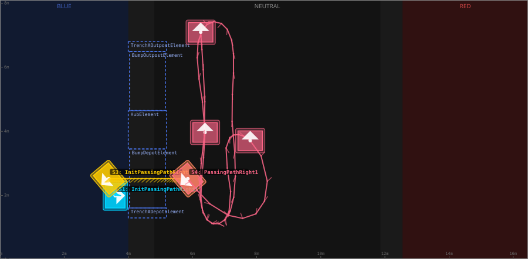
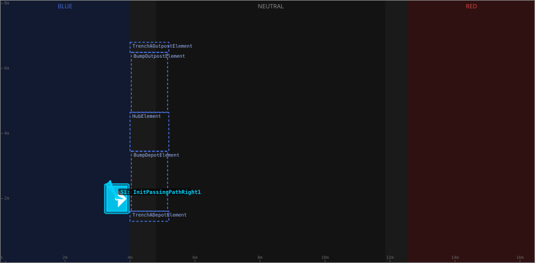
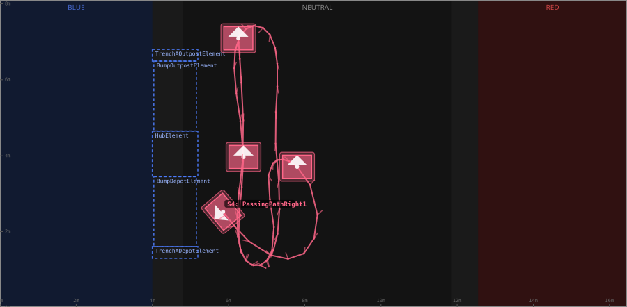

# Auton: BlueBOutLaunch1ComboNDepNOutPassNCli

> Auto-generated from [`src/main/deploy/auton/BlueBOutLaunch1ComboNDepNOutPassNCli.xml`](../../src/main/deploy/auton/BlueBOutLaunch1ComboNDepNOutPassNCli.xml).  
> Do not edit this file manually -- push a change to the XML and the [auton-diagrams workflow](../../.github/workflows/auton-diagrams.yml) will regenerate it.

## State Diagram

```mermaid
stateDiagram-v2
    direction LR

    %% Green = intake active, Purple = intake off
    classDef intake  fill:#1a7a3a,color:#ffffff,stroke:#0d4a1f,font-weight:bold
    classDef noIntake fill:#5a4a8a,color:#ffffff,stroke:#3a2a6a,font-weight:bold

    Step1 : "Step 1 - TRAJECTORY_DRIVE InitPassingPathRight1"
    Step2 : "Step 2 - DRIVE_STOP_MECH --"
    Step3 : "Step 3 - TRAJECTORY_DRIVE InitPassingPathRight2"
    Step4 : "Step 4 - TRAJECTORY_DRIVE PassingPathRight1"

    class Step1 noIntake
    class Step2 noIntake
    class Step3 noIntake
    class Step4 intake

    [*] --> Step1 : "start"
    Step1 --> Step2
    Step2 --> Step3: "launcher=PREPARE_TO_LAUNCH"
    Step3 --> Step4
    Step4 --> [*]: "intake=INTAKE | launcher=PREPARE_TO_LAUNCH"
```

## Primitive Summary

| Step | Primitive | Trajectory | Timeout | Intake | Launcher | Climber | Zones |
|------|-----------|------------|---------|--------|----------|---------|-------|
| 1 | TRAJECTORY_DRIVE | [InitPassingPathRight1](../../src/main/deploy/choreo/InitPassingPathRight1.traj) | 3.0 s | STATE_OFF | STATE_IDLE | STATE_OFF | -- |
| 2 | DRIVE_STOP_MECH | -- | 5.0 s | STATE_OFF | STATE_PREPARE_TO_LAUNCH | STATE_OFF | -- |
| 3 | TRAJECTORY_DRIVE | [InitPassingPathRight2](../../src/main/deploy/choreo/InitPassingPathRight2.traj) | 3.0 s | STATE_OFF | STATE_IDLE | STATE_OFF | -- |
| 4 | TRAJECTORY_DRIVE | [PassingPathRight1](../../src/main/deploy/choreo/PassingPathRight1.traj) | 20.0 s | STATE_INTAKE | STATE_PREPARE_TO_LAUNCH | STATE_OFF | -- |

## Trajectory Details

### All Trajectories Overview

### Step 1 -- InitPassingPathRight1

- **File:** [`InitPassingPathRight1.traj`](../../src/main/deploy/choreo/InitPassingPathRight1.traj)
- **Duration:** 0.88 s
- **Timeout in auton XML:** 3.0 s
- **Colour in overview:** `#00d4ff`

| # | X (m) | Y (m) | Heading (deg) |
|---|-------|-------|---------------|
| 1 | 3.593 | 1.994 | 0.0 |
| 2 | 3.387 | 2.535 | 220.1 |

### Step 3 -- InitPassingPathRight2

- **File:** [`InitPassingPathRight2.traj`](../../src/main/deploy/choreo/InitPassingPathRight2.traj)
- **Duration:** 1.815 s
- **Timeout in auton XML:** 3.0 s
- **Colour in overview:** `#ffcc00`

| # | X (m) | Y (m) | Heading (deg) |
|---|-------|-------|---------------|
| 1 | 3.387 | 2.524 | 220.1 |
| 2 | 5.856 | 2.524 | 220.1 |

### Step 4 -- PassingPathRight1

- **File:** [`PassingPathRight1.traj`](../../src/main/deploy/choreo/PassingPathRight1.traj)
- **Duration:** 14.356 s
- **Timeout in auton XML:** 20.0 s
- **Colour in overview:** `#ff6688`

| # | X (m) | Y (m) | Heading (deg) |
|---|-------|-------|---------------|
| 1 | 5.856 | 2.524 | 220.1 |
| 2 | 7.84 | 1.341 | 90.0 |
| 3 | 7.799 | 3.71 | 90.0 |
| 4 | 7.163 | 3.805 | 270.0 |
| 5 | 7.082 | 1.355 | 270.0 |
| 6 | 6.378 | 1.355 | 90.0 |
| 7 | 6.392 | 3.967 | 90.0 |
| 8 | 6.256 | 7.067 | 90.0 |
| 9 | 7.123 | 7.121 | 270.0 |
| 10 | 7.231 | 4.874 | 270.0 |
| 11 | 7.082 | 1.328 | 270.0 |
| 12 | 6.378 | 1.355 | 90.0 |
| 13 | 6.378 | 3.967 | 90.0 |
| 14 | 6.256 | 7.094 | 90.0 |

## Zone Legend

| Zone file | Effect when entered |
|-----------|---------------------|

