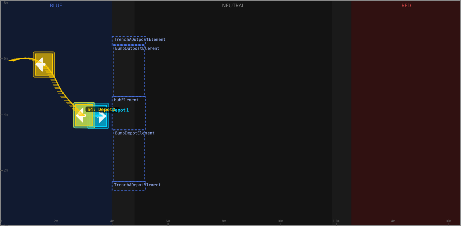
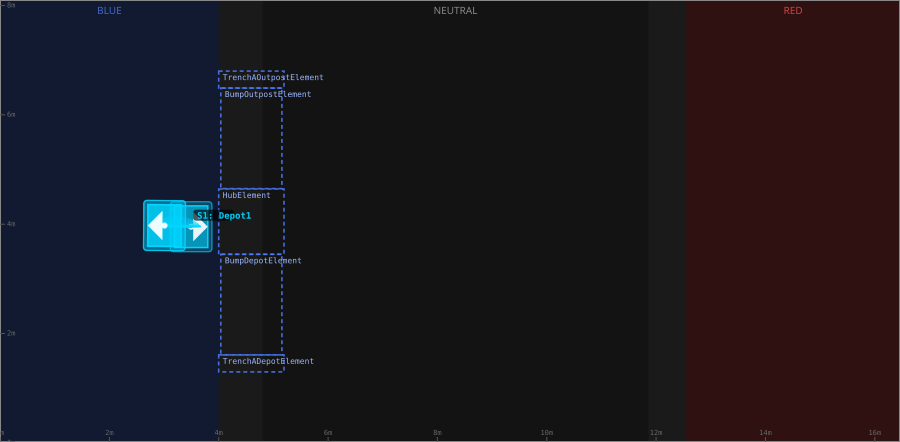
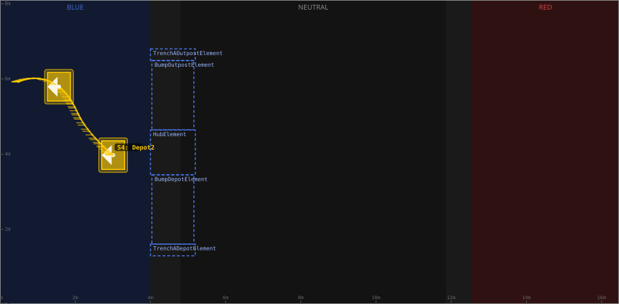

# Auton: BlueHubLaunch0DepNOutScoreNCli

> Auto-generated from [`src/main/deploy/auton/BlueHubLaunch0DepNOutScoreNCli.xml`](../../src/main/deploy/auton/BlueHubLaunch0DepNOutScoreNCli.xml).  
> Do not edit this file manually -- push a change to the XML and the [auton-diagrams workflow](../../.github/workflows/auton-diagrams.yml) will regenerate it.

## State Diagram

```mermaid
stateDiagram-v2
    direction LR

    %% Green = intake active, Purple = intake off
    classDef intake  fill:#1a7a3a,color:#ffffff,stroke:#0d4a1f,font-weight:bold
    classDef noIntake fill:#5a4a8a,color:#ffffff,stroke:#3a2a6a,font-weight:bold

    Step1 : "Step 1 - TRAJECTORY_DRIVE Depot1"
    Step2 : "Step 2 - DO_NOTHING --"
    Step3 : "Step 3 - DRIVE_STOP_MECH --"
    Step4 : "Step 4 - TRAJECTORY_DRIVE Depot2"
    Step5 : "Step 5 - DRIVE_STOP_MECH --"

    class Step1 noIntake
    class Step2 intake
    class Step3 noIntake
    class Step4 intake
    class Step5 intake

    [*] --> Step1 : "start"
    Step1 --> Step2
    Step2 --> Step3: "intake=FORCE_INTAKE_AUTON | launcher=PREPARE_TO_LAUNCH"
    Step3 --> Step4: "launcher=PREPARE_TO_LAUNCH"
    Step4 --> Step5: "intake=INTAKE"
    Step5 --> [*]: "intake=FORCE_INTAKE_AUTON | launcher=PREPARE_TO_LAUNCH"
```

## Primitive Summary

| Step | Primitive | Trajectory | Timeout | Intake | Launcher | Climber | Zones |
|------|-----------|------------|---------|--------|----------|---------|-------|
| 1 | TRAJECTORY_DRIVE | [Depot1](../../src/main/deploy/choreo/Depot1.traj) | 3.0 s | STATE_OFF | STATE_IDLE | STATE_OFF | -- |
| 2 | DO_NOTHING | -- | 5.0 s | STATE_FORCE_INTAKE_AUTON | STATE_PREPARE_TO_LAUNCH | STATE_OFF | -- |
| 3 | DRIVE_STOP_MECH | -- | 5.0 s | STATE_OFF | STATE_PREPARE_TO_LAUNCH | STATE_OFF | -- |
| 4 | TRAJECTORY_DRIVE | [Depot2](../../src/main/deploy/choreo/Depot2.traj) | 4.0 s | STATE_INTAKE | STATE_IDLE | STATE_OFF | -- |
| 5 | DRIVE_STOP_MECH | -- | 10.0 s | STATE_FORCE_INTAKE_AUTON | STATE_PREPARE_TO_LAUNCH | STATE_OFF | -- |

## Trajectory Details

### All Trajectories Overview

### Step 1 -- Depot1

- **File:** [`Depot1.traj`](../../src/main/deploy/choreo/Depot1.traj)
- **Duration:** 0.807 s
- **Timeout in auton XML:** 3.0 s
- **Colour in overview:** `#00d4ff`

| # | X (m) | Y (m) | Heading (deg) |
|---|-------|-------|---------------|
| 1 | 3.495 | 3.953 | 0.0 |
| 2 | 3.008 | 3.975 | 180.0 |

### Step 4 -- Depot2

- **File:** [`Depot2.traj`](../../src/main/deploy/choreo/Depot2.traj)
- **Duration:** 2.911 s
- **Timeout in auton XML:** 4.0 s
- **Colour in overview:** `#ffcc00`

| # | X (m) | Y (m) | Heading (deg) |
|---|-------|-------|---------------|
| 1 | 3.008 | 3.975 | 180.0 |
| 2 | 2.174 | 4.895 | 0.0 |
| 3 | 1.568 | 5.794 | 0.0 |
| 4 | 0.485 | 5.924 | 180.0 |

## Zone Legend

| Zone file | Effect when entered |
|-----------|---------------------|

