# Auton: BlueHubLaunch0DepOutScoreClimb

> Auto-generated from [`src/main/deploy/auton/BlueHubLaunch0DepOutScoreClimb.xml`](../../src/main/deploy/auton/BlueHubLaunch0DepOutScoreClimb.xml).  
> Do not edit this file manually -- push a change to the XML and the [auton-diagrams workflow](../../.github/workflows/auton-diagrams.yml) will regenerate it.

## State Diagram

```mermaid
stateDiagram-v2
    direction LR

    %% Green = intake active, Purple = intake off
    classDef intake  fill:#1a7a3a,color:#ffffff,stroke:#0d4a1f,font-weight:bold
    classDef noIntake fill:#5a4a8a,color:#ffffff,stroke:#3a2a6a,font-weight:bold

    Step1 : Step 1 - DRIVE_STOP_MECH --
    Step2 : Step 2 - TRAJECTORY_DRIVE BlueMLDepotOutpost_A
    Step3 : Step 3 - TRAJECTORY_DRIVE BlueMLDepotOutpost_B
    Step4 : Step 4 - TRAJECTORY_DRIVE BlueMLDepotOutpost_C
    Step5 : Step 5 - TRAJECTORY_DRIVE BlueMLDepotOutpost_D
    Step6 : Step 6 - DRIVE_STOP_MECH --

    class Step1 noIntake
    class Step2 intake
    class Step3 intake
    class Step4 intake
    class Step5 intake
    class Step6 noIntake

    [*] --> Step1 : start
    Step1 --> Step2: launcher=LAUNCH
    Step2 --> Step3: intake=INTAKE zones=LaunchZone PREPARE_TO_LAUNCH DepotZone DRIVE_TO_DEPOT
    Step3 --> Step4: intake=INTAKE zones=LaunchZone PREPARE_TO_LAUNCH OutpostZone DRIVE_TO_OUTPOST
    Step4 --> Step5: intake=INTAKE zones=LaunchZone PREPARE_TO_LAUNCH
    Step5 --> Step6: intake=INTAKE zones=LaunchZone PREPARE_TO_LAUNCH
    Step6 --> [*]: zones=ClimbingZone DRIVE_TO_TOWER
```

## Primitive Summary

| Step | Primitive | Trajectory | Timeout | Intake | Launcher | Climber | Zones |
|------|-----------|------------|---------|--------|----------|---------|-------|
| 1 | DRIVE_STOP_MECH | -- | -- s | STATE_OFF | STATE_LAUNCH | STATE_OFF | ? |
| 2 | TRAJECTORY_DRIVE | BlueMLDepotOutpost_A | 4.0 s | STATE_INTAKE | STATE_IDLE | STATE_OFF | BlueLaunchZone, BlueDepotZone |
| 3 | TRAJECTORY_DRIVE | BlueMLDepotOutpost_B | 4.0 s | STATE_INTAKE | STATE_IDLE | STATE_OFF | BlueLaunchZone, BlueOutpostZone |
| 4 | TRAJECTORY_DRIVE | BlueMLDepotOutpost_C | 3.0 s | STATE_INTAKE | STATE_IDLE | STATE_OFF | BlueLaunchZone |
| 5 | TRAJECTORY_DRIVE | BlueMLDepotOutpost_D | 3.0 s | STATE_INTAKE | STATE_IDLE | STATE_OFF | BlueLaunchZone |
| 6 | DRIVE_STOP_MECH | -- | -- s | STATE_OFF | STATE_IDLE | STATE_OFF | BlueClimbingZone |

## Zone Legend

| Zone file | Effect when entered |
|-----------|---------------------|
| `BlueClimbingZone` | `pathUpdateOption = DRIVE_TO_TOWER` |
| `BlueDepotZone` | `pathUpdateOption = DRIVE_TO_DEPOT` |
| `BlueLaunchZone` | `launcherState -> STATE_PREPARE_TO_LAUNCH` |
| `BlueOutpostZone` | `pathUpdateOption = DRIVE_TO_OUTPOST` |
