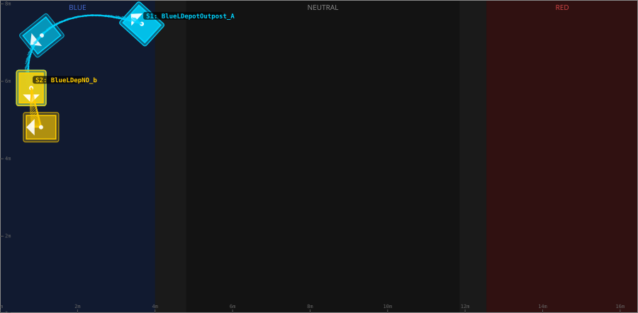
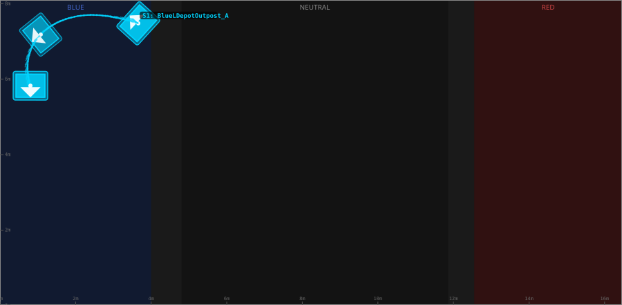
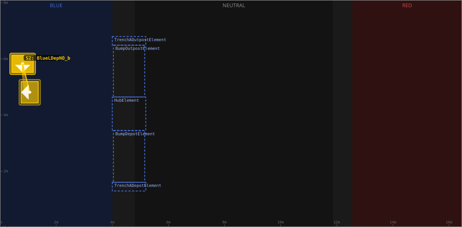

# Auton: BlueTDepLaunch0DepNOutScoreClimb

> Auto-generated from [`src/main/deploy/auton/BlueTDepLaunch0DepNOutScoreClimb.xml`](../../src/main/deploy/auton/BlueTDepLaunch0DepNOutScoreClimb.xml).  
> Do not edit this file manually -- push a change to the XML and the [auton-diagrams workflow](../../.github/workflows/auton-diagrams.yml) will regenerate it.

## State Diagram

```mermaid
stateDiagram-v2
    direction LR

    %% Green = intake active, Purple = intake off
    classDef intake  fill:#1a7a3a,color:#ffffff,stroke:#0d4a1f,font-weight:bold
    classDef noIntake fill:#5a4a8a,color:#ffffff,stroke:#3a2a6a,font-weight:bold

    Step1 : Step 1 - TRAJECTORY_DRIVE BlueLDepotOutpost_A
    Step2 : Step 2 - TRAJECTORY_DRIVE BlueLDepNO_b
    Step3 : Step 3 - DRIVE_STOP_MECH --

    class Step1 intake
    class Step2 intake
    class Step3 noIntake

    [*] --> Step1 : start
    Step1 --> Step2: intake=INTAKE zones=LaunchZone PREPARE_TO_LAUNCH
    Step2 --> Step3: intake=INTAKE zones=LaunchZone PREPARE_TO_LAUNCH
    Step3 --> [*]: zones=ClimbingZone DRIVE_TO_TOWER
```

## Primitive Summary

| Step | Primitive | Trajectory | Timeout | Intake | Launcher | Climber | Zones |
|------|-----------|------------|---------|--------|----------|---------|-------|
| 1 | TRAJECTORY_DRIVE | [BlueLDepotOutpost_A](../../src/main/deploy/choreo/BlueLDepotOutpost_A.traj) | 3.5 s | STATE_INTAKE | STATE_IDLE | STATE_OFF | BlueLaunchZone |
| 2 | TRAJECTORY_DRIVE | [BlueLDepNO_b](../../src/main/deploy/choreo/BlueLDepNO_b.traj) | 4.0 s | STATE_INTAKE | STATE_IDLE | STATE_OFF | BlueLaunchZone |
| 3 | DRIVE_STOP_MECH | -- | -- s | STATE_OFF | STATE_IDLE | STATE_OFF | BlueClimbingZone |

## Trajectory Details

### All Trajectories Overview

### Step 1 -- BlueLDepotOutpost_A

- **File:** [`BlueLDepotOutpost_A.traj`](../../src/main/deploy/choreo/BlueLDepotOutpost_A.traj)
- **Duration:** 2.653 s
- **Timeout in auton XML:** 3.5 s
- **Colour in overview:** `#00d4ff`

| # | X (m) | Y (m) | Heading (deg) |
|---|-------|-------|---------------|
| 1 | 3.66 | 7.482 | 137.7 |
| 2 | 1.078 | 7.183 | 0.0 |
| 3 | 0.806 | 5.828 | 270.0 |

### Step 2 -- BlueLDepNO_b

- **File:** [`BlueLDepNO_b.traj`](../../src/main/deploy/choreo/BlueLDepNO_b.traj)
- **Duration:** 1.181 s
- **Timeout in auton XML:** 4.0 s
- **Colour in overview:** `#ffcc00`

| # | X (m) | Y (m) | Heading (deg) |
|---|-------|-------|---------------|
| 1 | 0.806 | 5.828 | 270.0 |
| 2 | 1.059 | 4.814 | 180.0 |

## Zone Legend

| Zone file | Effect when entered |
|-----------|---------------------|
| `BlueClimbingZone` | `pathUpdateOption = DRIVE_TO_TOWER` |
| `BlueLaunchZone` | `launcherState -> STATE_PREPARE_TO_LAUNCH` |
