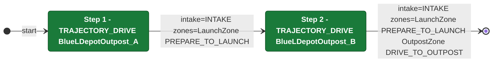

# Auton: BlueTDepLaunch0DepOutScoreNCli

> Auto-generated from [`src/main/deploy/auton/BlueTDepLaunch0DepOutScoreNCli.xml`](../../src/main/deploy/auton/BlueTDepLaunch0DepOutScoreNCli.xml).  
> Do not edit this file manually -- push a change to the XML and the [auton-diagrams workflow](../../.github/workflows/auton-diagrams.yml) will regenerate it.

## State Diagram

## Primitive Summary

| Step | Primitive | Trajectory | Timeout | Intake | Launcher | Climber | Zones |
|------|-----------|------------|---------|--------|----------|---------|-------|
| 1 | TRAJECTORY_DRIVE | BlueLDepotOutpost_A | 4.0 s | STATE_INTAKE | STATE_IDLE | STATE_OFF | BlueLaunchZone |
| 2 | TRAJECTORY_DRIVE | BlueLDepotOutpost_B | 4.0 s | STATE_INTAKE | STATE_IDLE | STATE_OFF | BlueLaunchZone, BlueOutpostZone |

## Zone Legend

| Zone file | Effect when entered |
|-----------|---------------------|
| `BlueLaunchZone` | `launcherState -> STATE_PREPARE_TO_LAUNCH` |
| `BlueOutpostZone` | `pathUpdateOption = DRIVE_TO_OUTPOST` |
