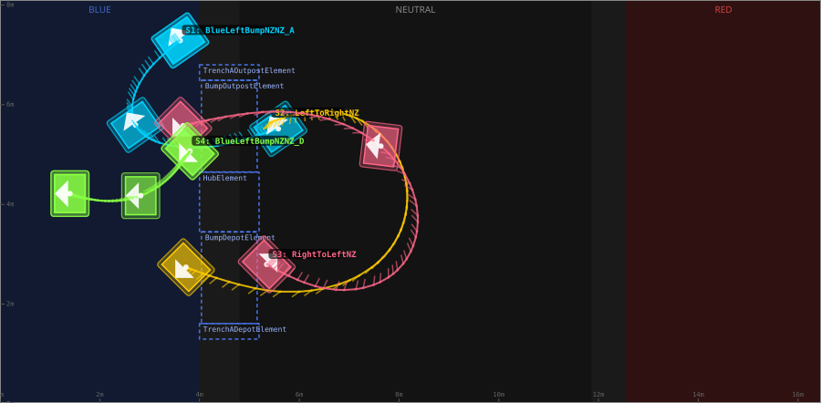
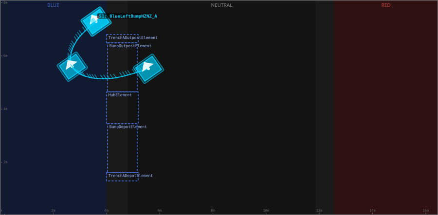
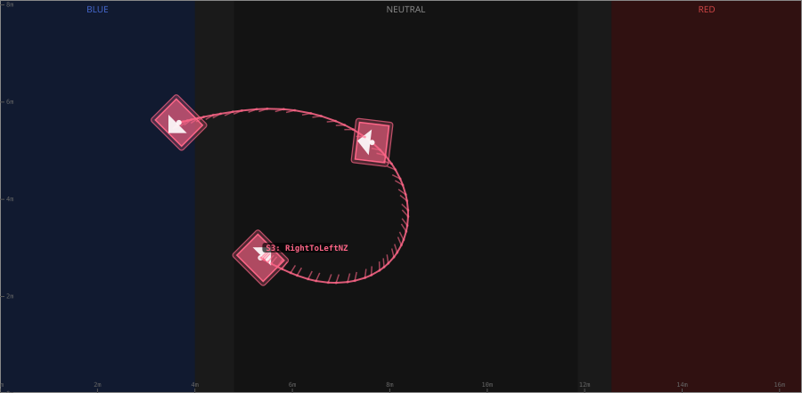
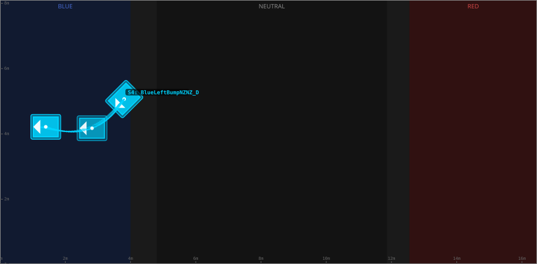

# Auton: BlueTDepLaunch2NDepNOutScoreClimb

> Auto-generated from [`src/main/deploy/auton/BlueTDepLaunch2NDepNOutScoreClimb.xml`](../../src/main/deploy/auton/BlueTDepLaunch2NDepNOutScoreClimb.xml).  
> Do not edit this file manually -- push a change to the XML and the [auton-diagrams workflow](../../.github/workflows/auton-diagrams.yml) will regenerate it.

## State Diagram

```mermaid
stateDiagram-v2
    direction LR

    %% Green = intake active, Purple = intake off
    classDef intake  fill:#1a7a3a,color:#ffffff,stroke:#0d4a1f,font-weight:bold
    classDef noIntake fill:#5a4a8a,color:#ffffff,stroke:#3a2a6a,font-weight:bold

    Step1 : "Step 1 - TRAJECTORY_DRIVE BlueLeftBumpNZNZ_A"
    Step2 : "Step 2 - TRAJECTORY_DRIVE LeftToRightNZ"
    Step3 : "Step 3 - TRAJECTORY_DRIVE RightToLeftNZ"
    Step4 : "Step 4 - TRAJECTORY_DRIVE BlueLeftBumpNZNZ_D"

    class Step1 intake
    class Step2 intake
    class Step3 intake
    class Step4 noIntake

    [*] --> Step1 : "start"
    Step1 --> Step2: "intake=INTAKE | zones=LeftBumpZone DRIVE_OVER_BUMP LaunchZone PREPARE_TO_LAUNCH"
    Step2 --> Step3: "intake=INTAKE | zones=RightBumpZone DRIVE_OVER_BUMP LaunchZone PREPARE_TO_LAUNCH"
    Step3 --> Step4: "intake=INTAKE | zones=LeftBumpZone DRIVE_OVER_BUMP"
    Step4 --> [*]: "zones=LaunchZone PREPARE_TO_LAUNCH"
```

## Primitive Summary

| Step | Primitive | Trajectory | Timeout | Intake | Launcher | Climber | Zones |
|------|-----------|------------|---------|--------|----------|---------|-------|
| 1 | TRAJECTORY_DRIVE | [BlueLeftBumpNZNZ_A](../../src/main/deploy/choreo/BlueLeftBumpNZNZ_A.traj) | 2.0 s | STATE_INTAKE | STATE_IDLE | STATE_OFF | BlueLeftBumpZone, BlueLaunchZone |
| 2 | TRAJECTORY_DRIVE | [LeftToRightNZ](../../src/main/deploy/choreo/LeftToRightNZ.traj) | 3.0 s | STATE_INTAKE | STATE_IDLE | STATE_OFF | BlueRightBumpZone, BlueLaunchZone |
| 3 | TRAJECTORY_DRIVE | [RightToLeftNZ](../../src/main/deploy/choreo/RightToLeftNZ.traj) | 3.0 s | STATE_INTAKE | STATE_IDLE | STATE_OFF | BlueLeftBumpZone |
| 4 | TRAJECTORY_DRIVE | [BlueLeftBumpNZNZ_D](../../src/main/deploy/choreo/BlueLeftBumpNZNZ_D.traj) | 2.0 s | STATE_OFF | STATE_IDLE | STATE_OFF | BlueLaunchZone |

## Trajectory Details

### All Trajectories Overview

### Step 1 -- BlueLeftBumpNZNZ_A

- **File:** [`BlueLeftBumpNZNZ_A.traj`](../../src/main/deploy/choreo/BlueLeftBumpNZNZ_A.traj)
- **Duration:** 3.316 s
- **Timeout in auton XML:** 2.0 s
- **Colour in overview:** `#00d4ff`

| # | X (m) | Y (m) | Heading (deg) |
|---|-------|-------|---------------|
| 1 | 3.612 | 7.289 | 125.0 |
| 2 | 2.716 | 5.594 | 125.0 |
| 3 | 5.581 | 5.516 | 125.0 |

### Step 2 -- LeftToRightNZ

- **File:** [`LeftToRightNZ.traj`](../../src/main/deploy/choreo/LeftToRightNZ.traj)
- **Duration:** 4.612 s
- **Timeout in auton XML:** 3.0 s
- **Colour in overview:** `#ffcc00`

| # | X (m) | Y (m) | Heading (deg) |
|---|-------|-------|---------------|
| 1 | 5.404 | 5.635 | 225.0 |
| 2 | 7.323 | 5.639 | 310.7 |
| 3 | 7.532 | 2.798 | 225.0 |
| 4 | 3.729 | 2.74 | 225.0 |

### Step 3 -- RightToLeftNZ

- **File:** [`RightToLeftNZ.traj`](../../src/main/deploy/choreo/RightToLeftNZ.traj)
- **Duration:** 4.779 s
- **Timeout in auton XML:** 3.0 s
- **Colour in overview:** `#ff6688`

| # | X (m) | Y (m) | Heading (deg) |
|---|-------|-------|---------------|
| 1 | 5.347 | 2.797 | 45.0 |
| 2 | 7.741 | 2.506 | 90.0 |
| 3 | 7.636 | 5.169 | 173.2 |
| 4 | 3.672 | 5.579 | 225.0 |

### Step 4 -- BlueLeftBumpNZNZ_D

- **File:** [`BlueLeftBumpNZNZ_D.traj`](../../src/main/deploy/choreo/BlueLeftBumpNZNZ_D.traj)
- **Duration:** 2.02 s
- **Timeout in auton XML:** 2.0 s
- **Colour in overview:** `#88ff44`

| # | X (m) | Y (m) | Heading (deg) |
|---|-------|-------|---------------|
| 1 | 3.807 | 5.068 | 225.0 |
| 2 | 2.821 | 4.174 | 180.0 |
| 3 | 1.402 | 4.216 | 180.0 |

## Zone Legend

| Zone file | Effect when entered |
|-----------|---------------------|
| `BlueLaunchZone` | `launcherState -> STATE_PREPARE_TO_LAUNCH` |
| `BlueLeftBumpZone` | `pathUpdateOption = DRIVE_OVER_BUMP` |
| `BlueRightBumpZone` | `pathUpdateOption = DRIVE_OVER_BUMP` |
