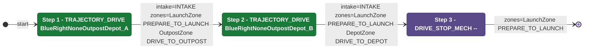
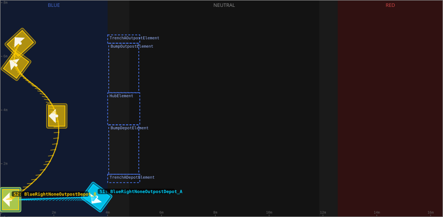
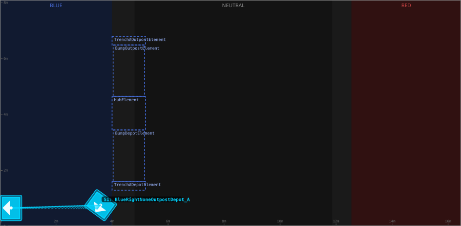
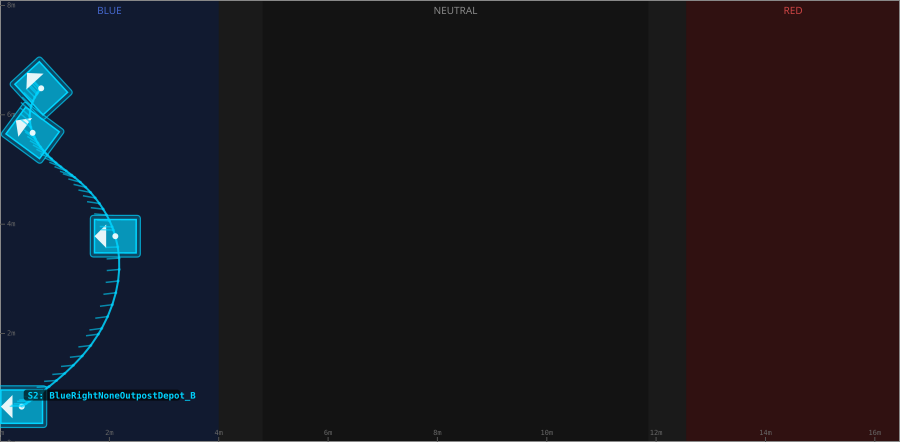

# Auton: BlueTOutLaunch0DepOutScoreClimb

> Auto-generated from [`src/main/deploy/auton/BlueTOutLaunch0DepOutScoreClimb.xml`](../../src/main/deploy/auton/BlueTOutLaunch0DepOutScoreClimb.xml).  
> Do not edit this file manually -- push a change to the XML and the [auton-diagrams workflow](../../.github/workflows/auton-diagrams.yml) will regenerate it.

## State Diagram

## Primitive Summary

| Step | Primitive | Trajectory | Timeout | Intake | Launcher | Climber | Zones |
|------|-----------|------------|---------|--------|----------|---------|-------|
| 1 | TRAJECTORY_DRIVE | [BlueRightNoneOutpostDepot_A](../../src/main/deploy/choreo/BlueRightNoneOutpostDepot_A.traj) | 3.0 s | STATE_INTAKE | STATE_IDLE | STATE_OFF | BlueLaunchZone, BlueOutpostZone |
| 2 | TRAJECTORY_DRIVE | [BlueRightNoneOutpostDepot_B](../../src/main/deploy/choreo/BlueRightNoneOutpostDepot_B.traj) | 5.0 s | STATE_INTAKE | STATE_IDLE | STATE_OFF | BlueLaunchZone, BlueDepotZone |
| 3 | DRIVE_STOP_MECH | -- | 5.0 s | STATE_OFF | STATE_IDLE | STATE_OFF | BlueLaunchZone |

## Trajectory Details

### All Trajectories Overview

### Step 1 -- BlueRightNoneOutpostDepot_A

- **File:** [`BlueRightNoneOutpostDepot_A.traj`](../../src/main/deploy/choreo/BlueRightNoneOutpostDepot_A.traj)
- **Duration:** 2.065 s
- **Timeout in auton XML:** 3.0 s
- **Colour in overview:** `#00d4ff`

| # | X (m) | Y (m) | Heading (deg) |
|---|-------|-------|---------------|
| 1 | 3.593 | 0.76 | 233.6 |
| 2 | 0.397 | 0.663 | 180.0 |

### Step 2 -- BlueRightNoneOutpostDepot_B

- **File:** [`BlueRightNoneOutpostDepot_B.traj`](../../src/main/deploy/choreo/BlueRightNoneOutpostDepot_B.traj)
- **Duration:** 3.812 s
- **Timeout in auton XML:** 5.0 s
- **Colour in overview:** `#ffcc00`

| # | X (m) | Y (m) | Heading (deg) |
|---|-------|-------|---------------|
| 1 | 0.397 | 0.663 | 180.0 |
| 2 | 2.109 | 3.78 | 179.9 |
| 3 | 0.597 | 5.671 | 143.6 |
| 4 | 0.753 | 6.485 | 132.6 |

## Zone Legend

| Zone file | Effect when entered |
|-----------|---------------------|
| `BlueDepotZone` | `pathUpdateOption = DRIVE_TO_DEPOT` |
| `BlueLaunchZone` | `launcherState -> STATE_PREPARE_TO_LAUNCH` |
| `BlueOutpostZone` | `pathUpdateOption = DRIVE_TO_OUTPOST` |
