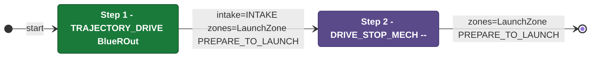
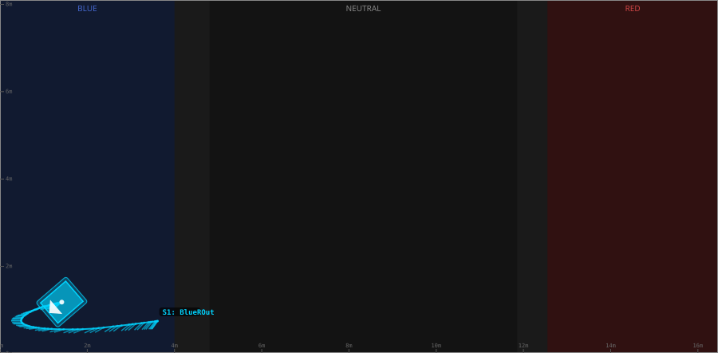

# Auton: BlueTOutLaunch0NDepOutScoreNCli

> Auto-generated from [`src/main/deploy/auton/BlueTOutLaunch0NDepOutScoreNCli.xml`](../../src/main/deploy/auton/BlueTOutLaunch0NDepOutScoreNCli.xml).  
> Do not edit this file manually -- push a change to the XML and the [auton-diagrams workflow](../../.github/workflows/auton-diagrams.yml) will regenerate it.

## State Diagram

## Primitive Summary

| Step | Primitive | Trajectory | Timeout | Intake | Launcher | Climber | Zones |
|------|-----------|------------|---------|--------|----------|---------|-------|
| 1 | TRAJECTORY_DRIVE | [BlueROut](../../src/main/deploy/choreo/BlueROut.traj) | 3.5 s | STATE_INTAKE | STATE_IDLE | STATE_OFF | BlueLaunchZone |
| 2 | DRIVE_STOP_MECH | -- | -- s | STATE_OFF | STATE_IDLE | STATE_OFF | BlueLaunchZone |

## Trajectory Details

### All Trajectories Overview

### Step 1 -- BlueROut

- **File:** [`BlueROut.traj`](../../src/main/deploy/choreo/BlueROut.traj)
- **Duration:** 3.182 s
- **Timeout in auton XML:** 3.5 s

| # | X (m) | Y (m) | Heading (deg) |
|---|-------|-------|---------------|
| 1 | 3.615 | 0.748 | 234.3 |
| 2 | 0.485 | 0.748 | 180.0 |
| 3 | 1.417 | 1.181 | 220.8 |

## Zone Legend

| Zone file | Effect when entered |
|-----------|---------------------|
| `BlueLaunchZone` | `launcherState -> STATE_PREPARE_TO_LAUNCH` |
