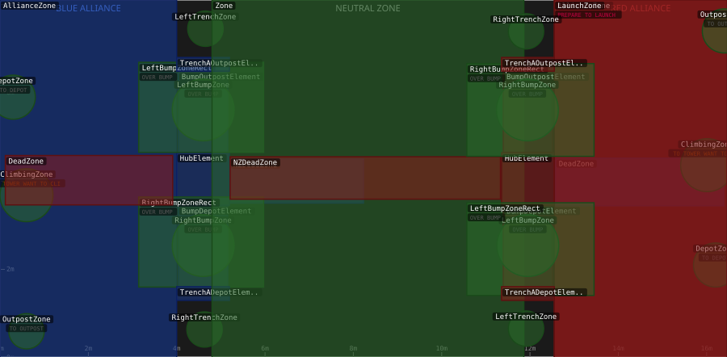

# Auton Field Zones

> Auto-generated from [`src/main/deploy/auton/zones/`](../../src/main/deploy/auton/zones/).
> Do not edit this file manually -- push a change to a zone XML and the
> [auton-diagrams workflow](../../.github/workflows/auton-diagrams.yml) will regenerate it.
>
> Full field: **16.46 m wide x 8.1 m tall**.
> Origin (0,0) is the bottom-left (Blue alliance wall).
> Circle radius values in the XML are stored in **centimetres** and converted to metres here.

## Field Diagram

## Individual Zone Pages

- [BlueAllianceZone](zones/BlueAllianceZone.md)
- [BlueBumpDepotElement](zones/BlueBumpDepotElement.md)
- [BlueBumpOutpostElement](zones/BlueBumpOutpostElement.md)
- [BlueClimbingZone](zones/BlueClimbingZone.md)
- [BlueDeadZone](zones/BlueDeadZone.md)
- [BlueDepotZone](zones/BlueDepotZone.md)
- [BlueHubElement](zones/BlueHubElement.md)
- [BlueLaunchZone](zones/BlueLaunchZone.md)
- [BlueLeftBumpZone](zones/BlueLeftBumpZone.md)
- [BlueLeftBumpZoneRect](zones/BlueLeftBumpZoneRect.md)
- [BlueLeftTrenchZone](zones/BlueLeftTrenchZone.md)
- [BlueNZDeadZone](zones/BlueNZDeadZone.md)
- [BlueOutpostZone](zones/BlueOutpostZone.md)
- [BlueRightBumpZone](zones/BlueRightBumpZone.md)
- [BlueRightBumpZoneRect](zones/BlueRightBumpZoneRect.md)
- [BlueRightTrenchZone](zones/BlueRightTrenchZone.md)
- [BlueTrenchADepotElement](zones/BlueTrenchADepotElement.md)
- [BlueTrenchAOutpostElement](zones/BlueTrenchAOutpostElement.md)
- [NeutralZone](zones/NeutralZone.md)
- [RedAllianceZone](zones/RedAllianceZone.md)
- [RedBumpDepotElement](zones/RedBumpDepotElement.md)
- [RedBumpOutpostElement](zones/RedBumpOutpostElement.md)
- [RedClimbingZone](zones/RedClimbingZone.md)
- [RedDeadZone](zones/RedDeadZone.md)
- [RedDepotZone](zones/RedDepotZone.md)
- [RedHubElement](zones/RedHubElement.md)
- [RedLaunchZone](zones/RedLaunchZone.md)
- [RedLeftBumpZone](zones/RedLeftBumpZone.md)
- [RedLeftBumpZoneRect](zones/RedLeftBumpZoneRect.md)
- [RedLeftTrenchZone](zones/RedLeftTrenchZone.md)
- [RedNZDeadZone](zones/RedNZDeadZone.md)
- [RedOutpostZone](zones/RedOutpostZone.md)
- [RedRightBumpZone](zones/RedRightBumpZone.md)
- [RedRightBumpZoneRect](zones/RedRightBumpZoneRect.md)
- [RedRightTrenchZone](zones/RedRightTrenchZone.md)
- [RedTrenchADepotElement](zones/RedTrenchADepotElement.md)
- [RedTrenchAOutpostElement](zones/RedTrenchAOutpostElement.md)

## Zone Legend

| Colour | Meaning |
|--------|---------|
| Dark blue background | Blue alliance zone (x = 0 -- 4.0 m) |
| Dark region (centre) | Neutral zone (x = 4.8 -- 11.86 m) |
| Dark red background | Red alliance zone (x = 12.55 -- 16.46 m) |
| Blue fill zones | Zones with allianceColor = BLUE |
| Red fill zones | Zones with allianceColor = RED |
| Green fill zones | Zones with allianceColor = BOTH |
| Grey fill zones | Zones with no allianceColor set |
| Orange badge text | DRIVE_OVER_BUMP effect |
| Purple badge text | DRIVE_TO_DEPOT effect |
| Teal badge text | DRIVE_TO_OUTPOST / HUB effect |
| Red-pink badge text | PREPARE_TO_LAUNCH effect |

## Zone Reference Table

| Zone | Type | Key Coords (m) | Alliance | Effects |
|------|------|----------------|----------|---------|
| `BlueAllianceZone` | rect | (0.0,0.0) to (4.0,8.1) | BLUE | -- |
| `BlueBumpDepotElement` | rect | (4.0381,1.61) to (5.1557,3.45) | BLUE | -- |
| `BlueBumpOutpostElement` | rect | (4.0381,4.65) to (5.1557,6.49) | BLUE | -- |
| `BlueClimbingZone` | circle | cx=0.6, cy=3.68, r=0.60 | BOTH | TO TOWER, WANT TO CLIMB |
| `BlueDeadZone` | rect | (12.58,3.44) to (16.39,4.52) | BLUE | -- |
| `BlueDepotZone` | circle | cx=0.3, cy=5.9, r=0.50 | BOTH | TO DEPOT |
| `BlueHubElement` | rect | (4.0,3.45) to (5.1938,4.6438) | BLUE | -- |
| `BlueLaunchZone` | rect | (0.0,0.0) to (4.0,8.1) | BLUE | PREPARE TO LAUNCH |
| `BlueLeftBumpZone` | circle | cx=4.6, cy=5.61, r=0.70 | BOTH | OVER BUMP |
| `BlueLeftBumpZoneRect` | rect | (3.14,4.65) to (5.97,6.69) | BOTH | OVER BUMP |
| `BlueLeftTrenchZone` | circle | cx=4.65, cy=7.45, r=0.40 | BOTH | -- |
| `BlueNZDeadZone` | rect | (5.21,3.5) to (8.23,4.5) | BLUE | -- |
| `BlueOutpostZone` | circle | cx=0.6, cy=0.6, r=0.40 | BOTH | TO OUTPOST |
| `BlueRightBumpZone` | circle | cx=4.6, cy=2.54, r=0.70 | BOTH | OVER BUMP |
| `BlueRightBumpZoneRect` | rect | (3.14,1.6) to (5.97,3.64) | BOTH | OVER BUMP |
| `BlueRightTrenchZone` | circle | cx=4.63, cy=0.64, r=0.40 | BOTH | -- |
| `BlueTrenchADepotElement` | rect | (4.0,1.3) to (5.1938,1.61) | BLUE | -- |
| `BlueTrenchAOutpostElement` | rect | (4.0,6.49) to (5.1938,6.8) | BLUE | -- |
| `NeutralZone` | rect | (4.8,0.0) to (11.86,8.1) | BOTH | -- |
| `RedAllianceZone` | rect | (12.55,0.0) to (16.55,8.1) | RED | -- |
| `RedBumpDepotElement` | rect | (11.3943,1.61) to (12.5119,3.45) | RED | -- |
| `RedBumpOutpostElement` | rect | (11.3943,4.65) to (12.5119,6.49) | RED | -- |
| `RedClimbingZone` | circle | cx=16.01, cy=4.36, r=0.60 | BOTH | TO TOWER, WANT TO CLIMB |
| `RedDeadZone` | rect | (0.12,3.46) to (3.91,4.58) | RED | -- |
| `RedDepotZone` | circle | cx=16.2, cy=2.1, r=0.50 | BOTH | TO DEPOT |
| `RedHubElement` | rect | (11.3562,3.45) to (12.55,4.6438) | RED | -- |
| `RedLaunchZone` | rect | (12.55,0.0) to (16.55,8.1) | RED | PREPARE TO LAUNCH |
| `RedLeftBumpZone` | circle | cx=11.95, cy=2.54, r=0.70 | BOTH | OVER BUMP |
| `RedLeftBumpZoneRect` | rect | (10.57,1.41) to (13.45,3.51) | BOTH | OVER BUMP |
| `RedLeftTrenchZone` | circle | cx=11.91, cy=0.66, r=0.40 | BOTH | -- |
| `RedNZDeadZone` | rect | (5.21,3.59) to (11.33,4.55) | RED | -- |
| `RedOutpostZone` | circle | cx=16.4, cy=7.4, r=0.50 | BOTH | TO OUTPOST |
| `RedRightBumpZone` | circle | cx=11.94, cy=5.61, r=0.70 | BOTH | OVER BUMP |
| `RedRightBumpZoneRect` | rect | (10.57,4.56) to (13.45,6.66) | BOTH | OVER BUMP |
| `RedRightTrenchZone` | circle | cx=11.91, cy=7.39, r=0.40 | BOTH | -- |
| `RedTrenchADepotElement` | rect | (11.3562,1.3) to (12.55,1.61) | RED | -- |
| `RedTrenchAOutpostElement` | rect | (11.3562,6.49) to (12.55,6.8) | RED | -- |
