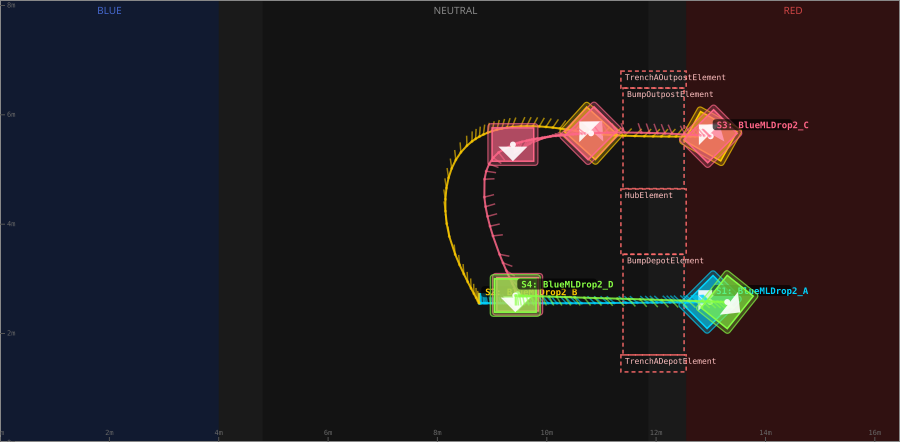
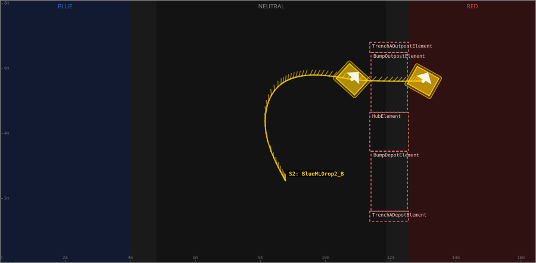

# Auton: RedBDepDrop2NDepNOutScoreNCli

> Auto-generated from [`src/main/deploy/auton/RedBDepDrop2NDepNOutScoreNCli.xml`](../../src/main/deploy/auton/RedBDepDrop2NDepNOutScoreNCli.xml).  
> Do not edit this file manually -- push a change to the XML and the [auton-diagrams workflow](../../.github/workflows/auton-diagrams.yml) will regenerate it.

## State Diagram

```mermaid
stateDiagram-v2
    direction LR

    %% Green = intake active, Purple = intake off
    classDef intake  fill:#1a7a3a,color:#ffffff,stroke:#0d4a1f,font-weight:bold
    classDef noIntake fill:#5a4a8a,color:#ffffff,stroke:#3a2a6a,font-weight:bold

    Step1 : "Step 1 - TRAJECTORY_DRIVE BlueMLDrop2_A"
    Step2 : "Step 2 - TRAJECTORY_DRIVE BlueMLDrop2_B"
    Step3 : "Step 3 - TRAJECTORY_DRIVE BlueMLDrop2_C"
    Step4 : "Step 4 - TRAJECTORY_DRIVE BlueMLDrop2_D"

    class Step1 intake
    class Step2 intake
    class Step3 noIntake
    class Step4 intake

    [*] --> Step1 : "start"
    Step1 --> Step2: "intake=INTAKE | zones=LeftBumpZone DRIVE_OVER_BUMP"
    Step2 --> Step3: "intake=INTAKE | zones=RightBumpZone DRIVE_OVER_BUMP LaunchZone PREPARE_TO_LAUNCH"
    Step3 --> Step4: "zones=RightBumpZone DRIVE_OVER_BUMP LaunchZone PREPARE_TO_LAUNCH"
    Step4 --> [*]: "intake=INTAKE | zones=LeftBumpZone DRIVE_OVER_BUMP LaunchZone PREPARE_TO_LAUNCH"
```

## Primitive Summary

| Step | Primitive | Trajectory | Timeout | Intake | Launcher | Climber | Zones |
|------|-----------|------------|---------|--------|----------|---------|-------|
| 1 | TRAJECTORY_DRIVE | [BlueMLDrop2_A](../../src/main/deploy/choreo/BlueMLDrop2_A.traj) | 4.0 s | STATE_INTAKE | STATE_IDLE | STATE_OFF | RedLeftBumpZone |
| 2 | TRAJECTORY_DRIVE | [BlueMLDrop2_B](../../src/main/deploy/choreo/BlueMLDrop2_B.traj) | 4.0 s | STATE_INTAKE | STATE_IDLE | STATE_OFF | RedRightBumpZone, RedLaunchZone |
| 3 | TRAJECTORY_DRIVE | [BlueMLDrop2_C](../../src/main/deploy/choreo/BlueMLDrop2_C.traj) | 4.0 s | STATE_OFF | STATE_IDLE | STATE_OFF | RedRightBumpZone, RedLaunchZone |
| 4 | TRAJECTORY_DRIVE | [BlueMLDrop2_D](../../src/main/deploy/choreo/BlueMLDrop2_D.traj) | 4.0 s | STATE_INTAKE | STATE_IDLE | STATE_OFF | RedLeftBumpZone, RedLaunchZone |

## Trajectory Details

### All Trajectories Overview

### Step 1 -- BlueMLDrop2_A

- **File:** [`BlueMLDrop2_A.traj`](../../src/main/deploy/choreo/BlueMLDrop2_A.traj)
- **Duration:** 2.374 s
- **Timeout in auton XML:** 4.0 s
- **Colour in overview:** `#00d4ff`

| # | X (m) | Y (m) | Heading (deg) |
|---|-------|-------|---------------|
| 1 | 12.986 | 2.577 | 135.0 |
| 2 | 10.637 | 2.555 | 135.0 |
| 3 | 8.763 | 2.555 | 90.0 |

### Step 2 -- BlueMLDrop2_B

- **File:** [`BlueMLDrop2_B.traj`](../../src/main/deploy/choreo/BlueMLDrop2_B.traj)
- **Duration:** 3.945 s
- **Timeout in auton XML:** 4.0 s
- **Colour in overview:** `#ffcc00`

| # | X (m) | Y (m) | Heading (deg) |
|---|-------|-------|---------------|
| 1 | 8.763 | 2.555 | 90.0 |
| 2 | 8.601 | 5.489 | 90.0 |
| 3 | 10.81 | 5.662 | 47.9 |
| 4 | 12.997 | 5.608 | 60.8 |

### Step 3 -- BlueMLDrop2_C

- **File:** [`BlueMLDrop2_C.traj`](../../src/main/deploy/choreo/BlueMLDrop2_C.traj)
- **Duration:** 4.322 s
- **Timeout in auton XML:** 4.0 s
- **Colour in overview:** `#ff6688`

| # | X (m) | Y (m) | Heading (deg) |
|---|-------|-------|---------------|
| 1 | 12.997 | 5.608 | 135.0 |
| 2 | 10.81 | 5.662 | 135.0 |
| 3 | 9.381 | 5.457 | 270.0 |
| 4 | 9.467 | 2.717 | 270.0 |

### Step 4 -- BlueMLDrop2_D

- **File:** [`BlueMLDrop2_D.traj`](../../src/main/deploy/choreo/BlueMLDrop2_D.traj)
- **Duration:** 1.331 s
- **Timeout in auton XML:** 4.0 s
- **Colour in overview:** `#88ff44`

| # | X (m) | Y (m) | Heading (deg) |
|---|-------|-------|---------------|
| 1 | 9.424 | 2.696 | 270.0 |
| 2 | 13.3 | 2.577 | 321.4 |

## Zone Legend

| Zone file | Effect when entered |
|-----------|---------------------|
| `RedLaunchZone` | `launcherState -> STATE_PREPARE_TO_LAUNCH` |
| `RedLeftBumpZone` | `pathUpdateOption = DRIVE_OVER_BUMP` |
| `RedRightBumpZone` | `pathUpdateOption = DRIVE_OVER_BUMP` |
