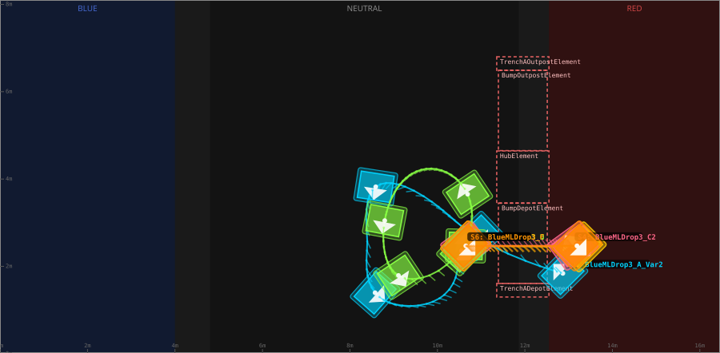
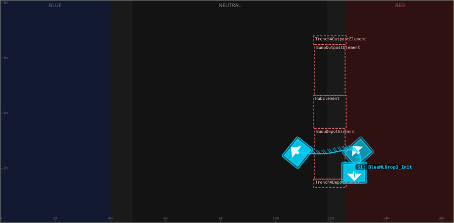
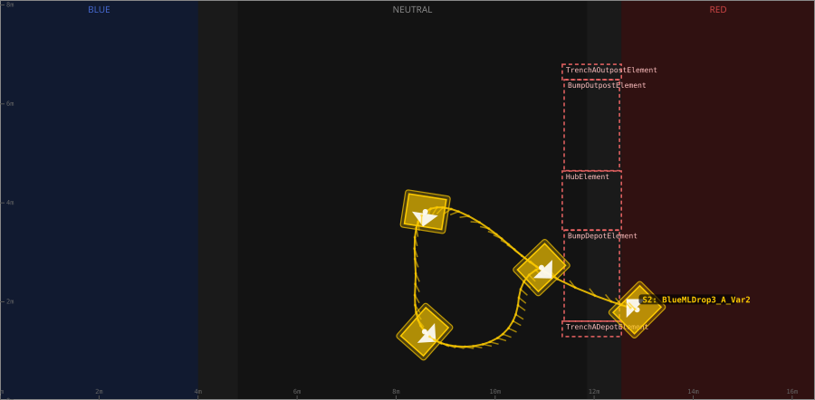
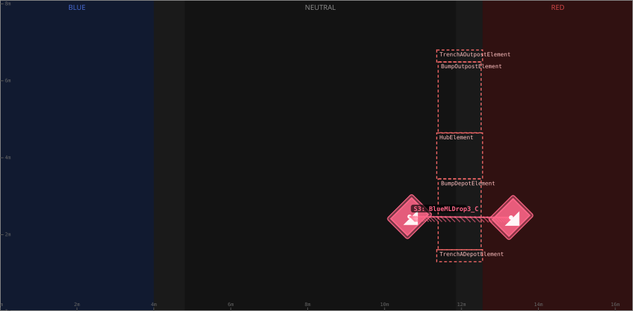
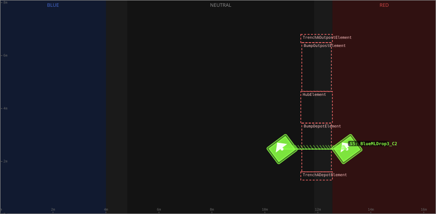
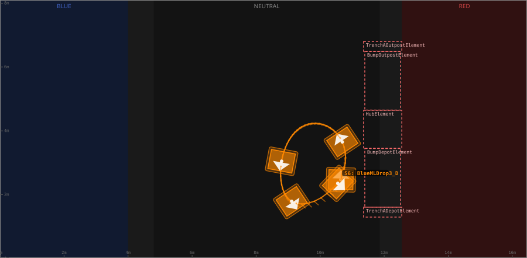
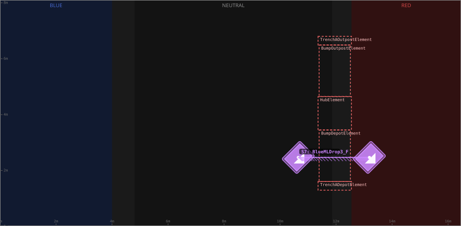

# Auton: RedBDepKeep3NDepNOutScoreNCliInvert

> Auto-generated from [`src/main/deploy/auton/RedBDepKeep3NDepNOutScoreNCliInvert.xml`](../../src/main/deploy/auton/RedBDepKeep3NDepNOutScoreNCliInvert.xml).  
> Do not edit this file manually -- push a change to the XML and the [auton-diagrams workflow](../../.github/workflows/auton-diagrams.yml) will regenerate it.

## State Diagram

```mermaid
stateDiagram-v2
    direction LR

    %% Green = intake active, Purple = intake off
    classDef intake  fill:#1a7a3a,color:#ffffff,stroke:#0d4a1f,font-weight:bold
    classDef noIntake fill:#5a4a8a,color:#ffffff,stroke:#3a2a6a,font-weight:bold

    Step1 : "Step 1 - TRAJECTORY_DRIVE BlueMLDrop3_Init"
    Step2 : "Step 2 - TRAJECTORY_DRIVE BlueMLDrop3_A_Var2"
    Step3 : "Step 3 - TRAJECTORY_DRIVE BlueMLDrop3_C"
    Step4 : "Step 4 - DRIVE_STOP_MECH --"
    Step5 : "Step 5 - TRAJECTORY_DRIVE BlueMLDrop3_C2"
    Step6 : "Step 6 - TRAJECTORY_DRIVE BlueMLDrop3_D"
    Step7 : "Step 7 - TRAJECTORY_DRIVE BlueMLDrop3_F"
    Step8 : "Step 8 - DRIVE_STOP_MECH --"

    class Step1 noIntake
    class Step2 intake
    class Step3 noIntake
    class Step4 noIntake
    class Step5 intake
    class Step6 intake
    class Step7 intake
    class Step8 noIntake

    [*] --> Step1 : "start"
    Step1 --> Step2: "zones=LeftBumpZoneRect DRIVE_OVER_BUMP"
    Step2 --> Step3: "intake=INTAKE"
    Step3 --> Step4: "zones=LeftBumpZoneRect DRIVE_OVER_BUMP LaunchZone PREPARE_TO_LAUNCH"
    Step4 --> Step5
    Step5 --> Step6: "intake=INTAKE | zones=LeftBumpZoneRect DRIVE_OVER_BUMP"
    Step6 --> Step7: "intake=INTAKE"
    Step7 --> Step8: "intake=INTAKE | zones=LeftBumpZoneRect DRIVE_OVER_BUMP LaunchZone PREPARE_TO_LAUNCH"
    Step8 --> [*]
```

## Primitive Summary

| Step | Primitive | Trajectory | Timeout | Intake | Launcher | Climber | Zones |
|------|-----------|------------|---------|--------|----------|---------|-------|
| 1 | TRAJECTORY_DRIVE | [BlueMLDrop3_Init](../../src/main/deploy/choreo/BlueMLDrop3_Init.traj) | 3.0 s | STATE_OFF | STATE_IDLE | STATE_OFF | RedLeftBumpZoneRect |
| 2 | TRAJECTORY_DRIVE | [BlueMLDrop3_A_Var2](../../src/main/deploy/choreo/BlueMLDrop3_A_Var2.traj) | 3.0 s | STATE_INTAKE | STATE_IDLE | STATE_OFF | -- |
| 3 | TRAJECTORY_DRIVE | [BlueMLDrop3_C](../../src/main/deploy/choreo/BlueMLDrop3_C.traj) | 5.0 s | STATE_OFF | STATE_IDLE | STATE_OFF | RedLeftBumpZoneRect, RedLaunchZone |
| 4 | DRIVE_STOP_MECH | -- | 5.0 s | STATE_OFF | STATE_IDLE | STATE_OFF | -- |
| 5 | TRAJECTORY_DRIVE | [BlueMLDrop3_C2](../../src/main/deploy/choreo/BlueMLDrop3_C2.traj) | 5.0 s | STATE_INTAKE | STATE_IDLE | STATE_OFF | RedLeftBumpZoneRect |
| 6 | TRAJECTORY_DRIVE | [BlueMLDrop3_D](../../src/main/deploy/choreo/BlueMLDrop3_D.traj) | 5.0 s | STATE_INTAKE | STATE_IDLE | STATE_OFF | -- |
| 7 | TRAJECTORY_DRIVE | [BlueMLDrop3_F](../../src/main/deploy/choreo/BlueMLDrop3_F.traj) | 5.0 s | STATE_INTAKE | STATE_IDLE | STATE_OFF | RedLeftBumpZoneRect, RedLaunchZone |
| 8 | DRIVE_STOP_MECH | -- | 5.0 s | STATE_OFF | STATE_IDLE | STATE_OFF | -- |

## Trajectory Details

### All Trajectories Overview

### Step 1 -- BlueMLDrop3_Init

- **File:** [`BlueMLDrop3_Init.traj`](../../src/main/deploy/choreo/BlueMLDrop3_Init.traj)
- **Duration:** 2.525 s
- **Timeout in auton XML:** 3.0 s
- **Colour in overview:** `#00d4ff`

| # | X (m) | Y (m) | Heading (deg) |
|---|-------|-------|---------------|
| 1 | 12.845 | 1.84 | 270.0 |
| 2 | 12.986 | 2.577 | 130.4 |
| 3 | 11.914 | 2.544 | 128.7 |
| 4 | 10.788 | 2.566 | 141.5 |

### Step 2 -- BlueMLDrop3_A_Var2

- **File:** [`BlueMLDrop3_A_Var2.traj`](../../src/main/deploy/choreo/BlueMLDrop3_A_Var2.traj)
- **Duration:** 6.169 s
- **Timeout in auton XML:** 3.0 s
- **Colour in overview:** `#ffcc00`

| # | X (m) | Y (m) | Heading (deg) |
|---|-------|-------|---------------|
| 1 | 12.867 | 1.84 | 135.0 |
| 2 | 10.875 | 2.685 | 136.4 |
| 3 | 9.922 | 3.443 | 164.6 |
| 4 | 8.59 | 3.822 | 261.2 |
| 5 | 8.395 | 2.512 | 180.0 |
| 6 | 8.576 | 1.396 | 318.5 |
| 7 | 9.348 | 1.093 | 348.5 |
| 8 | 10.247 | 1.44 | 336.0 |
| 9 | 10.561 | 2.371 | 316.5 |
| 10 | 10.937 | 2.692 | 313.8 |

### Step 3 -- BlueMLDrop3_C

- **File:** [`BlueMLDrop3_C.traj`](../../src/main/deploy/choreo/BlueMLDrop3_C.traj)
- **Duration:** 1.877 s
- **Timeout in auton XML:** 5.0 s
- **Colour in overview:** `#ff6688`

| # | X (m) | Y (m) | Heading (deg) |
|---|-------|-------|---------------|
| 1 | 10.647 | 2.469 | 315.0 |
| 2 | 13.289 | 2.447 | 315.0 |

### Step 5 -- BlueMLDrop3_C2

- **File:** [`BlueMLDrop3_C2.traj`](../../src/main/deploy/choreo/BlueMLDrop3_C2.traj)
- **Duration:** 1.809 s
- **Timeout in auton XML:** 5.0 s
- **Colour in overview:** `#88ff44`

| # | X (m) | Y (m) | Heading (deg) |
|---|-------|-------|---------------|
| 1 | 13.1 | 2.469 | 126.2 |
| 2 | 10.647 | 2.469 | 126.8 |

### Step 6 -- BlueMLDrop3_D

- **File:** [`BlueMLDrop3_D.traj`](../../src/main/deploy/choreo/BlueMLDrop3_D.traj)
- **Duration:** 2.641 s
- **Timeout in auton XML:** 5.0 s
- **Colour in overview:** `#ff8800`

| # | X (m) | Y (m) | Heading (deg) |
|---|-------|-------|---------------|
| 1 | 10.647 | 2.469 | 88.5 |
| 2 | 10.691 | 3.654 | 123.7 |
| 3 | 9.316 | 4.055 | 231.1 |
| 4 | 8.796 | 3.048 | 259.2 |
| 5 | 9.11 | 1.792 | 303.7 |
| 6 | 10.55 | 2.355 | 316.6 |

### Step 7 -- BlueMLDrop3_F

- **File:** [`BlueMLDrop3_F.traj`](../../src/main/deploy/choreo/BlueMLDrop3_F.traj)
- **Duration:** 1.843 s
- **Timeout in auton XML:** 5.0 s
- **Colour in overview:** `#cc88ff`

| # | X (m) | Y (m) | Heading (deg) |
|---|-------|-------|---------------|
| 1 | 10.647 | 2.469 | 315.0 |
| 2 | 13.192 | 2.469 | 315.0 |

## Zone Legend

| Zone file | Effect when entered |
|-----------|---------------------|
| `RedLaunchZone` | `launcherState -> STATE_PREPARE_TO_LAUNCH` |
| `RedLeftBumpZoneRect` | `pathUpdateOption = DRIVE_OVER_BUMP` |
