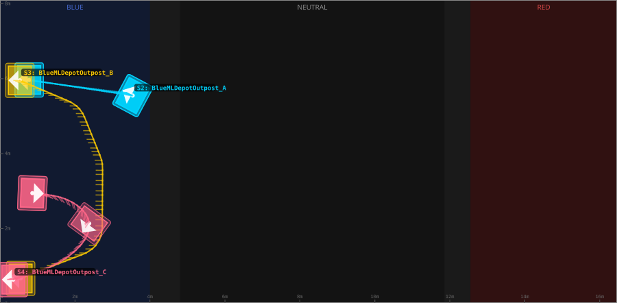
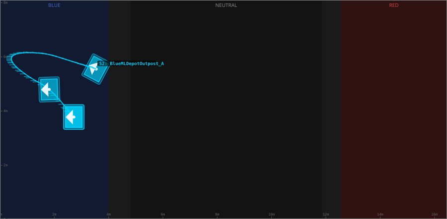
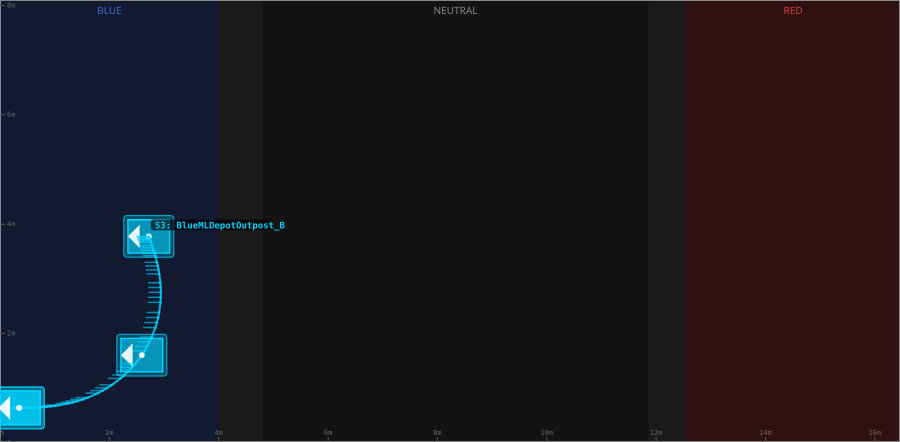
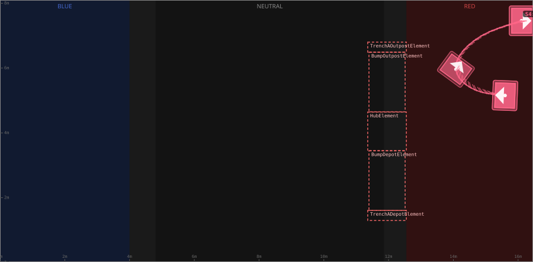

# Auton: RedBDepLaunch0DepOutScoreClimb

> Auto-generated from [`src/main/deploy/auton/RedBDepLaunch0DepOutScoreClimb.xml`](../../src/main/deploy/auton/RedBDepLaunch0DepOutScoreClimb.xml).  
> Do not edit this file manually -- push a change to the XML and the [auton-diagrams workflow](../../.github/workflows/auton-diagrams.yml) will regenerate it.

## State Diagram

```mermaid
stateDiagram-v2
    direction LR

    %% Green = intake active, Purple = intake off
    classDef intake  fill:#1a7a3a,color:#ffffff,stroke:#0d4a1f,font-weight:bold
    classDef noIntake fill:#5a4a8a,color:#ffffff,stroke:#3a2a6a,font-weight:bold

    Step1 : "Step 1 - DRIVE_STOP_MECH --"
    Step2 : "Step 2 - TRAJECTORY_DRIVE BlueMLDepotOutpost_A"
    Step3 : "Step 3 - TRAJECTORY_DRIVE BlueMLDepotOutpost_B"
    Step4 : "Step 4 - TRAJECTORY_DRIVE BlueMLDepotOutpost_C"
    Step5 : "Step 5 - TRAJECTORY_DRIVE BlueMLDepotOutpost_D"
    Step6 : "Step 6 - DRIVE_STOP_MECH --"

    class Step1 noIntake
    class Step2 intake
    class Step3 intake
    class Step4 intake
    class Step5 intake
    class Step6 noIntake

    [*] --> Step1 : "start"
    Step1 --> Step2: "launcher=LAUNCH"
    Step2 --> Step3: "intake=INTAKE | zones=LaunchZone PREPARE_TO_LAUNCH DepotZone DRIVE_TO_DEPOT"
    Step3 --> Step4: "intake=INTAKE | zones=LaunchZone PREPARE_TO_LAUNCH"
    Step4 --> Step5: "intake=INTAKE | zones=LaunchZone PREPARE_TO_LAUNCH OutpostZone DRIVE_TO_OUTPOST"
    Step5 --> Step6: "intake=INTAKE | zones=LaunchZone PREPARE_TO_LAUNCH"
    Step6 --> [*]: "zones=ClimbingZone DRIVE_TO_TOWER"
```

## Primitive Summary

| Step | Primitive | Trajectory | Timeout | Intake | Launcher | Climber | Zones |
|------|-----------|------------|---------|--------|----------|---------|-------|
| 1 | DRIVE_STOP_MECH | -- | -- s | STATE_OFF | STATE_LAUNCH | STATE_OFF | -- |
| 2 | TRAJECTORY_DRIVE | [BlueMLDepotOutpost_A](../../src/main/deploy/choreo/BlueMLDepotOutpost_A.traj) | 3.0 s | STATE_INTAKE | STATE_IDLE | STATE_OFF | RedLaunchZone, RedDepotZone |
| 3 | TRAJECTORY_DRIVE | [BlueMLDepotOutpost_B](../../src/main/deploy/choreo/BlueMLDepotOutpost_B.traj) | 3.0 s | STATE_INTAKE | STATE_IDLE | STATE_OFF | RedLaunchZone |
| 4 | TRAJECTORY_DRIVE | [BlueMLDepotOutpost_C](../../src/main/deploy/choreo/BlueMLDepotOutpost_C.traj) | 3.0 s | STATE_INTAKE | STATE_IDLE | STATE_OFF | RedLaunchZone, RedOutpostZone |
| 5 | TRAJECTORY_DRIVE | BlueMLDepotOutpost_D | 3.0 s | STATE_INTAKE | STATE_IDLE | STATE_OFF | RedLaunchZone |
| 6 | DRIVE_STOP_MECH | -- | -- s | STATE_OFF | STATE_IDLE | STATE_OFF | RedClimbingZone |

## Trajectory Details

### All Trajectories Overview

### Step 2 -- BlueMLDepotOutpost_A

- **File:** [`BlueMLDepotOutpost_A.traj`](../../src/main/deploy/choreo/BlueMLDepotOutpost_A.traj)
- **Duration:** 2.616 s
- **Timeout in auton XML:** 3.0 s
- **Colour in overview:** `#00d4ff`

| # | X (m) | Y (m) | Heading (deg) |
|---|-------|-------|---------------|
| 1 | 12.915 | 2.55 | 331.9 |
| 2 | 15.682 | 2.133 | 0.0 |

### Step 3 -- BlueMLDepotOutpost_B

- **File:** [`BlueMLDepotOutpost_B.traj`](../../src/main/deploy/choreo/BlueMLDepotOutpost_B.traj)
- **Duration:** 5.696 s
- **Timeout in auton XML:** 3.0 s
- **Colour in overview:** `#ffcc00`

| # | X (m) | Y (m) | Heading (deg) |
|---|-------|-------|---------------|
| 1 | 15.931 | 2.143 | 0.0 |
| 2 | 14.372 | 2.869 | 180.0 |
| 3 | 13.738 | 4.324 | 0.0 |
| 4 | 13.866 | 6.495 | 0.0 |
| 5 | 15.91 | 7.427 | 0.0 |

### Step 4 -- BlueMLDepotOutpost_C

- **File:** [`BlueMLDepotOutpost_C.traj`](../../src/main/deploy/choreo/BlueMLDepotOutpost_C.traj)
- **Duration:** 3.118 s
- **Timeout in auton XML:** 3.0 s
- **Colour in overview:** `#ff6688`

| # | X (m) | Y (m) | Heading (deg) |
|---|-------|-------|---------------|
| 1 | 16.108 | 7.46 | 0.0 |
| 2 | 14.079 | 5.963 | 53.7 |
| 3 | 15.597 | 5.153 | 177.9 |

### Step 5 -- BlueMLDepotOutpost_D

- **File:** `BlueMLDepotOutpost_D.traj` *(not found)*
- **Duration:** unknown
- **Timeout in auton XML:** 3.0 s
- **Colour in overview:** `#00d4ff`

## Zone Legend

| Zone file | Effect when entered |
|-----------|---------------------|
| `RedClimbingZone` | `pathUpdateOption = DRIVE_TO_TOWER` |
| `RedDepotZone` | `pathUpdateOption = DRIVE_TO_DEPOT` |
| `RedLaunchZone` | `launcherState -> STATE_PREPARE_TO_LAUNCH` |
| `RedOutpostZone` | `pathUpdateOption = DRIVE_TO_OUTPOST` |
