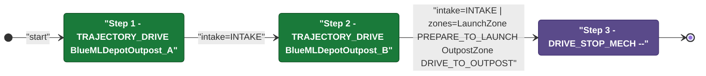
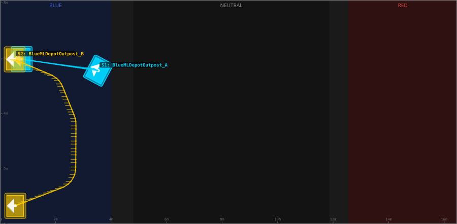
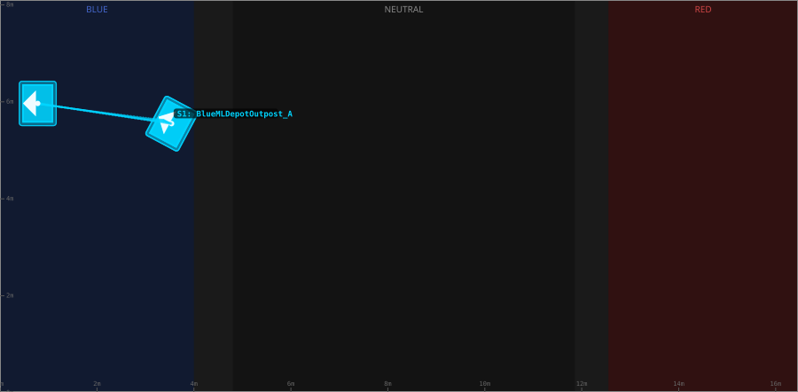
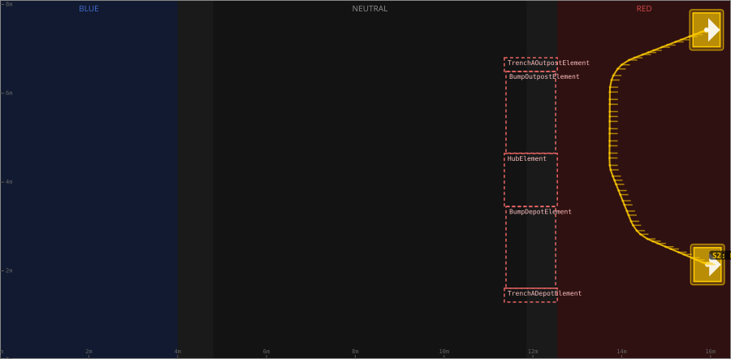

# Auton: RedBDepLaunch0DepOutScoreNCli

> Auto-generated from [`src/main/deploy/auton/RedBDepLaunch0DepOutScoreNCli.xml`](../../src/main/deploy/auton/RedBDepLaunch0DepOutScoreNCli.xml).  
> Do not edit this file manually -- push a change to the XML and the [auton-diagrams workflow](../../.github/workflows/auton-diagrams.yml) will regenerate it.

## State Diagram

## Primitive Summary

| Step | Primitive | Trajectory | Timeout | Intake | Launcher | Climber | Zones |
|------|-----------|------------|---------|--------|----------|---------|-------|
| 1 | TRAJECTORY_DRIVE | [BlueMLDepotOutpost_A](../../src/main/deploy/choreo/BlueMLDepotOutpost_A.traj) | 4.0 s | STATE_INTAKE | STATE_IDLE | STATE_OFF | -- |
| 2 | TRAJECTORY_DRIVE | [BlueMLDepotOutpost_B](../../src/main/deploy/choreo/BlueMLDepotOutpost_B.traj) | 15.0 s | STATE_INTAKE | STATE_IDLE | STATE_OFF | RedLaunchZone, RedOutpostZone |
| 3 | DRIVE_STOP_MECH | -- | 5.0 s | STATE_OFF | STATE_IDLE | STATE_OFF | -- |

## Trajectory Details

### All Trajectories Overview

### Step 1 -- BlueMLDepotOutpost_A

- **File:** [`BlueMLDepotOutpost_A.traj`](../../src/main/deploy/choreo/BlueMLDepotOutpost_A.traj)
- **Duration:** 2.616 s
- **Timeout in auton XML:** 4.0 s
- **Colour in overview:** `#00d4ff`

| # | X (m) | Y (m) | Heading (deg) |
|---|-------|-------|---------------|
| 1 | 12.915 | 2.55 | 331.9 |
| 2 | 15.682 | 2.133 | 0.0 |

### Step 2 -- BlueMLDepotOutpost_B

- **File:** [`BlueMLDepotOutpost_B.traj`](../../src/main/deploy/choreo/BlueMLDepotOutpost_B.traj)
- **Duration:** 5.696 s
- **Timeout in auton XML:** 15.0 s
- **Colour in overview:** `#ffcc00`

| # | X (m) | Y (m) | Heading (deg) |
|---|-------|-------|---------------|
| 1 | 15.931 | 2.143 | 0.0 |
| 2 | 14.372 | 2.869 | 180.0 |
| 3 | 13.738 | 4.324 | 0.0 |
| 4 | 13.866 | 6.495 | 0.0 |
| 5 | 15.91 | 7.427 | 0.0 |

## Zone Legend

| Zone file | Effect when entered |
|-----------|---------------------|
| `RedLaunchZone` | `launcherState -> STATE_PREPARE_TO_LAUNCH` |
| `RedOutpostZone` | `pathUpdateOption = DRIVE_TO_OUTPOST` |
