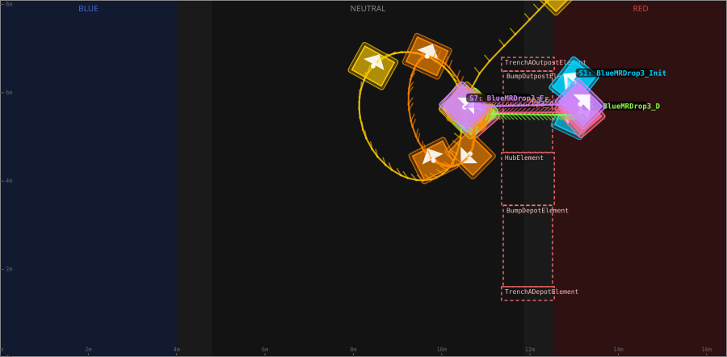
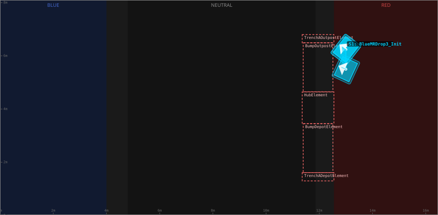
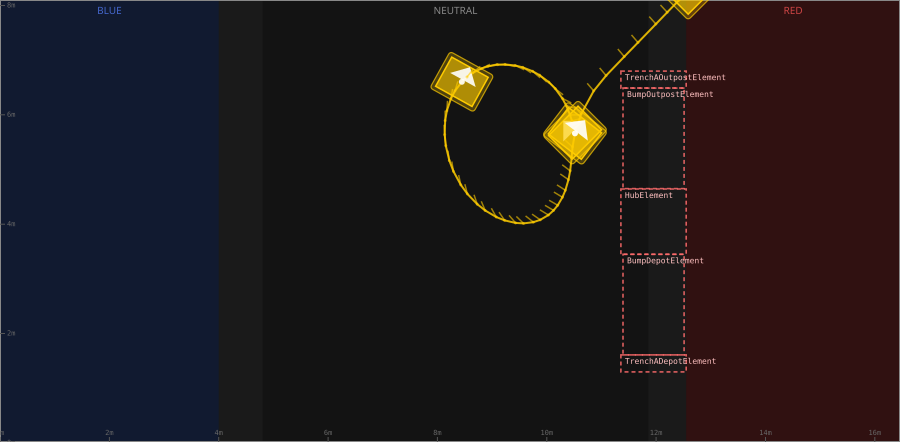
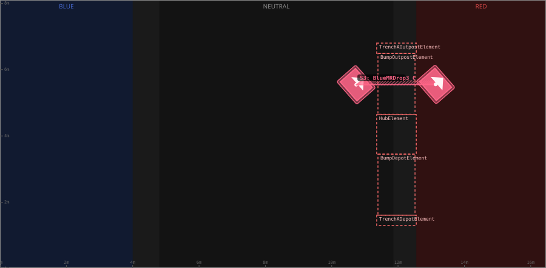
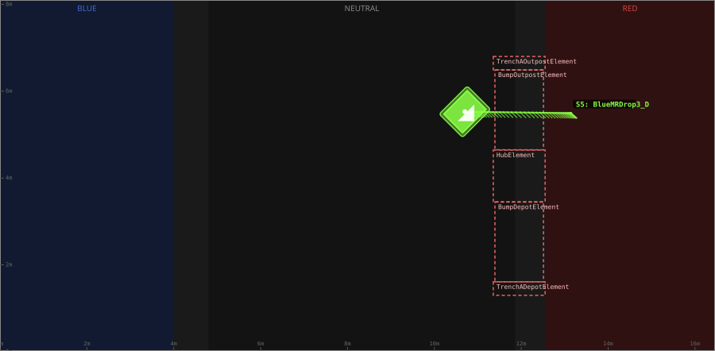
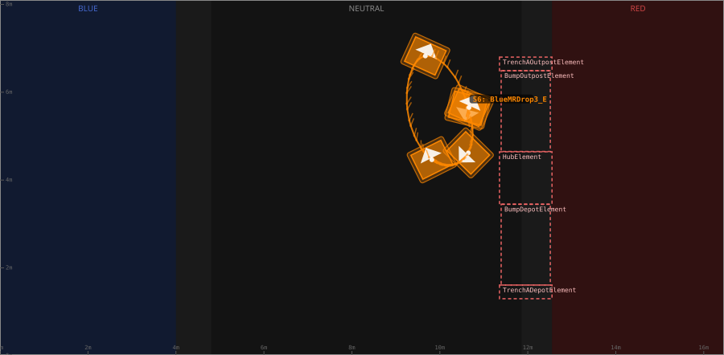
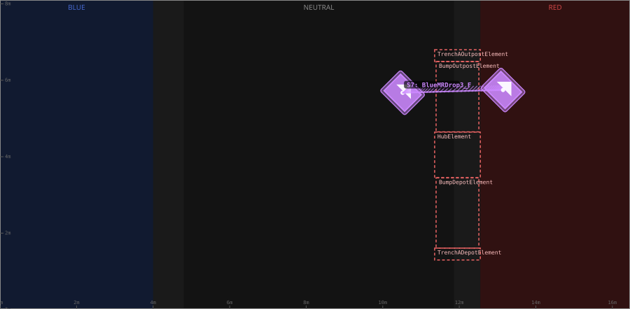

# Auton: RedBOutKeep3NDepNOutScoreNCliInvert

> Auto-generated from [`src/main/deploy/auton/RedBOutKeep3NDepNOutScoreNCliInvert.xml`](../../src/main/deploy/auton/RedBOutKeep3NDepNOutScoreNCliInvert.xml).  
> Do not edit this file manually -- push a change to the XML and the [auton-diagrams workflow](../../.github/workflows/auton-diagrams.yml) will regenerate it.

## State Diagram

```mermaid
stateDiagram-v2
    direction LR

    %% Green = intake active, Purple = intake off
    classDef intake  fill:#1a7a3a,color:#ffffff,stroke:#0d4a1f,font-weight:bold
    classDef noIntake fill:#5a4a8a,color:#ffffff,stroke:#3a2a6a,font-weight:bold

    Step1 : "Step 1 - TRAJECTORY_DRIVE BlueMRDrop3_Init"
    Step2 : "Step 2 - TRAJECTORY_DRIVE BlueMRDrop3_A_Var2"
    Step3 : "Step 3 - TRAJECTORY_DRIVE BlueMRDrop3_C"
    Step4 : "Step 4 - DRIVE_STOP_MECH --"
    Step5 : "Step 5 - TRAJECTORY_DRIVE BlueMRDrop3_D"
    Step6 : "Step 6 - TRAJECTORY_DRIVE BlueMRDrop3_E"
    Step7 : "Step 7 - TRAJECTORY_DRIVE BlueMRDrop3_F"
    Step8 : "Step 8 - DRIVE_STOP_MECH --"

    class Step1 noIntake
    class Step2 intake
    class Step3 noIntake
    class Step4 noIntake
    class Step5 intake
    class Step6 intake
    class Step7 noIntake
    class Step8 noIntake

    [*] --> Step1 : "start"
    Step1 --> Step2: "zones=RightBumpZoneRect DRIVE_OVER_BUMP"
    Step2 --> Step3: "intake=INTAKE"
    Step3 --> Step4: "zones=RightBumpZone DRIVE_OVER_BUMP LaunchZone PREPARE_TO_LAUNCH"
    Step4 --> Step5
    Step5 --> Step6: "intake=INTAKE | zones=RightBumpZone DRIVE_OVER_BUMP"
    Step6 --> Step7: "intake=INTAKE"
    Step7 --> Step8: "zones=LaunchZone PREPARE_TO_LAUNCH RightBumpZone DRIVE_OVER_BUMP"
    Step8 --> [*]
```

## Primitive Summary

| Step | Primitive | Trajectory | Timeout | Intake | Launcher | Climber | Zones |
|------|-----------|------------|---------|--------|----------|---------|-------|
| 1 | TRAJECTORY_DRIVE | [BlueMRDrop3_Init](../../src/main/deploy/choreo/BlueMRDrop3_Init.traj) | 3.0 s | STATE_OFF | STATE_IDLE | STATE_OFF | RedRightBumpZoneRect |
| 2 | TRAJECTORY_DRIVE | [BlueMRDrop3_A_Var2](../../src/main/deploy/choreo/BlueMRDrop3_A_Var2.traj) | 3.0 s | STATE_INTAKE | STATE_IDLE | STATE_OFF | -- |
| 3 | TRAJECTORY_DRIVE | [BlueMRDrop3_C](../../src/main/deploy/choreo/BlueMRDrop3_C.traj) | 5.0 s | STATE_OFF | STATE_IDLE | STATE_OFF | RedRightBumpZone, RedLaunchZone |
| 4 | DRIVE_STOP_MECH | -- | 5.0 s | STATE_OFF | STATE_IDLE | STATE_OFF | -- |
| 5 | TRAJECTORY_DRIVE | [BlueMRDrop3_D](../../src/main/deploy/choreo/BlueMRDrop3_D.traj) | 5.0 s | STATE_INTAKE | STATE_IDLE | STATE_OFF | RedRightBumpZone |
| 6 | TRAJECTORY_DRIVE | [BlueMRDrop3_E](../../src/main/deploy/choreo/BlueMRDrop3_E.traj) | 5.0 s | STATE_INTAKE | STATE_IDLE | STATE_OFF | -- |
| 7 | TRAJECTORY_DRIVE | [BlueMRDrop3_F](../../src/main/deploy/choreo/BlueMRDrop3_F.traj) | 3.0 s | STATE_OFF | STATE_IDLE | STATE_OFF | RedLaunchZone, RedRightBumpZone |
| 8 | DRIVE_STOP_MECH | -- | 5.0 s | STATE_OFF | STATE_IDLE | STATE_OFF | -- |

## Trajectory Details

### All Trajectories Overview

### Step 1 -- BlueMRDrop3_Init

- **File:** [`BlueMRDrop3_Init.traj`](../../src/main/deploy/choreo/BlueMRDrop3_Init.traj)
- **Duration:** 0.865 s
- **Timeout in auton XML:** 3.0 s
- **Colour in overview:** `#00d4ff`

| # | X (m) | Y (m) | Heading (deg) |
|---|-------|-------|---------------|
| 1 | 12.997 | 6.242 | 142.1 |
| 2 | 12.997 | 5.495 | 155.3 |

### Step 2 -- BlueMRDrop3_A_Var2

- **File:** [`BlueMRDrop3_A_Var2.traj`](../../src/main/deploy/choreo/BlueMRDrop3_A_Var2.traj)
- **Duration:** 5.526 s
- **Timeout in auton XML:** 3.0 s
- **Colour in overview:** `#ffcc00`

| # | X (m) | Y (m) | Heading (deg) |
|---|-------|-------|---------------|
| 1 | 12.64 | 8.326 | 135.0 |
| 2 | 10.518 | 5.674 | 135.0 |
| 3 | 10.097 | 4.224 | 149.4 |
| 4 | 8.636 | 4.454 | 106.7 |
| 5 | 8.448 | 6.604 | 61.0 |
| 6 | 9.949 | 6.67 | 315.4 |
| 7 | 10.515 | 5.66 | 52.5 |

### Step 3 -- BlueMRDrop3_C

- **File:** [`BlueMRDrop3_C.traj`](../../src/main/deploy/choreo/BlueMRDrop3_C.traj)
- **Duration:** 2.19 s
- **Timeout in auton XML:** 5.0 s
- **Colour in overview:** `#ff6688`

| # | X (m) | Y (m) | Heading (deg) |
|---|-------|-------|---------------|
| 1 | 10.737 | 5.546 | 41.4 |
| 2 | 13.133 | 5.554 | 41.1 |

### Step 5 -- BlueMRDrop3_D

- **File:** [`BlueMRDrop3_D.traj`](../../src/main/deploy/choreo/BlueMRDrop3_D.traj)
- **Duration:** 2.213 s
- **Timeout in auton XML:** 5.0 s
- **Colour in overview:** `#88ff44`

| # | X (m) | Y (m) | Heading (deg) |
|---|-------|-------|---------------|
| 1 | 13.149 | 5.495 | 318.6 |
| 2 | 10.702 | 5.527 | 315.0 |

### Step 6 -- BlueMRDrop3_E

- **File:** [`BlueMRDrop3_E.traj`](../../src/main/deploy/choreo/BlueMRDrop3_E.traj)
- **Duration:** 2.602 s
- **Timeout in auton XML:** 5.0 s
- **Colour in overview:** `#ff8800`

| # | X (m) | Y (m) | Heading (deg) |
|---|-------|-------|---------------|
| 1 | 10.638 | 5.636 | 255.9 |
| 2 | 10.647 | 4.618 | 225.5 |
| 3 | 9.818 | 4.462 | 116.6 |
| 4 | 9.67 | 6.826 | 65.5 |
| 5 | 10.663 | 5.652 | 65.8 |

### Step 7 -- BlueMRDrop3_F

- **File:** [`BlueMRDrop3_F.traj`](../../src/main/deploy/choreo/BlueMRDrop3_F.traj)
- **Duration:** 2.293 s
- **Timeout in auton XML:** 3.0 s
- **Colour in overview:** `#cc88ff`

| # | X (m) | Y (m) | Heading (deg) |
|---|-------|-------|---------------|
| 1 | 10.518 | 5.674 | 45.0 |
| 2 | 13.144 | 5.746 | 45.0 |

## Zone Legend

| Zone file | Effect when entered |
|-----------|---------------------|
| `RedLaunchZone` | `launcherState -> STATE_PREPARE_TO_LAUNCH` |
| `RedRightBumpZone` | `pathUpdateOption = DRIVE_OVER_BUMP` |
| `RedRightBumpZoneRect` | `pathUpdateOption = DRIVE_OVER_BUMP` |
