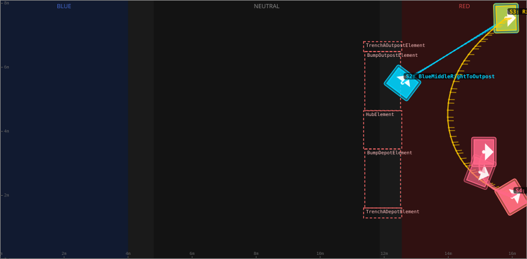
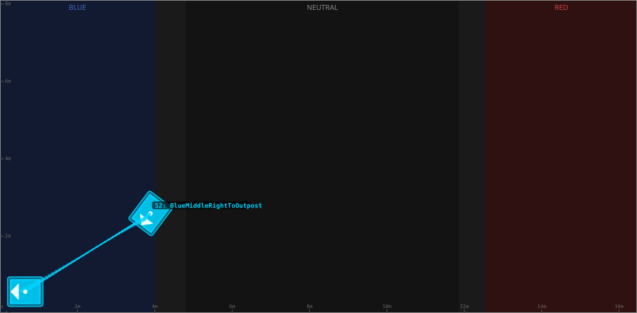
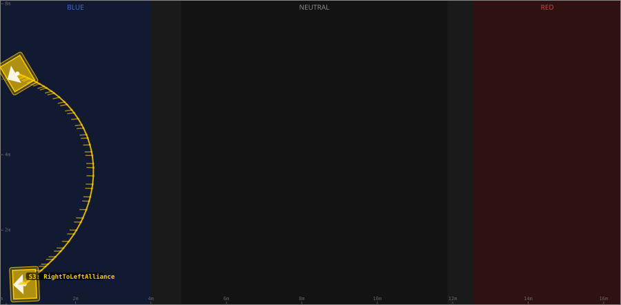
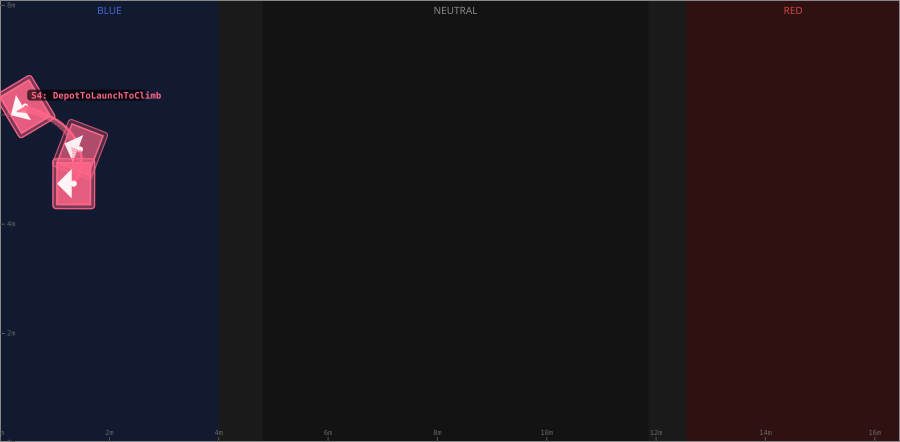

# Auton: RedBOutLaunch0DepOutScoreClimb

> Auto-generated from [`src/main/deploy/auton/RedBOutLaunch0DepOutScoreClimb.xml`](../../src/main/deploy/auton/RedBOutLaunch0DepOutScoreClimb.xml).  
> Do not edit this file manually -- push a change to the XML and the [auton-diagrams workflow](../../.github/workflows/auton-diagrams.yml) will regenerate it.

## State Diagram

```mermaid
stateDiagram-v2
    direction LR

    %% Green = intake active, Purple = intake off
    classDef intake  fill:#1a7a3a,color:#ffffff,stroke:#0d4a1f,font-weight:bold
    classDef noIntake fill:#5a4a8a,color:#ffffff,stroke:#3a2a6a,font-weight:bold

    Step1 : Step 1 - DRIVE_STOP_MECH --
    Step2 : Step 2 - TRAJECTORY_DRIVE BlueMiddleRightToOutpost
    Step3 : Step 3 - TRAJECTORY_DRIVE RightToLeftAlliance
    Step4 : Step 4 - TRAJECTORY_DRIVE DepotToLaunchToClimb
    Step5 : Step 5 - DRIVE_STOP_MECH --

    class Step1 noIntake
    class Step2 intake
    class Step3 intake
    class Step4 intake
    class Step5 noIntake

    [*] --> Step1 : start
    Step1 --> Step2: launcher=LAUNCH
    Step2 --> Step3: intake=INTAKE zones=LaunchZone PREPARE_TO_LAUNCH OutpostZone DRIVE_TO_OUTPOST
    Step3 --> Step4: intake=INTAKE zones=LaunchZone PREPARE_TO_LAUNCH DepotZone DRIVE_TO_DEPOT
    Step4 --> Step5: intake=INTAKE zones=LaunchZone PREPARE_TO_LAUNCH
    Step5 --> [*]: zones=ClimbingZone DRIVE_TO_TOWER
```

## Primitive Summary

| Step | Primitive | Trajectory | Timeout | Intake | Launcher | Climber | Zones |
|------|-----------|------------|---------|--------|----------|---------|-------|
| 1 | DRIVE_STOP_MECH | -- | -- s | STATE_OFF | STATE_LAUNCH | STATE_OFF | -- |
| 2 | TRAJECTORY_DRIVE | [BlueMiddleRightToOutpost](../../src/main/deploy/choreo/BlueMiddleRightToOutpost.traj) | 2.5 s | STATE_INTAKE | STATE_IDLE | STATE_OFF | RedLaunchZone, RedOutpostZone |
| 3 | TRAJECTORY_DRIVE | [RightToLeftAlliance](../../src/main/deploy/choreo/RightToLeftAlliance.traj) | 2.5 s | STATE_INTAKE | STATE_IDLE | STATE_OFF | RedLaunchZone, RedDepotZone |
| 4 | TRAJECTORY_DRIVE | [DepotToLaunchToClimb](../../src/main/deploy/choreo/DepotToLaunchToClimb.traj) | 2.5 s | STATE_INTAKE | STATE_IDLE | STATE_OFF | RedLaunchZone |
| 5 | DRIVE_STOP_MECH | -- | -- s | STATE_OFF | STATE_IDLE | STATE_OFF | RedClimbingZone |

## Trajectory Details

### All Trajectories Overview

### Step 2 -- BlueMiddleRightToOutpost

- **File:** [`BlueMiddleRightToOutpost.traj`](../../src/main/deploy/choreo/BlueMiddleRightToOutpost.traj)
- **Duration:** 2.257 s
- **Timeout in auton XML:** 2.5 s

| # | X (m) | Y (m) | Heading (deg) |
|---|-------|-------|---------------|
| 1 | 3.89 | 2.588 | 233.0 |
| 2 | 0.652 | 0.567 | 180.0 |

### Step 3 -- RightToLeftAlliance

- **File:** [`RightToLeftAlliance.traj`](../../src/main/deploy/choreo/RightToLeftAlliance.traj)
- **Duration:** 3.459 s
- **Timeout in auton XML:** 2.5 s

| # | X (m) | Y (m) | Heading (deg) |
|---|-------|-------|---------------|
| 1 | 0.652 | 0.567 | 182.5 |
| 2 | 2.445 | 3.98 | 180.0 |
| 3 | 0.461 | 6.151 | 210.9 |

### Step 4 -- DepotToLaunchToClimb

- **File:** [`DepotToLaunchToClimb.traj`](../../src/main/deploy/choreo/DepotToLaunchToClimb.traj)
- **Duration:** 1.778 s
- **Timeout in auton XML:** 2.5 s

| # | X (m) | Y (m) | Heading (deg) |
|---|-------|-------|---------------|
| 1 | 0.461 | 6.151 | 210.9 |
| 2 | 1.463 | 5.368 | 159.0 |
| 3 | 1.349 | 4.741 | 180.0 |

## Zone Legend

| Zone file | Effect when entered |
|-----------|---------------------|
| `RedClimbingZone` | `pathUpdateOption = DRIVE_TO_TOWER` |
| `RedDepotZone` | `pathUpdateOption = DRIVE_TO_DEPOT` |
| `RedLaunchZone` | `launcherState -> STATE_PREPARE_TO_LAUNCH` |
| `RedOutpostZone` | `pathUpdateOption = DRIVE_TO_OUTPOST` |
