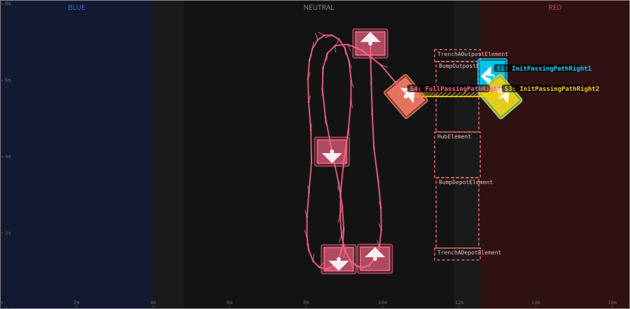
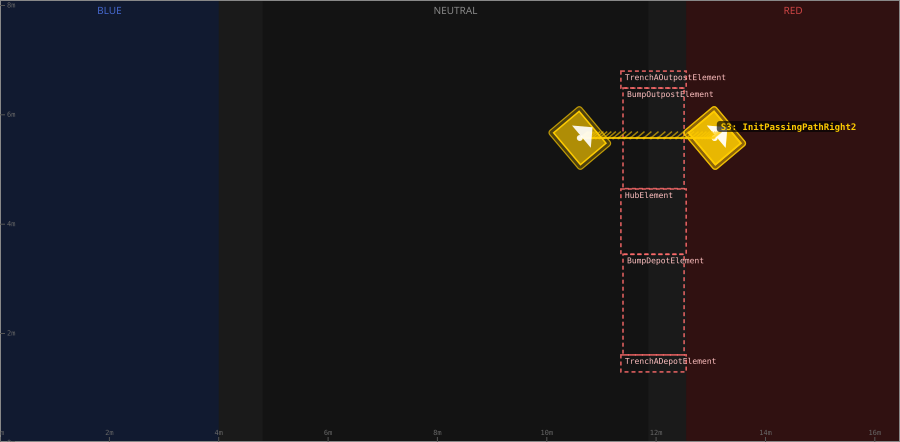
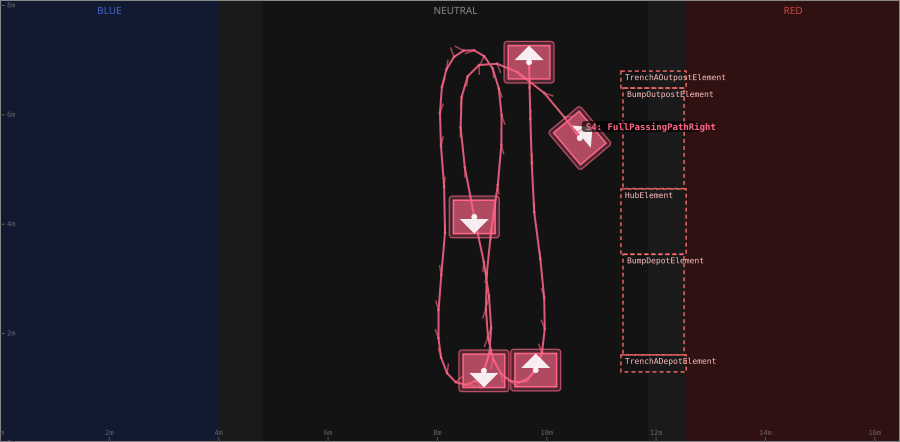

# Auton: RedBOutLaunch1FullNDepNOutPassNCli

> Auto-generated from [`src/main/deploy/auton/RedBOutLaunch1FullNDepNOutPassNCli.xml`](../../src/main/deploy/auton/RedBOutLaunch1FullNDepNOutPassNCli.xml).  
> Do not edit this file manually -- push a change to the XML and the [auton-diagrams workflow](../../.github/workflows/auton-diagrams.yml) will regenerate it.

## State Diagram

```mermaid
stateDiagram-v2
    direction LR

    %% Green = intake active, Purple = intake off
    classDef intake  fill:#1a7a3a,color:#ffffff,stroke:#0d4a1f,font-weight:bold
    classDef noIntake fill:#5a4a8a,color:#ffffff,stroke:#3a2a6a,font-weight:bold

    Step1 : "Step 1 - TRAJECTORY_DRIVE InitPassingPathRight1"
    Step2 : "Step 2 - DRIVE_STOP_MECH --"
    Step3 : "Step 3 - TRAJECTORY_DRIVE InitPassingPathRight2"
    Step4 : "Step 4 - TRAJECTORY_DRIVE FullPassingPathRight"

    class Step1 noIntake
    class Step2 noIntake
    class Step3 noIntake
    class Step4 intake

    [*] --> Step1 : "start"
    Step1 --> Step2
    Step2 --> Step3: "launcher=PREPARE_TO_LAUNCH"
    Step3 --> Step4
    Step4 --> [*]: "intake=INTAKE | launcher=PREPARE_TO_LAUNCH"
```

## Primitive Summary

| Step | Primitive | Trajectory | Timeout | Intake | Launcher | Climber | Zones |
|------|-----------|------------|---------|--------|----------|---------|-------|
| 1 | TRAJECTORY_DRIVE | [InitPassingPathRight1](../../src/main/deploy/choreo/InitPassingPathRight1.traj) | 3.0 s | STATE_OFF | STATE_IDLE | STATE_OFF | -- |
| 2 | DRIVE_STOP_MECH | -- | 5.0 s | STATE_OFF | STATE_PREPARE_TO_LAUNCH | STATE_OFF | -- |
| 3 | TRAJECTORY_DRIVE | [InitPassingPathRight2](../../src/main/deploy/choreo/InitPassingPathRight2.traj) | 3.0 s | STATE_OFF | STATE_IDLE | STATE_OFF | -- |
| 4 | TRAJECTORY_DRIVE | [FullPassingPathRight](../../src/main/deploy/choreo/FullPassingPathRight.traj) | 20.0 s | STATE_INTAKE | STATE_PREPARE_TO_LAUNCH | STATE_OFF | -- |

## Trajectory Details

### All Trajectories Overview

### Step 1 -- InitPassingPathRight1

- **File:** [`InitPassingPathRight1.traj`](../../src/main/deploy/choreo/InitPassingPathRight1.traj)
- **Duration:** 0.88 s
- **Timeout in auton XML:** 3.0 s
- **Colour in overview:** `#00d4ff`

| # | X (m) | Y (m) | Heading (deg) |
|---|-------|-------|---------------|
| 1 | 12.867 | 6.106 | 180.0 |
| 2 | 13.073 | 5.565 | 40.1 |

### Step 3 -- InitPassingPathRight2

- **File:** [`InitPassingPathRight2.traj`](../../src/main/deploy/choreo/InitPassingPathRight2.traj)
- **Duration:** 1.815 s
- **Timeout in auton XML:** 3.0 s
- **Colour in overview:** `#ffcc00`

| # | X (m) | Y (m) | Heading (deg) |
|---|-------|-------|---------------|
| 1 | 13.073 | 5.576 | 40.1 |
| 2 | 10.604 | 5.576 | 40.1 |

### Step 4 -- FullPassingPathRight

- **File:** [`FullPassingPathRight.traj`](../../src/main/deploy/choreo/FullPassingPathRight.traj)
- **Duration:** 13.181 s
- **Timeout in auton XML:** 20.0 s
- **Colour in overview:** `#ff6688`

| # | X (m) | Y (m) | Heading (deg) |
|---|-------|-------|---------------|
| 1 | 10.604 | 5.576 | 40.1 |
| 2 | 8.728 | 6.894 | 270.0 |
| 3 | 8.674 | 4.133 | 270.0 |
| 4 | 8.85 | 1.318 | 270.0 |
| 5 | 8.146 | 1.331 | 90.0 |
| 6 | 8.146 | 4.052 | 90.0 |
| 7 | 8.214 | 6.935 | 90.0 |
| 8 | 8.972 | 6.921 | 270.0 |
| 9 | 9.012 | 4.092 | 270.0 |
| 10 | 9.107 | 1.345 | 270.0 |
| 11 | 9.797 | 1.331 | 90.0 |
| 12 | 9.784 | 4.079 | 90.0 |
| 13 | 9.676 | 6.962 | 90.0 |

## Zone Legend

| Zone file | Effect when entered |
|-----------|---------------------|

