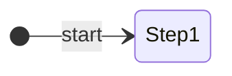

# Auton: RedDefaultFile

> Auto-generated from [`src/main/deploy/auton/RedDefaultFile.xml`](../../src/main/deploy/auton/RedDefaultFile.xml).  
> Do not edit this file manually -- push a change to the XML and the [auton-diagrams workflow](../../.github/workflows/auton-diagrams.yml) will regenerate it.

## State Diagram

## Primitive Summary

| Step | Primitive | Trajectory | Timeout | Intake | Launcher | Climber | Zones |
|------|-----------|------------|---------|--------|----------|---------|-------|

## Zone Legend

| Zone file | Effect when entered |
|-----------|---------------------|

