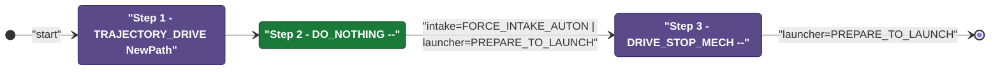
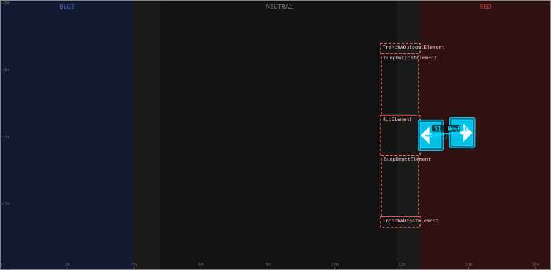

# Auton: RedHubLaunch0NDepNOutScoreNCli

> Auto-generated from [`src/main/deploy/auton/RedHubLaunch0NDepNOutScoreNCli.xml`](../../src/main/deploy/auton/RedHubLaunch0NDepNOutScoreNCli.xml).  
> Do not edit this file manually -- push a change to the XML and the [auton-diagrams workflow](../../.github/workflows/auton-diagrams.yml) will regenerate it.

## State Diagram

## Primitive Summary

| Step | Primitive | Trajectory | Timeout | Intake | Launcher | Climber | Zones |
|------|-----------|------------|---------|--------|----------|---------|-------|
| 1 | TRAJECTORY_DRIVE | [NewPath](../../src/main/deploy/choreo/NewPath.traj) | 3.0 s | STATE_OFF | STATE_IDLE | STATE_OFF | -- |
| 2 | DO_NOTHING | -- | 10.0 s | STATE_FORCE_INTAKE_AUTON | STATE_PREPARE_TO_LAUNCH | STATE_OFF | -- |
| 3 | DRIVE_STOP_MECH | -- | 10.0 s | STATE_OFF | STATE_PREPARE_TO_LAUNCH | STATE_OFF | -- |

## Trajectory Details

### All Trajectories Overview

### Step 1 -- NewPath

- **File:** [`NewPath.traj`](../../src/main/deploy/choreo/NewPath.traj)
- **Duration:** 0.77 s
- **Timeout in auton XML:** 3.0 s
- **Colour in overview:** `#00d4ff`

| # | X (m) | Y (m) | Heading (deg) |
|---|-------|-------|---------------|
| 1 | 12.867 | 4.049 | 180.0 |
| 2 | 13.809 | 4.125 | 0.0 |

## Zone Legend

| Zone file | Effect when entered |
|-----------|---------------------|

