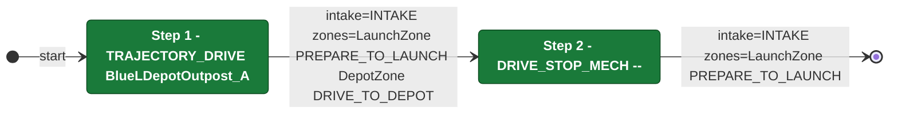

# Auton: RedTDepLaunch0DepNOutScoreNCli

> Auto-generated from [`src/main/deploy/auton/RedTDepLaunch0DepNOutScoreNCli.xml`](../../src/main/deploy/auton/RedTDepLaunch0DepNOutScoreNCli.xml).  
> Do not edit this file manually -- push a change to the XML and the [auton-diagrams workflow](../../.github/workflows/auton-diagrams.yml) will regenerate it.

## State Diagram

## Primitive Summary

| Step | Primitive | Trajectory | Timeout | Intake | Launcher | Climber | Zones |
|------|-----------|------------|---------|--------|----------|---------|-------|
| 1 | TRAJECTORY_DRIVE | [BlueLDepotOutpost_A](../../src/main/deploy/choreo/BlueLDepotOutpost_A.traj) | 3.5 s | STATE_INTAKE | STATE_IDLE | STATE_OFF | RedLaunchZone, RedDepotZone |
| 2 | DRIVE_STOP_MECH | -- | -- s | STATE_INTAKE | STATE_IDLE | STATE_OFF | RedLaunchZone |

## Trajectory Details

### All Trajectories Overview

### Step 1 -- BlueLDepotOutpost_A

- **File:** [`BlueLDepotOutpost_A.traj`](../../src/main/deploy/choreo/BlueLDepotOutpost_A.traj)
- **Duration:** 2.653 s
- **Timeout in auton XML:** 3.5 s
- **Colour in overview:** `#00d4ff`

| # | X (m) | Y (m) | Heading (deg) |
|---|-------|-------|---------------|
| 1 | 3.66 | 7.482 | 137.7 |
| 2 | 1.078 | 7.183 | 0.0 |
| 3 | 0.806 | 5.828 | 270.0 |

## Zone Legend

| Zone file | Effect when entered |
|-----------|---------------------|
| `RedDepotZone` | `pathUpdateOption = DRIVE_TO_DEPOT` |
| `RedLaunchZone` | `launcherState -> STATE_PREPARE_TO_LAUNCH` |
