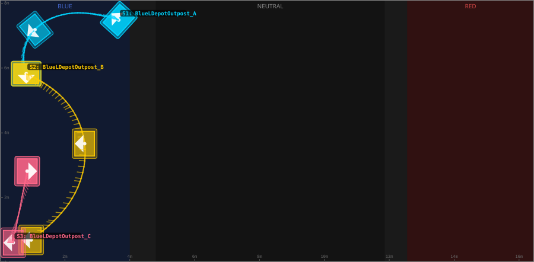
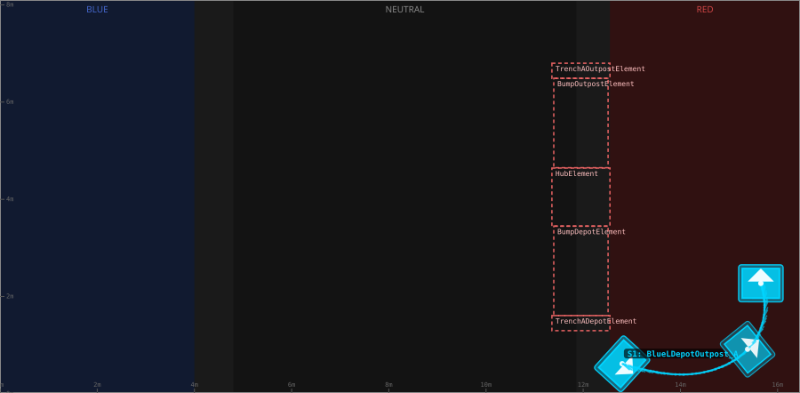
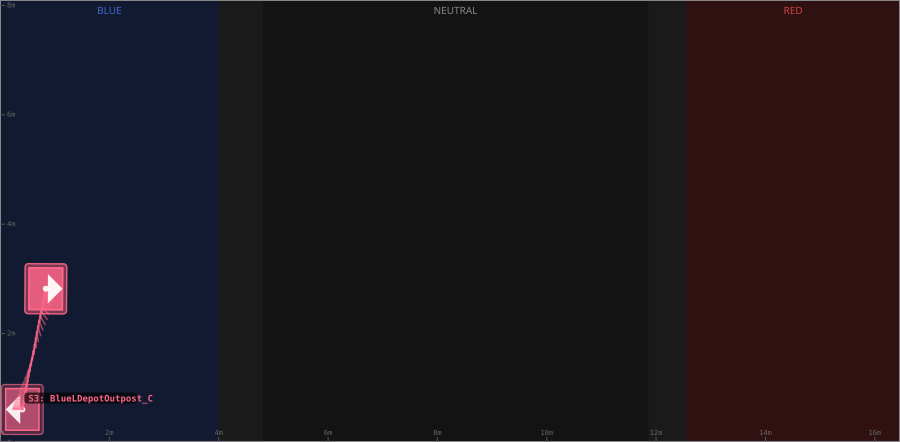

# Auton: RedTDepLaunch0DepOutScoreClimb

> Auto-generated from [`src/main/deploy/auton/RedTDepLaunch0DepOutScoreClimb.xml`](../../src/main/deploy/auton/RedTDepLaunch0DepOutScoreClimb.xml).  
> Do not edit this file manually -- push a change to the XML and the [auton-diagrams workflow](../../.github/workflows/auton-diagrams.yml) will regenerate it.

## State Diagram

```mermaid
stateDiagram-v2
    direction LR

    %% Green = intake active, Purple = intake off
    classDef intake  fill:#1a7a3a,color:#ffffff,stroke:#0d4a1f,font-weight:bold
    classDef noIntake fill:#5a4a8a,color:#ffffff,stroke:#3a2a6a,font-weight:bold

    Step1 : "Step 1 - TRAJECTORY_DRIVE BlueLDepotOutpost_A"
    Step2 : "Step 2 - TRAJECTORY_DRIVE BlueLDepotOutpost_B"
    Step3 : "Step 3 - TRAJECTORY_DRIVE BlueLDepotOutpost_C"
    Step4 : "Step 4 - DRIVE_STOP_MECH --"

    class Step1 noIntake
    class Step2 intake
    class Step3 noIntake
    class Step4 noIntake

    [*] --> Step1 : "start"
    Step1 --> Step2: "zones=LaunchZone PREPARE_TO_LAUNCH"
    Step2 --> Step3: "intake=INTAKE | zones=LaunchZone PREPARE_TO_LAUNCH OutpostZone DRIVE_TO_OUTPOST"
    Step3 --> Step4
    Step4 --> [*]: "zones=ClimbingZone DRIVE_TO_TOWER"
```

## Primitive Summary

| Step | Primitive | Trajectory | Timeout | Intake | Launcher | Climber | Zones |
|------|-----------|------------|---------|--------|----------|---------|-------|
| 1 | TRAJECTORY_DRIVE | [BlueLDepotOutpost_A](../../src/main/deploy/choreo/BlueLDepotOutpost_A.traj) | 3.0 s | STATE_OFF | STATE_IDLE | STATE_OFF | RedLaunchZone |
| 2 | TRAJECTORY_DRIVE | [BlueLDepotOutpost_B](../../src/main/deploy/choreo/BlueLDepotOutpost_B.traj) | 4.0 s | STATE_INTAKE | STATE_IDLE | STATE_OFF | RedLaunchZone, RedOutpostZone |
| 3 | TRAJECTORY_DRIVE | [BlueLDepotOutpost_C](../../src/main/deploy/choreo/BlueLDepotOutpost_C.traj) | 4.0 s | STATE_OFF | STATE_IDLE | STATE_OFF | -- |
| 4 | DRIVE_STOP_MECH | -- | -- s | STATE_OFF | STATE_IDLE | STATE_OFF | RedClimbingZone |

## Trajectory Details

### All Trajectories Overview

### Step 1 -- BlueLDepotOutpost_A

- **File:** [`BlueLDepotOutpost_A.traj`](../../src/main/deploy/choreo/BlueLDepotOutpost_A.traj)
- **Duration:** 2.653 s
- **Timeout in auton XML:** 3.0 s
- **Colour in overview:** `#00d4ff`

| # | X (m) | Y (m) | Heading (deg) |
|---|-------|-------|---------------|
| 1 | 12.8 | 0.618 | 317.7 |
| 2 | 15.382 | 0.917 | 180.0 |
| 3 | 15.654 | 2.272 | 90.0 |

### Step 2 -- BlueLDepotOutpost_B

- **File:** [`BlueLDepotOutpost_B.traj`](../../src/main/deploy/choreo/BlueLDepotOutpost_B.traj)
- **Duration:** 4.033 s
- **Timeout in auton XML:** 4.0 s
- **Colour in overview:** `#ffcc00`

| # | X (m) | Y (m) | Heading (deg) |
|---|-------|-------|---------------|
| 1 | 15.654 | 2.272 | 90.0 |
| 2 | 13.851 | 4.432 | 0.0 |
| 3 | 15.498 | 7.403 | 0.0 |

### Step 3 -- BlueLDepotOutpost_C

- **File:** [`BlueLDepotOutpost_C.traj`](../../src/main/deploy/choreo/BlueLDepotOutpost_C.traj)
- **Duration:** 1.041 s
- **Timeout in auton XML:** 4.0 s
- **Colour in overview:** `#ff6688`

| # | X (m) | Y (m) | Heading (deg) |
|---|-------|-------|---------------|
| 1 | 16.052 | 7.488 | 0.0 |
| 2 | 15.622 | 5.28 | 180.0 |

## Zone Legend

| Zone file | Effect when entered |
|-----------|---------------------|
| `RedClimbingZone` | `pathUpdateOption = DRIVE_TO_TOWER` |
| `RedLaunchZone` | `launcherState -> STATE_PREPARE_TO_LAUNCH` |
| `RedOutpostZone` | `pathUpdateOption = DRIVE_TO_OUTPOST` |
