# Auton: RedTDepLaunch2NDepNOutScoreClimb

> Auto-generated from [`src/main/deploy/auton/RedTDepLaunch2NDepNOutScoreClimb.xml`](../../src/main/deploy/auton/RedTDepLaunch2NDepNOutScoreClimb.xml).  
> Do not edit this file manually -- push a change to the XML and the [auton-diagrams workflow](../../.github/workflows/auton-diagrams.yml) will regenerate it.

## State Diagram

```mermaid
stateDiagram-v2
    direction LR

    %% Green = intake active, Purple = intake off
    classDef intake  fill:#1a7a3a,color:#ffffff,stroke:#0d4a1f,font-weight:bold
    classDef noIntake fill:#5a4a8a,color:#ffffff,stroke:#3a2a6a,font-weight:bold

    Step1 : Step 1 - TRAJECTORY_DRIVE BlueLeftBumpNZNZ_A
    Step2 : Step 2 - TRAJECTORY_DRIVE LeftToRightNZ
    Step3 : Step 3 - TRAJECTORY_DRIVE BlueLeftBumpNZNZ_C
    Step4 : Step 4 - TRAJECTORY_DRIVE RightToLeftNZ
    Step5 : Step 5 - TRAJECTORY_DRIVE BlueLeftBumpNZNZ_D

    class Step1 intake
    class Step2 intake
    class Step3 noIntake
    class Step4 intake
    class Step5 noIntake

    [*] --> Step1 : start
    Step1 --> Step2: intake=INTAKE zones=LeftBumpNZNZ_A
    Step2 --> Step3: intake=INTAKE zones=LeftToRightNZ
    Step3 --> Step4: zones=LaunchZone PREPARE_TO_LAUNCH
    Step4 --> Step5: intake=INTAKE zones=RightToLeftNZ
    Step5 --> [*]: zones=LaunchZone PREPARE_TO_LAUNCH
```

## Primitive Summary

| Step | Primitive | Trajectory | Timeout | Intake | Launcher | Climber | Zones |
|------|-----------|------------|---------|--------|----------|---------|-------|
| 1 | TRAJECTORY_DRIVE | BlueLeftBumpNZNZ_A | 2.0 s | STATE_INTAKE | STATE_IDLE | STATE_OFF | BlueLeftBumpNZNZ_A |
| 2 | TRAJECTORY_DRIVE | LeftToRightNZ | 5.0 s | STATE_INTAKE | STATE_IDLE | STATE_OFF | LeftToRightNZ |
| 3 | TRAJECTORY_DRIVE | BlueLeftBumpNZNZ_C | 5.0 s | STATE_OFF | STATE_IDLE | STATE_OFF | RedLaunchZone |
| 4 | TRAJECTORY_DRIVE | RightToLeftNZ | 5.0 s | STATE_INTAKE | STATE_IDLE | STATE_OFF | RightToLeftNZ |
| 5 | TRAJECTORY_DRIVE | BlueLeftBumpNZNZ_D | 5.0 s | STATE_OFF | STATE_IDLE | STATE_OFF | RedLaunchZone |

## Zone Legend

| Zone file | Effect when entered |
|-----------|---------------------|
| `BlueLeftBumpNZNZ_A` | *(no tracked effects)* |
| `LeftToRightNZ` | *(no tracked effects)* |
| `RedLaunchZone` | `launcherState -> STATE_PREPARE_TO_LAUNCH` |
| `RightToLeftNZ` | *(no tracked effects)* |
