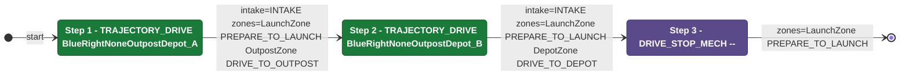

# Auton: RedTOutLaunch0DepOutScoreClimb

> Auto-generated from [`src/main/deploy/auton/RedTOutLaunch0DepOutScoreClimb.xml`](../../src/main/deploy/auton/RedTOutLaunch0DepOutScoreClimb.xml).  
> Do not edit this file manually -- push a change to the XML and the [auton-diagrams workflow](../../.github/workflows/auton-diagrams.yml) will regenerate it.

## State Diagram

## Primitive Summary

| Step | Primitive | Trajectory | Timeout | Intake | Launcher | Climber | Zones |
|------|-----------|------------|---------|--------|----------|---------|-------|
| 1 | TRAJECTORY_DRIVE | BlueRightNoneOutpostDepot_A | 3.0 s | STATE_INTAKE | STATE_IDLE | STATE_OFF | RedLaunchZone, RedOutpostZone |
| 2 | TRAJECTORY_DRIVE | BlueRightNoneOutpostDepot_B | 5.0 s | STATE_INTAKE | STATE_IDLE | STATE_OFF | RedLaunchZone, RedDepotZone |
| 3 | DRIVE_STOP_MECH | -- | 5.0 s | STATE_OFF | STATE_IDLE | STATE_OFF | RedLaunchZone |

## Zone Legend

| Zone file | Effect when entered |
|-----------|---------------------|
| `RedDepotZone` | `pathUpdateOption = DRIVE_TO_DEPOT` |
| `RedLaunchZone` | `launcherState -> STATE_PREPARE_TO_LAUNCH` |
| `RedOutpostZone` | `pathUpdateOption = DRIVE_TO_OUTPOST` |
