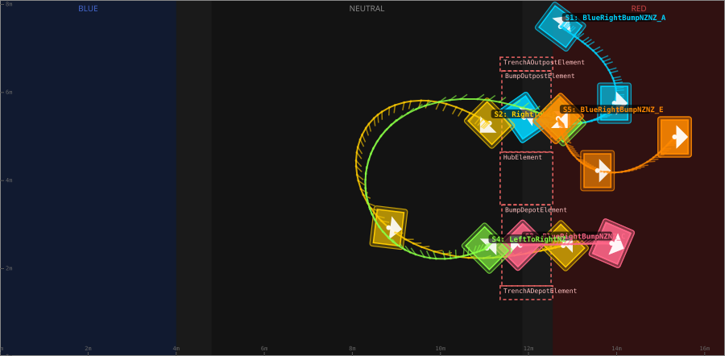
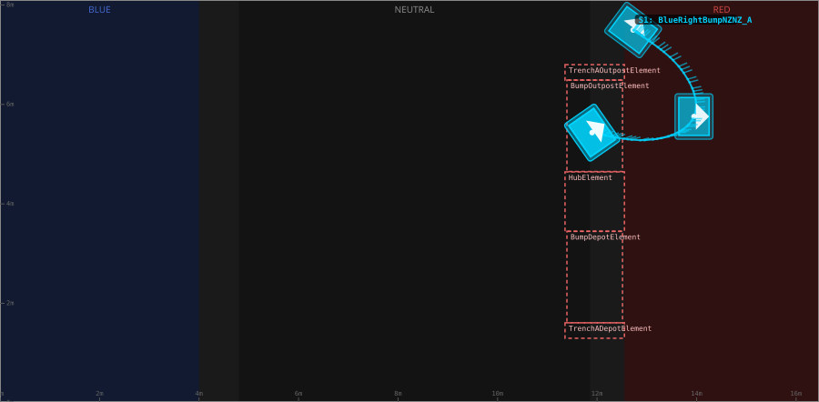
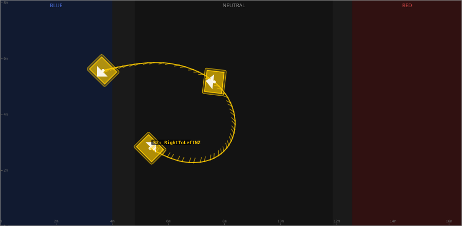
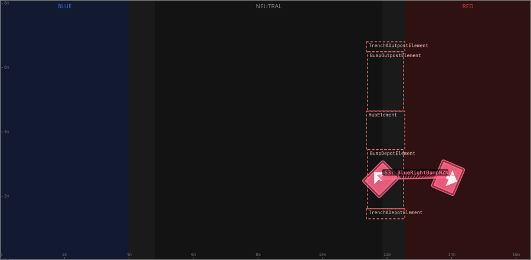
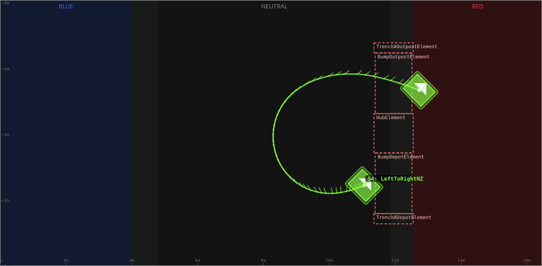

# Auton: RedTOutLaunch2NDepNOutScoreClimb

> Auto-generated from [`src/main/deploy/auton/RedTOutLaunch2NDepNOutScoreClimb.xml`](../../src/main/deploy/auton/RedTOutLaunch2NDepNOutScoreClimb.xml).  
> Do not edit this file manually -- push a change to the XML and the [auton-diagrams workflow](../../.github/workflows/auton-diagrams.yml) will regenerate it.

## State Diagram

```mermaid
stateDiagram-v2
    direction LR

    %% Green = intake active, Purple = intake off
    classDef intake  fill:#1a7a3a,color:#ffffff,stroke:#0d4a1f,font-weight:bold
    classDef noIntake fill:#5a4a8a,color:#ffffff,stroke:#3a2a6a,font-weight:bold

    Step1 : "Step 1 - TRAJECTORY_DRIVE BlueRightBumpNZNZ_A"
    Step2 : "Step 2 - TRAJECTORY_DRIVE RightToLeftNZ"
    Step3 : "Step 3 - TRAJECTORY_DRIVE BlueRightBumpNZNZ_C"
    Step4 : "Step 4 - TRAJECTORY_DRIVE LeftToRightNZ"
    Step5 : "Step 5 - TRAJECTORY_DRIVE BlueRightBumpNZNZ_E"

    class Step1 noIntake
    class Step2 noIntake
    class Step3 noIntake
    class Step4 noIntake
    class Step5 noIntake

    [*] --> Step1 : "start"
    Step1 --> Step2: "zones=RightBumpZone DRIVE_OVER_BUMP"
    Step2 --> Step3: "zones=LeftBumpZone DRIVE_OVER_BUMP"
    Step3 --> Step4: "zones=LeftBumpZone DRIVE_OVER_BUMP"
    Step4 --> Step5
    Step5 --> [*]: "zones=RightBumpZone DRIVE_OVER_BUMP"
```

## Primitive Summary

| Step | Primitive | Trajectory | Timeout | Intake | Launcher | Climber | Zones |
|------|-----------|------------|---------|--------|----------|---------|-------|
| 1 | TRAJECTORY_DRIVE | [BlueRightBumpNZNZ_A](../../src/main/deploy/choreo/BlueRightBumpNZNZ_A.traj) | 5.0 s | STATE_OFF | STATE_IDLE | STATE_OFF | RedRightBumpZone |
| 2 | TRAJECTORY_DRIVE | [RightToLeftNZ](../../src/main/deploy/choreo/RightToLeftNZ.traj) | 5.0 s | STATE_OFF | STATE_IDLE | STATE_OFF | RedLeftBumpZone |
| 3 | TRAJECTORY_DRIVE | [BlueRightBumpNZNZ_C](../../src/main/deploy/choreo/BlueRightBumpNZNZ_C.traj) | 5.0 s | STATE_OFF | STATE_IDLE | STATE_OFF | RedLeftBumpZone |
| 4 | TRAJECTORY_DRIVE | [LeftToRightNZ](../../src/main/deploy/choreo/LeftToRightNZ.traj) | 5.0 s | STATE_OFF | STATE_IDLE | STATE_OFF | -- |
| 5 | TRAJECTORY_DRIVE | [BlueRightBumpNZNZ_E](../../src/main/deploy/choreo/BlueRightBumpNZNZ_E.traj) | 5.0 s | STATE_OFF | STATE_IDLE | STATE_OFF | RedRightBumpZone |

## Trajectory Details

### All Trajectories Overview

### Step 1 -- BlueRightBumpNZNZ_A

- **File:** [`BlueRightBumpNZNZ_A.traj`](../../src/main/deploy/choreo/BlueRightBumpNZNZ_A.traj)
- **Duration:** 3.118 s
- **Timeout in auton XML:** 5.0 s
- **Colour in overview:** `#00d4ff`

| # | X (m) | Y (m) | Heading (deg) |
|---|-------|-------|---------------|
| 1 | 12.724 | 7.496 | 53.2 |
| 2 | 13.947 | 5.758 | 0.0 |
| 3 | 11.899 | 5.434 | 35.0 |

### Step 2 -- RightToLeftNZ

- **File:** [`RightToLeftNZ.traj`](../../src/main/deploy/choreo/RightToLeftNZ.traj)
- **Duration:** 4.779 s
- **Timeout in auton XML:** 5.0 s
- **Colour in overview:** `#ffcc00`

| # | X (m) | Y (m) | Heading (deg) |
|---|-------|-------|---------------|
| 1 | 11.113 | 5.303 | 225.0 |
| 2 | 8.719 | 5.594 | 270.0 |
| 3 | 8.824 | 2.931 | 353.2 |
| 4 | 12.788 | 2.521 | 45.0 |

### Step 3 -- BlueRightBumpNZNZ_C

- **File:** [`BlueRightBumpNZNZ_C.traj`](../../src/main/deploy/choreo/BlueRightBumpNZNZ_C.traj)
- **Duration:** 1.665 s
- **Timeout in auton XML:** 5.0 s
- **Colour in overview:** `#ff6688`

| # | X (m) | Y (m) | Heading (deg) |
|---|-------|-------|---------------|
| 1 | 11.811 | 2.531 | 135.0 |
| 2 | 13.888 | 2.575 | 336.4 |

### Step 4 -- LeftToRightNZ

- **File:** [`LeftToRightNZ.traj`](../../src/main/deploy/choreo/LeftToRightNZ.traj)
- **Duration:** 4.612 s
- **Timeout in auton XML:** 5.0 s
- **Colour in overview:** `#88ff44`

| # | X (m) | Y (m) | Heading (deg) |
|---|-------|-------|---------------|
| 1 | 11.056 | 2.465 | 45.0 |
| 2 | 9.137 | 2.461 | 130.7 |
| 3 | 8.928 | 5.302 | 45.0 |
| 4 | 12.731 | 5.36 | 45.0 |

### Step 5 -- BlueRightBumpNZNZ_E

- **File:** [`BlueRightBumpNZNZ_E.traj`](../../src/main/deploy/choreo/BlueRightBumpNZNZ_E.traj)
- **Duration:** 2.501 s
- **Timeout in auton XML:** 5.0 s
- **Colour in overview:** `#ff8800`

| # | X (m) | Y (m) | Heading (deg) |
|---|-------|-------|---------------|
| 1 | 12.672 | 5.41 | 315.0 |
| 2 | 13.564 | 4.226 | 0.0 |
| 3 | 15.317 | 4.992 | 0.0 |

## Zone Legend

| Zone file | Effect when entered |
|-----------|---------------------|
| `RedLeftBumpZone` | `pathUpdateOption = DRIVE_OVER_BUMP` |
| `RedRightBumpZone` | `pathUpdateOption = DRIVE_OVER_BUMP` |
