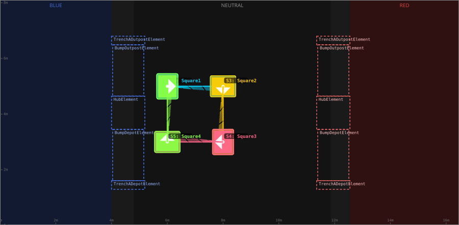
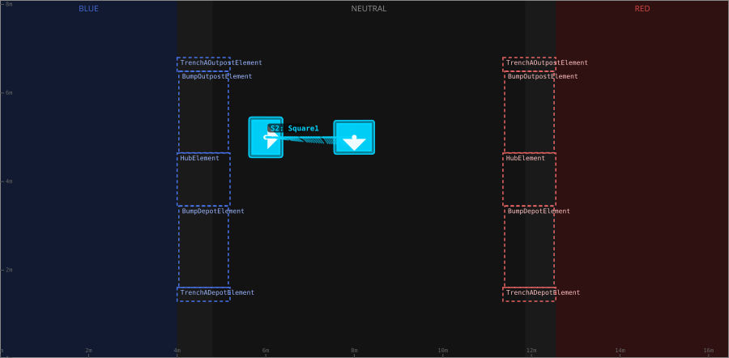
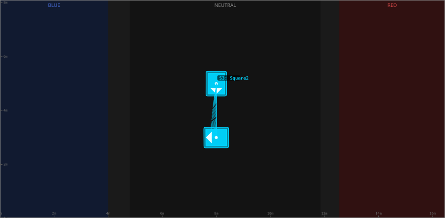
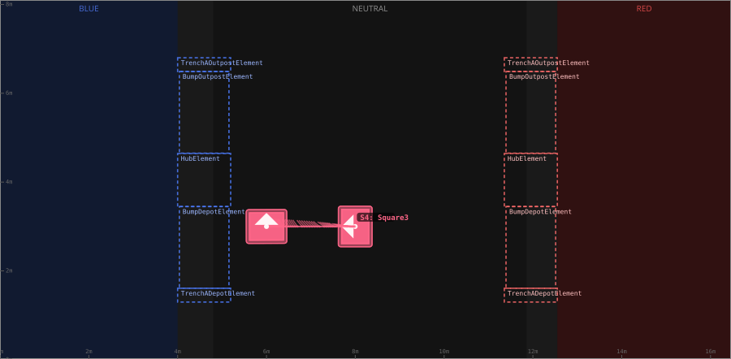
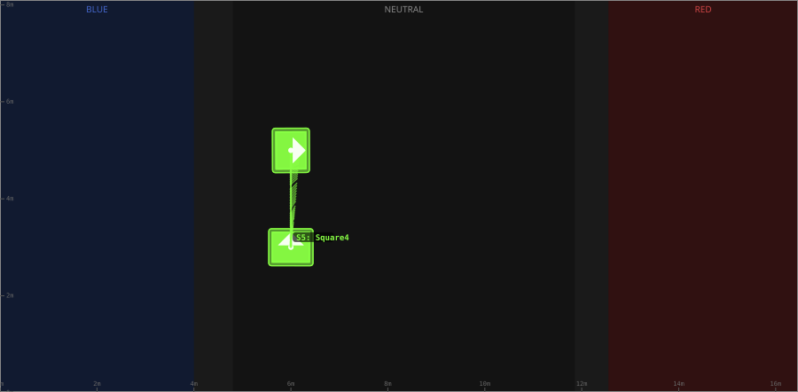

# Auton: SquareTest

> Auto-generated from [`src/main/deploy/auton/SquareTest.xml`](../../src/main/deploy/auton/SquareTest.xml).  
> Do not edit this file manually -- push a change to the XML and the [auton-diagrams workflow](../../.github/workflows/auton-diagrams.yml) will regenerate it.

## State Diagram

```mermaid
stateDiagram-v2
    direction LR

    %% Green = intake active, Purple = intake off
    classDef intake  fill:#1a7a3a,color:#ffffff,stroke:#0d4a1f,font-weight:bold
    classDef noIntake fill:#5a4a8a,color:#ffffff,stroke:#3a2a6a,font-weight:bold

    Step1 : "Step 1 - RESET_POSITION Square1"
    Step2 : "Step 2 - TRAJECTORY_DRIVE Square1"
    Step3 : "Step 3 - TRAJECTORY_DRIVE Square2"
    Step4 : "Step 4 - TRAJECTORY_DRIVE Square3"
    Step5 : "Step 5 - TRAJECTORY_DRIVE Square4"

    class Step1 noIntake
    class Step2 noIntake
    class Step3 noIntake
    class Step4 noIntake
    class Step5 noIntake

    [*] --> Step1 : "start"
    Step1 --> Step2
    Step2 --> Step3
    Step3 --> Step4
    Step4 --> Step5
    Step5 --> [*]
```

## Primitive Summary

| Step | Primitive | Trajectory | Timeout | Intake | Launcher | Climber | Zones |
|------|-----------|------------|---------|--------|----------|---------|-------|
| 1 | RESET_POSITION | Square1 | -- s | STATE_OFF | STATE_IDLE | STATE_OFF | -- |
| 2 | TRAJECTORY_DRIVE | [Square1](../../src/main/deploy/choreo/Square1.traj) | 5.0 s | STATE_OFF | STATE_IDLE | STATE_OFF | -- |
| 3 | TRAJECTORY_DRIVE | [Square2](../../src/main/deploy/choreo/Square2.traj) | 5.0 s | STATE_OFF | STATE_IDLE | STATE_OFF | -- |
| 4 | TRAJECTORY_DRIVE | [Square3](../../src/main/deploy/choreo/Square3.traj) | 5.0 s | STATE_OFF | STATE_IDLE | STATE_OFF | -- |
| 5 | TRAJECTORY_DRIVE | [Square4](../../src/main/deploy/choreo/Square4.traj) | 5.0 s | STATE_OFF | STATE_IDLE | STATE_OFF | -- |

## Trajectory Details

### All Trajectories Overview

### Step 2 -- Square1

- **File:** [`Square1.traj`](../../src/main/deploy/choreo/Square1.traj)
- **Duration:** 2.829 s
- **Timeout in auton XML:** 5.0 s
- **Colour in overview:** `#00d4ff`

| # | X (m) | Y (m) | Heading (deg) |
|---|-------|-------|---------------|
| 1 | 6.0 | 5.0 | 0.0 |
| 2 | 8.0 | 5.0 | 270.0 |

### Step 3 -- Square2

- **File:** [`Square2.traj`](../../src/main/deploy/choreo/Square2.traj)
- **Duration:** 2.829 s
- **Timeout in auton XML:** 5.0 s
- **Colour in overview:** `#ffcc00`

| # | X (m) | Y (m) | Heading (deg) |
|---|-------|-------|---------------|
| 1 | 8.0 | 5.0 | 270.0 |
| 2 | 8.0 | 3.0 | 180.0 |

### Step 4 -- Square3

- **File:** [`Square3.traj`](../../src/main/deploy/choreo/Square3.traj)
- **Duration:** 2.829 s
- **Timeout in auton XML:** 5.0 s
- **Colour in overview:** `#ff6688`

| # | X (m) | Y (m) | Heading (deg) |
|---|-------|-------|---------------|
| 1 | 8.0 | 3.0 | 180.0 |
| 2 | 6.0 | 3.0 | 90.0 |

### Step 5 -- Square4

- **File:** [`Square4.traj`](../../src/main/deploy/choreo/Square4.traj)
- **Duration:** 2.829 s
- **Timeout in auton XML:** 5.0 s
- **Colour in overview:** `#88ff44`

| # | X (m) | Y (m) | Heading (deg) |
|---|-------|-------|---------------|
| 1 | 6.0 | 3.0 | 90.0 |
| 2 | 6.0 | 5.0 | 0.0 |

## Zone Legend

| Zone file | Effect when entered |
|-----------|---------------------|

