# Auton: SquareTest

> Auto-generated from [`src/main/deploy/auton/SquareTest.xml`](../../src/main/deploy/auton/SquareTest.xml).  
> Do not edit this file manually -- push a change to the XML and the [auton-diagrams workflow](../../.github/workflows/auton-diagrams.yml) will regenerate it.

## State Diagram

```mermaid
stateDiagram-v2
    direction LR

    %% Green = intake active, Purple = intake off
    classDef intake  fill:#1a7a3a,color:#ffffff,stroke:#0d4a1f,font-weight:bold
    classDef noIntake fill:#5a4a8a,color:#ffffff,stroke:#3a2a6a,font-weight:bold

    Step1 : Step 1 - RESET_POSITION Square1
    Step2 : Step 2 - TRAJECTORY_DRIVE Square1
    Step3 : Step 3 - TRAJECTORY_DRIVE Square2
    Step4 : Step 4 - TRAJECTORY_DRIVE Square3
    Step5 : Step 5 - TRAJECTORY_DRIVE Square4

    class Step1 noIntake
    class Step2 noIntake
    class Step3 noIntake
    class Step4 noIntake
    class Step5 noIntake

    [*] --> Step1 : start
    Step1 --> Step2
    Step2 --> Step3
    Step3 --> Step4
    Step4 --> Step5
    Step5 --> [*]
```

## Primitive Summary

| Step | Primitive | Trajectory | Timeout | Intake | Launcher | Climber | Zones |
|------|-----------|------------|---------|--------|----------|---------|-------|
| 1 | RESET_POSITION | Square1 | -- s | STATE_OFF | STATE_IDLE | STATE_OFF | ? |
| 2 | TRAJECTORY_DRIVE | Square1 | 5.0 s | STATE_OFF | STATE_IDLE | STATE_OFF | ? |
| 3 | TRAJECTORY_DRIVE | Square2 | 5.0 s | STATE_OFF | STATE_IDLE | STATE_OFF | ? |
| 4 | TRAJECTORY_DRIVE | Square3 | 5.0 s | STATE_OFF | STATE_IDLE | STATE_OFF | ? |
| 5 | TRAJECTORY_DRIVE | Square4 | 5.0 s | STATE_OFF | STATE_IDLE | STATE_OFF | ? |

## Zone Legend

| Zone file | Effect when entered |
|-----------|---------------------|

