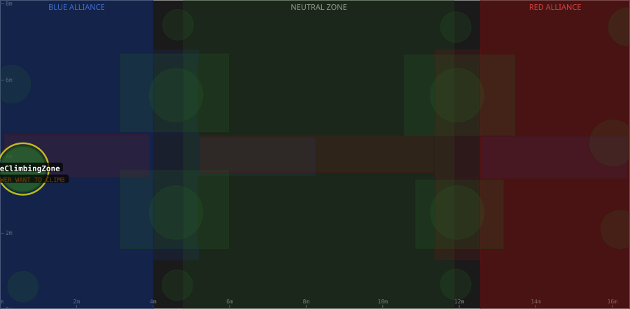

# Zone: BlueClimbingZone

> Auto-generated from [`src/main/deploy/auton/zones/BlueClimbingZone.xml`](../../../src/main/deploy/auton/zones/BlueClimbingZone.xml).
> Do not edit manually -- changes to the XML will trigger regeneration via the
> [auton-diagrams workflow](../../../.github/workflows/auton-diagrams.yml).
>
> All other zones are shown dimmed for context. The highlighted zone (yellow outline) is `BlueClimbingZone`.

## Field Diagram

## Zone Properties

| Property | Value |
|----------|-------|
| Name | `BlueClimbingZone` |
| Alliance | BOTH |
| Effects | TO TOWER, WANT TO CLIMB |

## Geometry

| Property | Value |
|----------|-------|
| Type | Circle |
| Centre X | 0.6 m |
| Centre Y | 3.68 m |
| Radius | 0.60 m |

---

[Back to all zones](../FieldZones.md)
