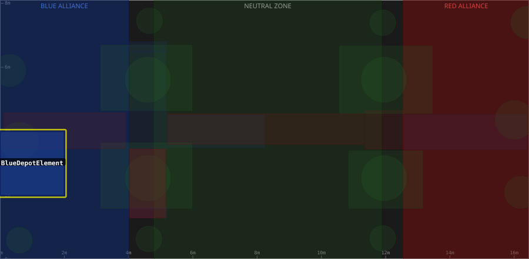

# Zone: BlueDepotElement

> Auto-generated from [`src/main/deploy/auton/zones/BlueDepotElement.xml`](../../../src/main/deploy/auton/zones/BlueDepotElement.xml).
> Do not edit manually -- changes to the XML will trigger regeneration via the
> [auton-diagrams workflow](../../../.github/workflows/auton-diagrams.yml).
>
> All other zones are shown dimmed for context. The highlighted zone (yellow outline) is `BlueDepotElement`.

## Field Diagram

## Zone Properties

| Property | Value |
|----------|-------|
| Name | `BlueDepotElement` |
| Alliance | BLUE |
| Effects | None |

## Geometry

| Property | Value |
|----------|-------|
| Type | Rectangle |
| X1 | 0.0 m |
| Y1 | 2.0 m |
| X2 | 2.0 m |
| Y2 | 4.0 m |
| Width | 2.000 m |
| Height | 2.000 m |

---

[Back to all zones](../FieldZones.md)
