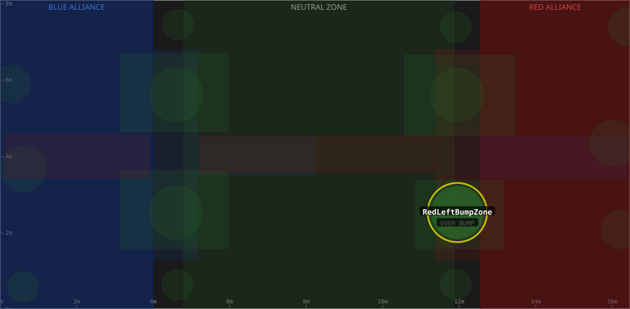

# Zone: RedLeftBumpZone

> Auto-generated from [`src/main/deploy/auton/zones/RedLeftBumpZone.xml`](../../../src/main/deploy/auton/zones/RedLeftBumpZone.xml).
> Do not edit manually -- changes to the XML will trigger regeneration via the
> [auton-diagrams workflow](../../../.github/workflows/auton-diagrams.yml).
>
> All other zones are shown dimmed for context. The highlighted zone (yellow outline) is `RedLeftBumpZone`.

## Field Diagram

## Zone Properties

| Property | Value |
|----------|-------|
| Name | `RedLeftBumpZone` |
| Alliance | BOTH |
| Effects | OVER BUMP |

## Geometry

| Property | Value |
|----------|-------|
| Type | Circle |
| Centre X | 11.95 m |
| Centre Y | 2.54 m |
| Radius | 0.70 m |

---

[Back to all zones](../FieldZones.md)
